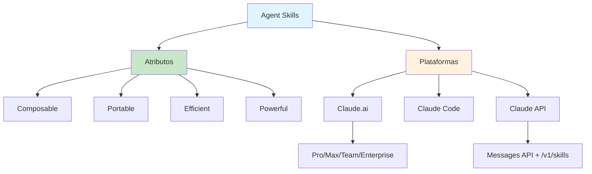

# [Introducing Agent Skills](/blog/introducing-agent-skills)

> [!compass] **[IA](/blog/moc---inteligncia-artificial)** » [Claude](/blog/claude) » Agent Skills

---

> [!info]+ Detalhes do Artigo
> **Ler:** [Introducing Agent Skills](https://claude.com/blog/skills)
> **Fonte:** [Anthropic](/blog/anthropic) (Blog Claude - Anúncio de Produto)
> **Publicado:** 16 de outubro de 2025 (atualizado em 18 de dezembro de 2025)
> **Tempo de Leitura:** 5 minutos

> [!abstract]+ Materiais Complementares
>
> **Artigos Relacionados**
> - [Equipping Agents for the Real World with Agent Skills](/blog/equipping-agents-for-the-real-world-with-agent-skills) - Deep dive técnico
> - [Agent Skills - Overview](/blog/agent-skills---overview) - Documentação completa
>
> **Documentação**
> - [Skills Quickstart](https://platform.claude.com/docs/en/agents-and-tools/agent-skills/quickstart)
> - [Anthropic Academy](https://academy.anthropic.com)

> [!tip]- Léxico
>
> - **Skills**: Pastas com instruções, scripts e recursos que Claude carrega conforme necessário
> - **skill-creator**: Skill built-in que fornece orientação interativa para criar novas skills
> - **Code Execution Tool**: Ferramenta beta necessária para skills na API

> [!question]- Pontos para Aprofundar
>
> - **Como empresas estão usando skills?**
>     - Box: transformar arquivos seguindo padrões organizacionais
>     - Canva: expandir capacidades criativas de agentes

---

## Resumo

Este é o anúncio oficial do lançamento de Agent Skills pela Anthropic. Skills são pastas que incluem instruções, scripts e recursos que Claude carrega conforme necessário - apenas quando relevante para a tarefa. O artigo destaca os quatro atributos fundamentais (Composable, Portable, Efficient, Powerful) e apresenta casos de uso de parceiros como Box e Canva.

**Definição central:**
- **Skills** = Capacidades modulares que Claude acessa automaticamente quando relevantes
- **Proposta de valor** = Criar uma vez, usar automaticamente em múltiplas conversas

---

## Principais Conceitos

### Conceito 1: Quatro Atributos Fundamentais

Skills possuem características que as tornam poderosas e práticas:

| Atributo | Descrição |
|:---------|:----------|
| **Composable** | Múltiplas skills funcionam em conjunto automaticamente |
| **Portable** | Funcionam em Claude.ai, Claude Code e API |
| **Efficient** | Carrega apenas informações mínimas quando necessário |
| **Powerful** | Pode incluir código executável para tarefas especializadas |

### Conceito 2: Disponibilidade por Plataforma

**Claude Apps (claude.ai):**
- Disponível para Pro, Max, Team e Enterprise
- Invocação automática baseada na tarefa
- Criação via `skill-creator` interativo

**Plataforma de Desenvolvedores:**
- Integração via Messages API
- Endpoint `/v1/skills` para gerenciamento programático
- Requer Code Execution Tool beta

### Conceito 3: Skills Pre-built pela Anthropic

A Anthropic fornece skills prontas para documentos:
- **Excel** - Criar planilhas, analisar dados, gerar relatórios
- **PowerPoint** - Criar e editar apresentações
- **Word** - Criar e formatar documentos
- **PDF** - Gerar documentos PDF formatados

---

## Detalhamento

### Seção 1: Casos de Uso - Parceiros

> [!example] Box
> Transforma arquivos em apresentações e planilhas seguindo padrões organizacionais específicos da empresa.

> [!example] Canva
> Planeja usar Skills para customizar agentes e expandir capacidades criativas.

### Seção 2: Como Criar Skills

**No Claude.ai:**
1. Acesse Settings > Features
2. Use a skill `skill-creator` para orientação interativa
3. Upload como arquivo zip

**Na API:**
1. Use endpoint `/v1/skills` para upload
2. Inclua `skill_id` no parâmetro `container`
3. Habilite Code Execution Tool beta

---

## Técnicas e Métodos

### Técnica 1: Usar skill-creator

**Conceito:** Skill built-in que guia a criação de novas skills interativamente.

**Implementação:**
1. Inicie conversa no Claude.ai
2. Descreva o que você quer automatizar
3. O skill-creator gera a estrutura inicial
4. Refine e faça upload

> [!tip] Quick Win
> Comece descrevendo um workflow repetitivo que você faz frequentemente.

### Técnica 2: Integração via API

**Conceito:** Gerenciamento programático de skills para automação.

**Headers necessários:**
```
code-execution-2025-08-25
skills-2025-10-02
files-api-2025-04-14
```

---

## Mapa de Conceitos

O diagrama mostra os quatro atributos fundamentais de Skills e como se manifestam nas diferentes plataformas.



---

## Insights & Aprendizados

**O que funcionou bem (casos documentados):**
- **Box**: Padronização de outputs organizacionais
- **Canva**: Expansão de capacidades criativas

**O que posso adaptar:**
- **skill-creator**: Usar para prototipagem rápida de novas skills
- **Skills de documento**: Aproveitar Excel/PowerPoint/Word/PDF built-in

---

## Recursos Adicionais

**Documentação:**
- [Agent Skills Overview](https://platform.claude.com/docs/en/agents-and-tools/agent-skills/overview)
- [Skills Cookbook](https://github.com/anthropics/claude-cookbooks/tree/main/skills)

**Aprendizado:**
- [Anthropic Academy](https://academy.anthropic.com) - Cursos de desenvolvimento

