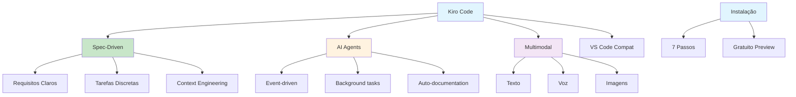

# [Kiro Code Amazon - DataHackers](/blog/kiro-code-amazon---datahackers)

> [!compass] **[MyMess](/blog/moc---projeto-mymess)** » [Estudos](/blog/dashboard---estudos-mymess) » Engenharia de Contexto

---

> [!info]+ Detalhes do Artigo
> **Ler:** [Kiro Code - Ferramenta de Coding da Amazon](https://www.datahackers.news/p/kiro-code-como-utilizar-a-nova-ferramenta-de-coding-da-amazon-gratuitamente-93ad)
> **Fonte:** [DataHackers](/blog/datahackers) (Newsletter Tutorial)
> **Autores:** Data Hackers
> **Publicado:** 01 de Agosto de 2025

> [!abstract]+ Materiais Complementares
>
> **Características Principais**
> - Spec-driven development
> - Agentes IA automatizados
> - Compatibilidade VS Code
> - Multimodal (texto, voz, imagens)
>
> **7 Passos de Instalação**
> 1. Visitar kiro.dev
> 2. Download do instalador
> 3. Instalar (Win/Mac/Linux)
> 4. Lançar Kiro IDE
> 5. Login (social ou AWS)
> 6. Importar settings do VS Code
> 7. Selecionar tema e habilitar shell

> [!tip]- Léxico
>
> **Ferramentas e Recursos**
> - **Kiro Code**: Plataforma de coding da Amazon com IA integrada
>
> **Técnicas e Estratégias**
> - **Spec-Driven Development**: Abordagem documentation-first via Context Engineering
>
> **Tecnologia e IA**
> - **AI Agent Integration**: Agentes automatizados que executam tarefas em eventos (file save, etc)
>
> **Conteúdo e Criação**
> - **Multimodal**: Interação via texto, comandos de voz e imagens
> [!question]- Pontos para Aprofundar (Sugestão da IA)
>
> - **Como Kiro se compara a Claude Code e Cursor?**
>     - Testar side-by-side em projetos reais
> - **Quais são as limitações do tier gratuito?**
>     - Explorar limites de uso durante preview
> - **Como maximizar spec-driven development?**
>     - Criar templates de especificação

> [!robot]- Sugestões Complementares
>
> - **Leituras Recomendadas:**
>     - Documentação oficial Kiro
>     - Comparativo de AI coding tools
> - **Ferramentas Úteis:**
>     - **Kiro** - IDE principal
>     - **VS Code** - Plugins compatíveis
>     - **AWS** - Login e integração
> - **Exercícios Práticos:**
>     - Instalar e configurar Kiro
>     - Criar projeto com spec-driven approach
>     - Comparar produtividade com outras ferramentas

---

## Resumo

Tutorial do **Data Hackers** sobre **Kiro Code**, a plataforma de coding da Amazon com IA integrada. Diferencia-se por abordagem **spec-driven development** que transforma "prompts em requisitos claros e tarefas discretas" ao invés de sugestões vagas. Usa **agentes IA automatizados** que executam tarefas em eventos predefinidos (como salvar arquivos). Compatível com plugins e temas do VS Code, oferece interação **multimodal** (texto, voz, imagens). **Gratuito durante fase de preview**.

**Definição central:** "Kiro transforma prompts em requisitos claros e tarefas discretas através de Context Engineering, não apenas gerando sugestões vagas de código."

---

## Principais Conceitos

### O que é Kiro Code?

A tabela abaixo resume as informações principais.

| Aspecto | Descrição |
|:--------|:----------|
| **Tipo** | IDE com IA integrada da Amazon |
| **Diferencial** | Spec-driven development via Context Engineering |
| **Compatibilidade** | Plugins e temas do VS Code |
| **Interação** | Multimodal (texto, voz, imagens) |
| **Preço** | Gratuito durante preview |

### Comparativo com Outras Ferramentas

A tabela a seguir detalha os campos e seus valores.

| Ferramenta | Foco | Abordagem |
|:-----------|:-----|:----------|
| **Kiro** | Spec-driven | Requisitos claros + tarefas discretas |
| **Claude Code** | Conversational | Chat + comandos |
| **Cursor** | Inline | Autocomplete + chat |
| **GitHub Copilot** | Inline | Autocomplete contextual |

---

## Detalhamento

### Características Principais

#### 1. Spec-Driven Development

Abordagem documentation-first via Context Engineering:
- Transforma prompts em requisitos claros
- Cria tarefas discretas e mensuráveis
- Documentação gerada automaticamente

#### 2. AI Agent Integration

Agentes automatizados que executam tarefas baseadas em eventos:
- **File save**: Gera documentação automaticamente
- **Background tasks**: Testes unitários em segundo plano
- **Event-driven**: Ações predefinidas por tipo de evento

#### 3. Multimodal

Múltiplas formas de interação:
- **Texto**: Comandos e prompts escritos
- **Voz**: Comandos de voz
- **Imagens**: Referências visuais e screenshots

### Instalação em 7 Passos

Os dados abaixo mostram a estrutura e configurações.

| # | Passo | Detalhe |
|:--|:------|:--------|
| 1 | Visitar kiro.dev | Site oficial |
| 2 | Download | Instalador para seu OS |
| 3 | Instalar | Windows, macOS ou Linux |
| 4 | Lançar | Abrir Kiro IDE |
| 5 | Login | Social (Google, GitHub) ou AWS |
| 6 | Importar | Settings do VS Code (opcional) |
| 7 | Configurar | Tema + habilitar shell para agentes |

### Vantagens para Programadores

A tabela abaixo resume as informações principais.

| Vantagem | Descrição |
|:---------|:----------|
| **Workflow simplificado** | Desenvolvimento intuitivo |
| **Automação** | Tarefas repetitivas automatizadas |
| **Qualidade** | Análise de código em tempo real |
| **Colaboração** | Features para equipes |
| **Multi-linguagem** | Suporte a várias linguagens |
| **Gratuito** | Durante fase de preview |

### Dicas para Iniciantes

O artigo recomenda:
- Explorar menu de funções
- Usar templates predefinidos
- Consultar documentação
- Participar da comunidade
- Aproveitar features de IA
- Testar incrementalmente
- Aprender atalhos de teclado
- Experimentar livremente
- Organizar arquivos estrategicamente
- Assistir tutoriais em vídeo

---

## Mapa de Conceitos

O diagrama abaixo ilustra o fluxo do processo, mostrando as etapas e suas conexões.

---

## Insights & Aprendizados

**O que funcionou bem:**
- Tutorial passo-a-passo claro
- Diferenciação clara de outras ferramentas
- Destaque para spec-driven development
- Menção de gratuidade na preview

**O que posso adaptar para o MyMess:**
- **Spec-driven**: Aplicar em briefings de clientes (requisitos claros)
- **AI agents**: Automatizar tarefas repetitivas em workflows
- **Event-driven**: Criar triggers para documentação automática
- **Comparativo**: Usar para ajudar clientes a escolher ferramentas

**Ideias para aplicar:**
- Testar Kiro para projetos de automação
- Criar templates de especificação para equipe
- Comparar Kiro vs Claude Code para diferentes casos de uso
- Documentar workflow spec-driven para replicar

---

## Recursos Adicionais

- [DataHackers - Kiro Code](https://www.datahackers.news/p/kiro-code-como-utilizar-a-nova-ferramenta-de-coding-da-amazon-gratuitamente-93ad)
- [DataHackers](https://www.datahackers.news/)
- [Kiro Official](https://kiro.dev)
- [AWS](https://aws.amazon.com/)

---

## Propriedades da nota

> [!note]- Propriedades Gerais do Obsidian
>
>> **Identificação**
>
> | Campo      | Valor                    |
> |:-----------|:-------------------------|
> | **Título** | `INPUT[text:titulo]`     |
>
>> **Conexões**
>
> | Campo           | Valor                                                                 |
> |:----------------|:----------------------------------------------------------------------|
> | **Pai**         | `INPUT[suggester(optionQuery("")):pai]`                               |
> | **Coleção**     | `INPUT[inlineSelect(option(financeiro, Financeiro), option(growth, Growth), option(ia, IA), option(lideranca, Liderança), option(marketing, Marketing), option(negocios, Negócios), option(produtividade, Produtividade), option(pkm, PKM), option(saas, SaaS), option(tecnologia, Tecnologia), option(vendas, Vendas)):colecao]` |
> | **Área**        | `INPUT[suggester(optionQuery("Esforços/Áreas")):area]`                         |
> | **Projeto**     | `INPUT[suggester(optionQuery("#projeto")):projeto]`                   |
> | **Autor**       | `INPUT[suggester(optionQuery("Atlas/Pessoas")):pessoa]`                      |
> | **Relacionado** | `INPUT[inlineListSuggester(optionQuery(""), useLinks(true)):relacionado]` |
>
>> **Classificação**
>
> | Campo      | Valor                                                                 |
> |:-----------|:----------------------------------------------------------------------|
> | **Tipo**   | `INPUT[inlineSelect(option(atomica, Atômica), option(aula, Aula), option(artigo, Artigo), option(checklist, Checklist), option(curso, Curso), option(dashboard, Dashboard), option(framework, Framework), option(livro, Livro), option(moc, MOC), option(newsletter, Newsletter), option(pessoa, Pessoa), option(prompt, Prompt), option(template, Template Obsidian), option(tutorial, Tutorial), option(video_youtube, Vídeo Youtube)):tipo_nota]` |
> | **Tags**   | `INPUT[inlineList:tags]`                                              |
> | **Status** | `INPUT[inlineSelect(option(nao_iniciado, ⬜ Não Iniciado), option(em_andamento, 🔄 Em Andamento), option(concluido, ✅ Concluído), option(pausado, ⏸️ Pausado), option(cancelado, ❌ Cancelado)):status]` |
>
>> **Temporal**
>
> | Campo          | Valor                      |
> |:---------------|:---------------------------|
> | **Criado**     | `INPUT[date:data_criado]`       |
> | **Atualizado** | `INPUT[date:data_atualizado]`   |

> [!note]- Propriedades SaaS
>
> | Campo             | Valor                                                              |
> |:------------------|:-------------------------------------------------------------------|
> | **Mostrar Bloco** | `INPUT[toggle(onValue(true), offValue(false)):mostrar_bloco_saas]` |
> | **Status SaaS**   | `INPUT[toggle(onValue(true), offValue(false)):status_saas]`        |

> [!note]- Propriedades do Artigo
>
> | Campo            | Valor                          |
> |:-----------------|:-------------------------------|
> | **URL**          | `INPUT[text(placeholder(https://...)):url_artigo]`  |
> | **Fonte**        | `INPUT[text:fonte]`  |
> | **Autor**        | `INPUT[text:autor]`  |
> | **Data Publicação** | `INPUT[date:data_publicacao]`  |
> | **Tipo Conteúdo** | `INPUT[inlineSelect(option(educacional, Educacional), option(curadoria, Curadoria), option(historia, História Pessoal), option(listicle, Lista), option(contrarian, Opinião Contrária), option(tutorial, Tutorial), option(entrevista, Entrevista), option(analise, Análise), option(estudo_de_caso, Estudo de Caso), option(lancamento, Lançamento), option(opiniao, Opinião), option(outro, Outro)):tipo_conteudo]`  |
> | **Categoria** | `INPUT[text:categoria]`  |

