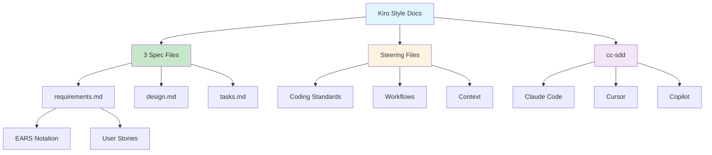

# [Kiro IDE Style Docs with Claude - Reddit](/blog/kiro-ide-style-docs-with-claude---reddit)

> [!compass] **[MyMess](/blog/moc---projeto-mymess)** » [Estudos](/blog/dashboard---estudos-mymess) » Engenharia de Contexto

---

> [!info]+ Detalhes do Artigo
> **Ler:** [Guide: How to Use Kiro IDE Style Docs with Claude](https://www.reddit.com/r/ClaudeAI/comments/1m5f1n4/guide_how_to_use_kiro_ide_style_docs_with/)
> **Fonte:** [Reddit](/blog/reddit) (r/ClaudeAI - Guia)
> **Autores:** Comunidade Reddit
> **Publicado:** Julho 2025

> [!abstract]+ Materiais Complementares
>
> **3 Arquivos de Especificação Kiro**
> 1. requirements.md - User stories + acceptance criteria (EARS)
> 2. design.md - Arquitetura técnica + componentes
> 3. tasks.md - Checklist de tarefas de implementação
>
> **Ferramentas Relacionadas**
> - cc-sdd (Kiro-style para outros tools)
> - Claude Sonnet 4.0/4.5
> - Steering files para configuração

> [!tip]- Léxico
>
> **Ferramentas e Recursos**
> - **EARS Notation**: Easy Approach to Requirements Syntax para critérios de aceitação
> - **Steering Files**: Arquivos de configuração para agentes (padrões, workflows, ferramentas)
>
> **Conceitos Fundamentais**
> - **Spec-Driven Development**: Metodologia requirements → design → tasks
>
> **Tecnologia e IA**
> - **cc-sdd**: Comandos Kiro-style para Claude Code, Cursor, Copilot, etc.
> [!question]- Pontos para Aprofundar (Sugestão da IA)
>
> - **Como implementar EARS notation em projetos?**
>     - Estudar formato Easy Approach to Requirements Syntax
> - **Como criar steering files efetivos?**
>     - Explorar padrões de coding, workflows preferidos
> - **cc-sdd funciona bem com Claude Code?**
>     - Testar implementação em projeto real

> [!robot]- Sugestões Complementares
>
> - **Leituras Recomendadas:**
>     - Documentação Kiro oficial (kiro.dev)
>     - Repositório cc-sdd (GitHub)
> - **Ferramentas Úteis:**
>     - **Kiro IDE** - Spec-driven nativo
>     - **cc-sdd** - Kiro-style para outros tools
>     - **Claude Code** - Com Claude.md files
> - **Exercícios Práticos:**
>     - Criar requirements.md com EARS notation
>     - Configurar steering files em projeto existente

---

## Resumo

Guia da comunidade r/ClaudeAI sobre como usar **Kiro IDE Style Docs com Claude**. Apresenta a metodologia **Spec-Driven Development** que usa 3 arquivos de especificação (requirements.md, design.md, tasks.md) como "single source of truth". Destaca **EARS notation** para critérios de aceitação e **steering files** para configurar agentes. Projeto **cc-sdd** permite usar comandos Kiro-style em Claude Code, Cursor, Copilot e outros.

**Insight central:** "Kiro's bet is that enforcing process upfront prevents the technical debt that typically accumulates from rapid AI-assisted development."

---

## Principais Conceitos

### Spec-Driven Development - 3 Arquivos

A tabela abaixo resume as informações principais.

| Arquivo | Função | Conteúdo |
|:--------|:-------|:---------|
| **requirements.md** | O que construir | User stories + acceptance criteria (EARS) |
| **design.md** | Como construir | Arquitetura, componentes, data models, interfaces |
| **tasks.md** | Passos de implementação | Checklist de tarefas sequenciadas por dependência |

### Kiro vs Claude Code

A tabela a seguir detalha os campos e seus valores.

| Aspecto | Kiro | Claude Code |
|:--------|:-----|:------------|
| **Integração** | IDE-integrated | Terminal-native |
| **Workflow** | Estruturado (req→design→tasks) | Flexível, conversacional |
| **Contexto** | Steering docs + spec sync | Claude.md + filesystem search |
| **Filosofia** | Processo upfront evita débito | Capacidade máxima, cerimônia mínima |

---

## Detalhamento

### EARS Notation (Easy Approach to Requirements Syntax)

Formato para escrever critérios de aceitação claros:

```
EARS Format:
"When [trigger], the system shall [action]"
"If [condition], then [response]"
"The [system] shall [capability]"
```

### Steering Files

Arquivos de configuração para personalizar comportamento dos agentes:

| Configuração | Descrição |
|:-------------|:----------|
| **Coding standards** | Padrões de código do projeto |
| **Preferred workflows** | Fluxos de trabalho preferidos |
| **Tools** | Ferramentas e integrações |
| **Context** | Contexto adicional do projeto |

### cc-sdd - Kiro-Style para Outros Tools

Projeto open-source que leva comandos Kiro-style para múltiplas ferramentas:

**Ferramentas suportadas:**
- Claude Code
- Codex
- Cursor
- GitHub Copilot
- Gemini CLI
- Windsurf

**Workflow enforced:**
```
Requirements → Design → Tasks → Implementation
```

### Modelos Disponíveis no Kiro

Os dados abaixo mostram a estrutura e configurações.

| Modelo | Uso |
|:-------|:----|
| **Claude Sonnet 4.5** | Coding avançado + reasoning |
| **Auto** | Mix de modelos (Sonnet 4.5 + especializados) para balancear qualidade/latência/custo |
| **Claude Sonnet 4.0** | Opção durante preview |

---

## Mapa de Conceitos

O diagrama abaixo ilustra o fluxo do processo, mostrando as etapas e suas conexões.



---

## Insights & Aprendizados

**O que funcionou bem:**
- Metodologia clara de 3 arquivos
- EARS notation para requisitos não-ambíguos
- cc-sdd para portabilidade entre tools
- Comparativo Kiro vs Claude Code

**O que posso adaptar para o MyMess:**
- **3 Spec Files**: Adaptar para briefings de clientes (requirements = briefing, design = estratégia, tasks = cronograma)
- **EARS notation**: Usar para critérios de sucesso de campanhas
- **Steering files**: Criar para cada tipo de projeto (marketing, social, etc.)
- **cc-sdd**: Testar com Claude Code para projetos de automação

**Ideias para aplicar:**
- Criar template de requirements.md para briefings de marketing
- Implementar steering files com padrões de copy e design
- Testar cc-sdd workflow em próximo projeto de automação
- Documentar processo spec-driven para equipe

---

## Recursos Adicionais

- [Reddit r/ClaudeAI - Guia Kiro Style](https://www.reddit.com/r/ClaudeAI/comments/1m5f1n4/guide_how_to_use_kiro_ide_style_docs_with/)
- [Kiro Official](https://kiro.dev/)
- [cc-sdd GitHub](https://github.com/gotalab/cc-sdd)
- [AWS re:Post - Kiro Agentic AI IDE](https://repost.aws/articles/AROjWKtr5RTjy6T2HbFJD_Mw/)

---

## Propriedades da nota

> [!note]- Propriedades Gerais do Obsidian
>
>> **Identificação**
>
> | Campo      | Valor                    |
> |:-----------|:-------------------------|
> | **Título** | `INPUT[text:titulo]`     |
>
>> **Conexões**
>
> | Campo           | Valor                                                                 |
> |:----------------|:----------------------------------------------------------------------|
> | **Pai**         | `INPUT[suggester(optionQuery("")):pai]`                               |
> | **Coleção**     | `INPUT[inlineSelect(option(financeiro, Financeiro), option(growth, Growth), option(ia, IA), option(lideranca, Liderança), option(marketing, Marketing), option(negocios, Negócios), option(produtividade, Produtividade), option(pkm, PKM), option(saas, SaaS), option(tecnologia, Tecnologia), option(vendas, Vendas)):colecao]` |
> | **Área**        | `INPUT[suggester(optionQuery("Esforços/Áreas")):area]`                         |
> | **Projeto**     | `INPUT[suggester(optionQuery("#projeto")):projeto]`                   |
> | **Autor**       | `INPUT[suggester(optionQuery("Atlas/Pessoas")):pessoa]`                      |
> | **Relacionado** | `INPUT[inlineListSuggester(optionQuery(""), useLinks(true)):relacionado]` |
>
>> **Classificação**
>
> | Campo      | Valor                                                                 |
> |:-----------|:----------------------------------------------------------------------|
> | **Tipo**   | `INPUT[inlineSelect(option(atomica, Atômica), option(aula, Aula), option(artigo, Artigo), option(checklist, Checklist), option(curso, Curso), option(dashboard, Dashboard), option(framework, Framework), option(livro, Livro), option(moc, MOC), option(newsletter, Newsletter), option(pessoa, Pessoa), option(prompt, Prompt), option(template, Template Obsidian), option(tutorial, Tutorial), option(video_youtube, Vídeo Youtube)):tipo_nota]` |
> | **Tags**   | `INPUT[inlineList:tags]`                                              |
> | **Status** | `INPUT[inlineSelect(option(nao_iniciado, ⬜ Não Iniciado), option(em_andamento, 🔄 Em Andamento), option(concluido, ✅ Concluído), option(pausado, ⏸️ Pausado), option(cancelado, ❌ Cancelado)):status]` |
>
>> **Temporal**
>
> | Campo          | Valor                      |
> |:---------------|:---------------------------|
> | **Criado**     | `INPUT[date:data_criado]`       |
> | **Atualizado** | `INPUT[date:data_atualizado]`   |

> [!note]- Propriedades SaaS
>
> | Campo             | Valor                                                              |
> |:------------------|:-------------------------------------------------------------------|
> | **Mostrar Bloco** | `INPUT[toggle(onValue(true), offValue(false)):mostrar_bloco_saas]` |
> | **Status SaaS**   | `INPUT[toggle(onValue(true), offValue(false)):status_saas]`        |

> [!note]- Propriedades do Artigo
>
> | Campo            | Valor                          |
> |:-----------------|:-------------------------------|
> | **URL**          | `INPUT[text(placeholder(https://...)):url_artigo]`  |
> | **Fonte**        | `INPUT[text:fonte]`  |
> | **Autor**        | `INPUT[text:autor]`  |
> | **Data Publicação** | `INPUT[date:data_publicacao]`  |
> | **Tipo Conteúdo** | `INPUT[inlineSelect(option(educacional, Educacional), option(curadoria, Curadoria), option(historia, História Pessoal), option(listicle, Lista), option(contrarian, Opinião Contrária), option(tutorial, Tutorial), option(entrevista, Entrevista), option(analise, Análise), option(estudo_de_caso, Estudo de Caso), option(lancamento, Lançamento), option(opiniao, Opinião), option(outro, Outro)):tipo_conteudo]`  |
> | **Categoria** | `INPUT[text:categoria]`  |

