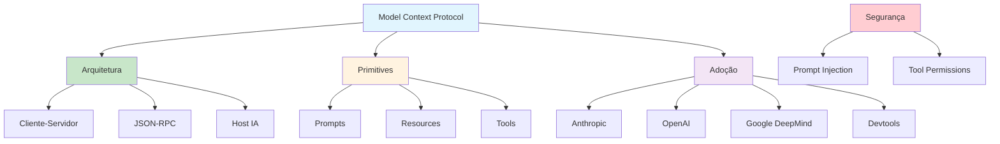

# [MCP Model Context Protocol - Obsidian Publish](/blog/mcp-model-context-protocol---obsidian-publish)

> [!compass] **[MyMess](/blog/moc---projeto-mymess)** » [Estudos](/blog/dashboard---estudos-mymess) » Engenharia de Contexto

---

> [!info]+ Detalhes do Artigo
> **Ler:** [MCP - Model Context Protocol](https://publish.obsidian.md/followtheidea/Content/AI/MCP+-+Model+Context+Protocol)
> **Fonte:** Obsidian Publish + Anthropic (Oficial)
> **Autores:** David Soria Parra, Justin Spahr-Summers (Anthropic)
> **Publicado:** Novembro 2024

> [!abstract]+ Materiais Complementares
>
> **3 Primitives do MCP**
> 1. Prompts - Instruções/templates preparados
> 2. Resources - Dados estruturados (documentos, snippets)
> 3. Tools - Funções executáveis pelo modelo
>
> **Adoção da Indústria**
> - OpenAI (Março 2025)
> - Google DeepMind (Abril 2025)
> - Block, Apollo, Zed, Replit, Sourcegraph

> [!tip]- Léxico
>
> **Ferramentas e Recursos**
> - **MCP**: Model Context Protocol - padrão aberto para conectar IA a ferramentas externas
> - **USB-C para IA**: Analogia - interface universal para sistemas de IA
>
> **Tecnologia e IA**
> - **JSON-RPC**: Protocolo leve de comunicação usado pelo MCP
> - **Primitives**: Tipos de mensagens (Prompts, Resources, Tools)
> [!question]- Pontos para Aprofundar (Sugestão da IA)
>
> - **Como criar um MCP Server personalizado?**
>     - Estudar SDKs disponíveis
> - **Quais são as vulnerabilidades de segurança?**
>     - Explorar prompt injection, tool permissions
> - **Como integrar MCP com Obsidian?**
>     - Testar obsidian-memory-mcp

> [!robot]- Sugestões Complementares
>
> - **Leituras Recomendadas:**
>     - Documentação oficial Anthropic
>     - Curso Introduction to MCP (Anthropic)
> - **Ferramentas Úteis:**
>     - **Claude Desktop** - Cliente MCP nativo
>     - **Desktop Extensions** - Instalação simplificada
>     - **MCP SDKs** - Múltiplas linguagens
> - **Exercícios Práticos:**
>     - Instalar MCP Server com desktop extension
>     - Criar servidor personalizado para vault Obsidian

---

## Resumo

Artigo sobre **Model Context Protocol (MCP)**, padrão aberto criado pela **Anthropic** em Novembro 2024 para conectar sistemas de IA a ferramentas e dados externos. Funciona como **"USB-C para aplicações de IA"** - interface universal padronizada. Usa arquitetura **cliente-servidor com JSON-RPC** e define 3 tipos de primitives (Prompts, Resources, Tools). Adotado por **OpenAI** (Março 2025) e **Google DeepMind** (Abril 2025) como padrão de-facto da indústria.

**Definição central:** "Think of MCP like a USB-C port for AI applications. Just as USB-C provides a standardized way to connect electronic devices, MCP provides a standardized way to connect AI applications to external systems."

---

## Principais Conceitos

### O que é MCP?

A tabela abaixo resume as informações principais.

| Aspecto | Descrição |
|:--------|:----------|
| **Tipo** | Padrão aberto (open-source) |
| **Criadores** | David Soria Parra, Justin Spahr-Summers (Anthropic) |
| **Lançamento** | Novembro 2024 |
| **Função** | Padronizar integração de IA com ferramentas/dados externos |
| **Comunicação** | JSON-RPC (remote procedure call) |

### 3 Primitives do MCP

A tabela a seguir detalha os campos e seus valores.

| Primitive | Função | Exemplo |
|:----------|:-------|:--------|
| **Prompts** | Instruções/templates preparados | Templates de análise, formatação |
| **Resources** | Dados estruturados | Documentos, snippets, schemas |
| **Tools** | Funções executáveis | Leitura de arquivos, chamadas API |

### Arquitetura Cliente-Servidor

```
User → AI Host → MCP Client → MCP Server → Data Source
                              ↓
                      JSON-RPC Communication
```

---

## Detalhamento

### Adoção da Indústria

Os dados abaixo mostram a estrutura e configurações.

| Empresa/Plataforma | Data | Status |
|:-------------------|:-----|:-------|
| **Anthropic** | Nov 2024 | Criador |
| **Block, Apollo** | 2024 | Early adopters |
| **Zed, Replit, Sourcegraph** | 2024-2025 | Integração em devtools |
| **OpenAI** | Março 2025 | ChatGPT desktop, Agents SDK |
| **Google DeepMind** | Abril 2025 | Gemini models |

### Casos de Uso

A tabela abaixo resume as informações principais.

| Caso | Descrição |
|:-----|:----------|
| **Assistente pessoal** | Acesso a Google Calendar + Notion |
| **Dev tools** | Claude Code gera app web a partir de design Figma |
| **Enterprise** | Chatbots conectam múltiplos databases |
| **3D Design** | IA cria designs no Blender e imprime em 3D |

### Instalação Simplificada

Com **Desktop Extensions** (introduzidas em 2025):
- Single-click install
- Não precisa configurar JSON manualmente
- Não precisa gerenciar dependências

### Considerações de Segurança

> [!warning] Vulnerabilidades Identificadas (Abril 2025)
> - **Prompt injection**: Contexto malicioso pode manipular IA
> - **Tool permissions**: Combinação de tools pode exfiltrar arquivos
> - **Lookalike tools**: Ferramentas falsas podem substituir legítimas

---

## Mapa de Conceitos

O diagrama abaixo ilustra o fluxo do processo, mostrando as etapas e suas conexões.



---

## Insights & Aprendizados

**O que funcionou bem:**
- Analogia USB-C clara e memorável
- Primitives bem definidos (Prompts, Resources, Tools)
- Adoção massiva da indústria
- Desktop Extensions simplificam instalação

**O que posso adaptar para o MyMess:**
- **MCP Servers**: Criar servidor para conectar agentes a bases de conhecimento
- **Resources**: Expor briefings de clientes como resources estruturados
- **Tools**: Criar ferramentas customizadas para workflows de marketing
- **Segurança**: Implementar validação de contexto (anti-injection)

**Ideias para aplicar:**
- Implementar obsidian-memory-mcp para base de conhecimento
- Criar MCP Server para integrar CRM com agentes
- Desenvolver tools personalizados para automação de campanhas
- Testar desktop extensions para instalação simplificada

---

## Recursos Adicionais

- [Anthropic - Introducing MCP](https://www.anthropic.com/news/model-context-protocol)
- [MCP Documentation](https://docs.anthropic.com/en/docs/mcp)
- [MCP GitHub](https://github.com/modelcontextprotocol)
- [Anthropic Courses - Introduction to MCP](https://anthropic.skilljar.com/introduction-to-model-context-protocol)
- [Getting Started Guide](https://support.anthropic.com/en/articles/10949351-getting-started-with-model-context-protocol-mcp-on-claude-for-desktop)

---

## Propriedades da nota

> [!note]- Propriedades Gerais do Obsidian
>
>> **Identificação**
>
> | Campo      | Valor                    |
> |:-----------|:-------------------------|
> | **Título** | `INPUT[text:titulo]`     |
>
>> **Conexões**
>
> | Campo           | Valor                                                                 |
> |:----------------|:----------------------------------------------------------------------|
> | **Pai**         | `INPUT[suggester(optionQuery("")):pai]`                               |
> | **Coleção**     | `INPUT[inlineSelect(option(financeiro, Financeiro), option(growth, Growth), option(ia, IA), option(lideranca, Liderança), option(marketing, Marketing), option(negocios, Negócios), option(produtividade, Produtividade), option(pkm, PKM), option(saas, SaaS), option(tecnologia, Tecnologia), option(vendas, Vendas)):colecao]` |
> | **Área**        | `INPUT[suggester(optionQuery("Esforços/Áreas")):area]`                         |
> | **Projeto**     | `INPUT[suggester(optionQuery("#projeto")):projeto]`                   |
> | **Autor**       | `INPUT[suggester(optionQuery("Atlas/Pessoas")):pessoa]`                      |
> | **Relacionado** | `INPUT[inlineListSuggester(optionQuery(""), useLinks(true)):relacionado]` |
>
>> **Classificação**
>
> | Campo      | Valor                                                                 |
> |:-----------|:----------------------------------------------------------------------|
> | **Tipo**   | `INPUT[inlineSelect(option(atomica, Atômica), option(aula, Aula), option(artigo, Artigo), option(checklist, Checklist), option(curso, Curso), option(dashboard, Dashboard), option(framework, Framework), option(livro, Livro), option(moc, MOC), option(newsletter, Newsletter), option(pessoa, Pessoa), option(prompt, Prompt), option(template, Template Obsidian), option(tutorial, Tutorial), option(video_youtube, Vídeo Youtube)):tipo_nota]` |
> | **Tags**   | `INPUT[inlineList:tags]`                                              |
> | **Status** | `INPUT[inlineSelect(option(nao_iniciado, ⬜ Não Iniciado), option(em_andamento, 🔄 Em Andamento), option(concluido, ✅ Concluído), option(pausado, ⏸️ Pausado), option(cancelado, ❌ Cancelado)):status]` |
>
>> **Temporal**
>
> | Campo          | Valor                      |
> |:---------------|:---------------------------|
> | **Criado**     | `INPUT[date:data_criado]`       |
> | **Atualizado** | `INPUT[date:data_atualizado]`   |

> [!note]- Propriedades SaaS
>
> | Campo             | Valor                                                              |
> |:------------------|:-------------------------------------------------------------------|
> | **Mostrar Bloco** | `INPUT[toggle(onValue(true), offValue(false)):mostrar_bloco_saas]` |
> | **Status SaaS**   | `INPUT[toggle(onValue(true), offValue(false)):status_saas]`        |

> [!note]- Propriedades do Artigo
>
> | Campo            | Valor                          |
> |:-----------------|:-------------------------------|
> | **URL**          | `INPUT[text(placeholder(https://...)):url_artigo]`  |
> | **Fonte**        | `INPUT[text:fonte]`  |
> | **Autor**        | `INPUT[text:autor]`  |
> | **Data Publicação** | `INPUT[date:data_publicacao]`  |
> | **Tipo Conteúdo** | `INPUT[inlineSelect(option(educacional, Educacional), option(curadoria, Curadoria), option(historia, História Pessoal), option(listicle, Lista), option(contrarian, Opinião Contrária), option(tutorial, Tutorial), option(entrevista, Entrevista), option(analise, Análise), option(estudo_de_caso, Estudo de Caso), option(lancamento, Lançamento), option(opiniao, Opinião), option(outro, Outro)):tipo_conteudo]`  |

