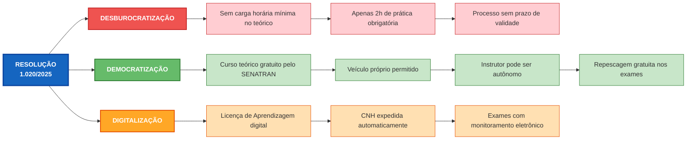

# [Mudanças na Habilitação 2025 - Resolução CONTRAN 1.020](/blog/mudanas-na-habilitao-2025---resoluo-contran-1020)

> [!compass] **[MyMess](/blog/moc---projeto-mymess)** » [Estudos](/blog/dashboard---estudos-mymess) » Negócios

---

> [!info]+ Detalhes do Artigo **Ler:**
> [Resolução CONTRAN nº 1.020/2025](https://www.in.gov.br/web/dou/-/resolucao-contran-n-1.020-de-1-de-dezembro-de-2025-674131330) **Fonte:** [Diário Oficial da União](/blog/dirio-oficial-da-unio) (Oficial - Governo) **Autores:** Conselho Nacional de Trânsito - CONTRAN **Publicado:** 09/12/2025

> [!abstract]+ Materiais Complementares
>
> **Documentação Oficial**
>
> - [Resolução CONTRAN nº 1.020/2025 - PDF Completo (DETRAN RS)](https://www.detran.rs.gov.br/upload/arquivos/202512/09223649-resolucao-do-contran-n-1-02025.pdf) - Texto integral da resolução
> - [Código de Trânsito Brasileiro - Lei 9.503/1997](http://www.planalto.gov.br/ccivil_03/leis/l9503compilado.htm) - Base legal referenciada
> - [Convenção de Viena sobre Trânsito Viário 1968](http://www.planalto.gov.br/ccivil_03/decreto/d86714.htm) - Acordo internacional citado
>
> **Resoluções Revogadas**
>
> - Resolução 789/2020 - Regulamentação anterior de habilitação
> - Resolução 928/2022 - Cursos de formação
> - Resolução 930/2022 - Exames de direção

> [!tip]- Léxico
> 
> - **Renach**: Registro Nacional de Carteiras de Habilitação - sistema centralizado de dados
> - **BINCO**: Base Índice Nacional de Condutores - gera número único do condutor
> - **Licença de Aprendizagem**: Documento digital que autoriza aulas práticas em vias públicas
> - **EaD Síncrono**: Ensino a distância em tempo real (videoaula ao vivo)
> - **EaD Assíncrono**: Ensino a distância sem tempo definido (aulas gravadas)
> - **Permissão para Dirigir**: Documento provisório válido por 1 ano antes da CNH definitiva

> [!question]- Pontos para Aprofundar (Sugestão da IA)
> 
> - **Como o SENATRAN vai operacionalizar o curso teórico gratuito?**
>     - Verificar plataforma, conteúdo e processo de certificação
> - **Qual será o impacto real na taxa de aprovação com apenas 2h de prática?**
>     - Monitorar dados de aprovação nos primeiros meses de vigência
> - **Como autoescolas podem comprovar taxa de aprovação para diferenciação?**
>     - Buscar métricas oficiais disponibilizadas pelos Detrans

> [!robot]- Sugestões Complementares
> 
> - **Leituras Recomendadas:**
>     - "Manual Brasileiro de Exames de Direção Veicular" - quando publicado pelo SENATRAN
>     - Banco Nacional de Questões - disponível nos canais do SENATRAN
> - **Ferramentas Úteis:**
>     - **Simuladores de prova teórica** - preparação para exame oficial
>     - **Plataformas EaD homologadas** - lista a ser divulgada pelo SENATRAN
> - **Ações Práticas:**
>     - **Mapear concorrência local** - quem já está se adaptando
>     - **Levantar taxa de aprovação histórica** - construir prova social

---

## Resumo

Resolução que moderniza e desburocratiza todo o processo de habilitação no Brasil. Elimina carga horária mínima obrigatória no curso teórico, reduz aulas práticas de 20h para 2h, permite curso teórico gratuito pelo governo e autoriza uso de veículo próprio. Representa mudança radical no modelo de negócio das autoescolas.

**Definição central:**

- **Objetivo** = Modelo mais acessível, flexível, desburocratizado e orientado à segurança viária
- **Problema resolvido** = Processo de habilitação caro, burocrático e pouco eficiente

---

## Principais Conceitos

### Conceito 1: Fim da Carga Horária Obrigatória no Teórico

O candidato não precisa mais cumprir horas mínimas de curso teórico. A conclusão é definida por:

| Modelo Antigo                 | Modelo Novo                         |
| :---------------------------- | :---------------------------------- |
| 45 horas obrigatórias         | Sem carga mínima                    |
| Controle de frequência rígido | Controle por interação/avaliação    |
| Autoescola obrigatória        | Múltiplas opções incluindo gratuita |

### Conceito 2: Redução Drástica da Prática

> "O curso de aulas práticas de direção veicular deverá observar carga horária mínima de duas horas"

De 20-25 horas obrigatórias para apenas 2 horas. O instrutor orienta conforme perfil do aluno, focando nas habilidades necessárias para aprovação no exame.

### Conceito 3: Democratização do Acesso

1. **Curso teórico gratuito:** SENATRAN oferece EaD assíncrono sem custo
2. **Veículo próprio:** Candidato pode usar seu carro nas aulas e no exame
3. **Instrutor autônomo:** Profissional não precisa vínculo com autoescola
4. **Repescagem gratuita:** Segunda tentativa nos exames sem taxa adicional

---

## Detalhamento

### Seção 1: Estrutura do Novo Processo

**Etapas obrigatórias:**

1. Requerimento (digital ou presencial)
2. Curso teórico (livre escolha)
3. Abertura Renach + biometria
4. Avaliação psicológica
5. Exame aptidão física/mental
7. Aulas práticas (mín. 2h)
8. Exame de direção
9. Permissão para Dirigir (1 ano)
10. CNH definitiva (automática)

**Destaques:**

- Processo permanece aberto por tempo indeterminado
- Transferência entre estados preserva etapas concluídas
- Documentos expedidos automaticamente em formato digital

### Seção 2: Sistema de Avaliação no Exame Prático

**Novo modelo de pontuação:**

- Candidato inicia com zero pontos
- Cada infração soma pontos multiplicados por peso
- Aprovação: até 10 pontos

|Natureza|Peso|
|:--|:--|
|Leve|1|
|Média|2|
|Grave|4|
|Gravíssima|6|

> [!warning] Atenção Segunda tentativa no mesmo dia é permitida se houver disponibilidade operacional.

### Seção 3: Cursos Especializados Mantêm Estrutura

> [!quote] Oportunidade Preservada "O curso especializado prático de direção veicular deverá observar carga horária mínima de dez horas"

Categorias C, D, E e cursos especializados (transporte de passageiros, escolares, carga perigosa) mantêm exigências mais robustas.

---

## Impacto para Autoescolas

> [!danger] Resumo Brutal
>
> |Antes|Agora|
> |:--|:--|
> |Autoescola era **obrigatória**|Autoescola é **opcional** no teórico e quase opcional na prática|
> |Receita por **volume de horas**|Receita por **valor percebido e resultado**|
> |Mercado **protegido**|Mercado **aberto e competitivo**|

### O que REDUZ para a Autoescola

|Item|Antes|Agora|Impacto|
|:--|:--|:--|:--|
|Carga horária prática|20-25h|**2h mínimas**|Crítico|
|Curso teórico|Obrigatório pago|Gratuito pelo SENATRAN|Crítico|
|Veículo|Da autoescola|Pode ser do candidato|Alto|
|Instrutor|Vinculado à autoescola|Pode ser autônomo|Médio|
|Controle de frequência|Rígido (45h)|Sem carga mínima|Alto|

### O que IMPACTA Negativamente

> [!warning] Ameaças Diretas
>

### O que ABRE de Oportunidade

> [!success] Mercados Preservados e Novos
>

---

## Estratégia de Reposicionamento - Autoescola Jotta

> [!danger] Diagnóstico
> O modelo antigo (vender horas obrigatórias) **morreu**. O novo jogo é vender **aprovação** e **conveniência**.

### 3 Frentes de Ação

#### 1. Reposicionar o Core

| Antes                | Agora                           |
| :------------------- | :------------------------------ |
| "Faça suas 45h aqui" | "Passe de primeira com a Jotta" |

**Ações:**
- [ ] Divulgar **taxa de aprovação** como principal argumento de venda

#### 2. Capturar Novos Mercados

> [!success] Cursos Especializados (C, D, E)
> - **Público:** motoristas de app, caminhoneiros, entregadores

> [!success] Reciclagem de Infratores
> - Criar funil de captação com **tráfego pago local**

> [!success] Parcerias com Escolas
> - Programa do governo permite teórico como atividade extracurricular
> - Posicionar Jotta como **parceira educacional**

#### 3. Modelo de Receita Híbrido

|Produto|Ticket|Margem|Papel|
|:--|:--|:--|:--|
|Pacote mínimo (2h + apoio)|Baixo|Baixa|Entrada|
|Pacote aprovação garantida|Médio|Média|**Core**|
|Cursos especializados|Alto|Alta|Premium|
|Reciclagem|Médio|Média|Recorrente|
|Formação de instrutores|Alto|Alta|Novo mercado|

### Ação Imediata

> [!todo] Próximos Passos
> - [ ] **Mapear demanda de cursos especializados** na região
> - [ ] **Prospectar escolas** para parceria no programa de educação para trânsito

---

## Mapa de Conceitos

---

## Insights & Aprendizados

**O que muda radicalmente:**

- **Modelo de negócio:** De venda de horas para venda de resultado/aprovação
- **Competição:** Autoescola concorre com curso gratuito do governo
- **Valor percebido:** Taxa de aprovação vira principal argumento de venda

**O que a Autoescola Jotta pode fazer:**

- **Imediato:** Levantar taxa de aprovação histórica como prova social
- **Curto prazo:** Criar pacote "Aprovação Garantida" com reforço gratuito se reprovar
- **Médio prazo:** Expandir cursos especializados (C, D, E) e reciclagem
- **Longo prazo:** Parcerias com escolas no Programa de Educação para Trânsito

**Ações concretas:**

- Landing page focada em taxa de aprovação
- Funil de captação para reciclagem (tráfego pago local)
- Mapeamento de demanda de cursos especializados na região
- Prospecção ativa em escolas de ensino médio

---

## Linha do Tempo

|Data|Evento|
|:--|:--|
|01/12/2025|Assinatura da Resolução|
|09/12/2025|Publicação no DOU|
|09/12/2025|**Vigência imediata**|
|A definir|Publicação do Manual de Exames de Direção|
|A definir|Disponibilização do curso gratuito SENATRAN|

---

## Propriedades da nota

> [!note]- Propriedades Gerais do Obsidian
> 
> > **Identificação**
> 
> |Campo|Valor|
> |:--|:--|
> |**Título**|`INPUT[text:titulo]`|
> 
> > **Conexões**
> 
> |Campo|Valor|
> |:--|:--|
> |**Pai**|`INPUT[suggester(optionQuery("")):pai]`|
> |**Coleção**|`INPUT[inlineSelect(option(financeiro, Financeiro), option(growth, Growth), option(ia, IA), option(lideranca, Liderança), option(marketing, Marketing), option(negocios, Negócios), option(produtividade, Produtividade), option(pkm, PKM), option(saas, SaaS), option(tecnologia, Tecnologia), option(vendas, Vendas)):colecao]`|
> |**Área**|`INPUT[suggester(optionQuery("Esforços/Áreas")):area]`|
> |**Projeto**|`INPUT[suggester(optionQuery("#projeto")):projeto]`|
> |**Autor**|`INPUT[suggester(optionQuery("Atlas/Pessoas")):pessoa]`|
> |**Relacionado**|`INPUT[inlineListSuggester(optionQuery(""), useLinks(true)):relacionado]`|
> 
> > **Classificação**
> 
> |Campo|Valor|
> |:--|:--|
> |**Tipo**|`INPUT[inlineSelect(option(atomica, Atômica), option(aula, Aula), option(artigo, Artigo), option(checklist, Checklist), option(curso, Curso), option(dashboard, Dashboard), option(framework, Framework), option(livro, Livro), option(moc, MOC), option(newsletter, Newsletter), option(pessoa, Pessoa), option(prompt, Prompt), option(template, Template Obsidian), option(tutorial, Tutorial), option(video_youtube, Vídeo Youtube)):tipo_nota]`|
> |**Tags**|`INPUT[inlineList:tags]`|
> |**Status**|`INPUT[inlineSelect(option(nao_iniciado, ⬜ Não Iniciado), option(em_andamento, 🔄 Em Andamento), option(concluido, ✅ Concluído), option(pausado, ⏸️ Pausado), option(cancelado, ❌ Cancelado)):status]`|
> 
> > **Temporal**
> 
> |Campo|Valor|
> |:--|:--|
> |**Criado**|`INPUT[date:data_criado]`|
> |**Atualizado**|`INPUT[date:data_atualizado]`|
> 
> > **Visual**
> 
> |Campo|Valor|
> |:--|:--|
> |**Visual da Nota**|`INPUT[inlineSelect(option(normal, Normal), option(wide-page, Wide Page), option(dashboard, Dashboard)):cssclasses]`|
> |**Modo Leitura**|`INPUT[toggle(onValue(preview), offValue(source)):obsidianUIMode]`|
> |**Imagem Destaque**|`INPUT[text:imagem_destaque]`|
> 
> > **Compartilhar link**
> 
> |Campo|Valor|
> |:--|:--|
> |**Share Link**|`INPUT[text(placeholder(https://...)):share_link]`|
> |**Share Upd.**|`INPUT[text:share_updated]`|

> [!note]- Propriedades SaaS
> 
> |Campo|Valor|
> |:--|:--|
> |**Mostrar Bloco**|`INPUT[toggle(onValue(true), offValue(false)):mostrar_bloco_saas]`|
> |**Status SaaS**|`INPUT[toggle(onValue(true), offValue(false)):status_saas]`|

> [!note]- Propriedades do Artigo
> 
> |Campo|Valor|
> |:--|:--|
> |**URL**|`INPUT[text(placeholder(https://...)):url_artigo]`|
> |**Fonte**|`INPUT[text:fonte]`|
> |**Autor**|`INPUT[text:autor]`|
> |**Data Publicação**|`INPUT[date:data_publicacao]`|
> |**Tipo Conteúdo**|`INPUT[inlineSelect(option(educacional, Educacional), option(curadoria, Curadoria), option(historia, História Pessoal), option(listicle, Lista), option(contrarian, Opinião Contrária), option(tutorial, Tutorial), option(entrevista, Entrevista), option(analise, Análise), option(estudo_de_caso, Estudo de Caso), option(lancamento, Lançamento), option(opiniao, Opinião), option(outro, Outro)):tipo_conteudo]`|

---

<- [Dashboard](/blog/mudancas-na-habilitacao-2025---resolucao-contran-1020) ->

