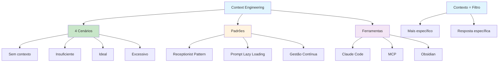

# [Newsletter 197 Context Engineering - DeveloPassion](/blog/newsletter-197-context-engineering---developassion)

> [!compass] **[MyMess](/blog/moc---projeto-mymess)** » [Estudos](/blog/dashboard---estudos-mymess) » Engenharia de Contexto

---

> [!info]+ Detalhes do Artigo
> **Ler:** [DeveloPassion's Newsletter 197 - Context Engineering](https://www.dsebastien.net/developassions-newsletter-197-context-engineering/)
> **Fonte:** DeveloPassion Newsletter (Edição 197)
> **Autores:** Sébastien Dubois
> **Publicado:** 04 de Julho de 2025

> [!abstract]+ Materiais Complementares
>
> **4 Cenários de Contexto**
> 1. Sem contexto → respostas genéricas
> 2. Contexto insuficiente → respostas vagas
> 3. Contexto ideal → respostas específicas
> 4. Excesso de contexto → alucinações
>
> **Padrões e Técnicas**
> - Receptionist AI Design Pattern
> - Prompt Lazy Loading (PLL)
> - Abordagem modular com múltiplos agentes

> [!tip]- Léxico
>
> **Conteúdo e Criação**
> - **Context as Filter**: "Quanto mais específico o contexto, mais específica a resposta"
> - **Gestão contextual contínua**: Contexto mantido durante toda interação, não só no prompt inicial
>
> **Tecnologia e IA**
> - **Receptionist Pattern**: Estrutura para gerenciar múltiplos agentes especializados
> - **Prompt Lazy Loading (PLL)**: Carregamento contextual sob demanda
> [!question]- Pontos para Aprofundar (Sugestão da IA)
>
> - **Como implementar Receptionist Pattern?**
>     - Estudar arquitetura de múltiplos agentes
> - **Qual o ponto de "excesso de contexto"?**
>     - Testar thresholds para diferentes tarefas
> - **Como aplicar PLL em produção?**
>     - Explorar carregamento dinâmico

> [!robot]- Sugestões Complementares
>
> - **Leituras Recomendadas:**
>     - Simon Willison - Context Engineering
>     - Phil Schmid - Context Engineering
>     - Drew Breunig - Context failures
> - **Ferramentas Úteis:**
>     - **Claude Code** - Implementação prática
>     - **MCP** - Integração de contexto
>     - **LM Studio** - Suporte a MCP
> - **Exercícios Práticos:**
>     - Implementar agente com Receptionist Pattern
>     - Testar diferentes níveis de contexto

---

## Resumo

Newsletter 197 de **Sébastien Dubois** (DeveloPassion) sobre Context Engineering. Define CE como "projetar e gerenciar não apenas prompts e sua estrutura, mas todo o contexto que incluem". Apresenta **4 cenários de contexto** e a analogia de **contexto como filtro/funil**. Destaca padrões como **Receptionist AI Pattern** e **Prompt Lazy Loading (PLL)**. Compara gestão de contexto com instruir um colega junior - excesso causa confusão.

**Definição central:** "Context engineering is about carefully designing and managing not just your prompts and their structure, but the entire context that they include."

---

## Principais Conceitos

### 4 Cenários de Contexto

A tabela abaixo resume as informações principais.

| Cenário | Contexto | Resultado |
|:--------|:---------|:----------|
| 1 | **Nenhum** | Respostas genéricas |
| 2 | **Insuficiente** | Respostas vagas |
| 3 | **Ideal** | Respostas específicas e relevantes |
| 4 | **Excessivo** | Alucinações de IA |

### Contexto como Filtro

> [!quote] Analogia
> "Context can be considered as a filter or funnel. The more specific the context, the more specific the answer."

### Distinção Importante

A tabela a seguir detalha os campos e seus valores.

| Prompting | Context Engineering |
|:----------|:--------------------|
| O que perguntar | O que o modelo **sabe** quando você pergunta |
| Foco na instrução | Foco no **ambiente completo** |
| Artefato único | **Ciclo de vida completo** |

---

## Detalhamento

### Padrões e Técnicas

#### 1. Receptionist AI Design Pattern

Estrutura para gerenciar múltiplos agentes:
- Um "recepcionista" coordena
- Agentes especializados executam tarefas
- Evita "sobrecarga mental" da IA

#### 2. Prompt Lazy Loading (PLL)

Carregamento contextual sob demanda:
- Não carregar todo contexto de uma vez
- Adicionar informação conforme necessário
- Similar a lazy loading em programação

#### 3. Gestão Contextual Contínua

> [!info] Princípio
> Contexto deve ser mantido durante **toda a interação**, não apenas no prompt inicial.

### Analogia Humana

> [!tip] Insight
> Similar a instruir um colega junior - contexto excessivo causa confusão, contexto insuficiente gera trabalho genérico.

### Referências Citadas

Os dados abaixo mostram a estrutura e configurações.

| Autor | Tópico |
|:------|:-------|
| **Simon Willison** | Context Engineering conceitual |
| **Phil Schmid** | Context Engineering técnico |
| **Drew Breunig** | Falhas e correções de contexto |
| **Andrej Karpathy** | Futuro do desenvolvimento com IA |

### Ferramentas e Plataformas Mencionadas

A tabela abaixo resume as informações principais.

| Ferramenta | Função |
|:-----------|:-------|
| **Claude Code** | Implementação prática de CE |
| **MCP** | Protocolo de contexto |
| **LM Studio** | Suporte a MCP |
| **Obsidian** | Knowledge management |
| **ElevenLabs** | Voice AI |

---

## Mapa de Conceitos

O diagrama abaixo ilustra o fluxo do processo, mostrando as etapas e suas conexões.

---

## Insights & Aprendizados

**O que funcionou bem:**
- 4 cenários claros e memoráveis
- Analogia filtro/funil didática
- Conexão com princípios de arquitetura de software
- Referências a autores importantes

**O que posso adaptar para o MyMess:**
- **4 Cenários**: Usar como checklist para avaliar briefings
- **Receptionist Pattern**: Implementar agente coordenador + especializados
- **PLL**: Carregar contexto de cliente sob demanda
- **Analogia junior**: Usar para explicar CE a clientes

**Ideias para aplicar:**
- Criar checklist "nível de contexto" para cada projeto
- Implementar agente receptionist para coordenar workflow
- Desenvolver sistema de lazy loading para briefings longos
- Documentar "ponto ideal" de contexto para cada tipo de tarefa

---

## Recursos Adicionais

- [DeveloPassion Newsletter 197](https://www.dsebastien.net/developassions-newsletter-197-context-engineering/)
- [Simon Willison - Context Engineering](https://simonwillison.net/2025/Jun/27/context-engineering)
- [Phil Schmid - Context Engineering](https://philschmid.de/context-engineering)
- [OpenAI Cookbook](https://cookbook.openai.com)
- [Knowii Community](https://knowii.community/)

---

## Propriedades da nota

> [!note]- Propriedades Gerais do Obsidian
>
>> **Identificação**
>
> | Campo      | Valor                    |
> |:-----------|:-------------------------|
> | **Título** | `INPUT[text:titulo]`     |
>
>> **Conexões**
>
> | Campo           | Valor                                                                 |
> |:----------------|:----------------------------------------------------------------------|
> | **Pai**         | `INPUT[suggester(optionQuery("")):pai]`                               |
> | **Coleção**     | `INPUT[inlineSelect(option(financeiro, Financeiro), option(growth, Growth), option(ia, IA), option(lideranca, Liderança), option(marketing, Marketing), option(negocios, Negócios), option(produtividade, Produtividade), option(pkm, PKM), option(saas, SaaS), option(tecnologia, Tecnologia), option(vendas, Vendas)):colecao]` |
> | **Área**        | `INPUT[suggester(optionQuery("Esforços/Áreas")):area]`                         |
> | **Projeto**     | `INPUT[suggester(optionQuery("#projeto")):projeto]`                   |
> | **Autor**       | `INPUT[suggester(optionQuery("Atlas/Pessoas")):pessoa]`                      |
> | **Relacionado** | `INPUT[inlineListSuggester(optionQuery(""), useLinks(true)):relacionado]` |
>
>> **Classificação**
>
> | Campo      | Valor                                                                 |
> |:-----------|:----------------------------------------------------------------------|
> | **Tipo**   | `INPUT[inlineSelect(option(atomica, Atômica), option(aula, Aula), option(artigo, Artigo), option(checklist, Checklist), option(curso, Curso), option(dashboard, Dashboard), option(framework, Framework), option(livro, Livro), option(moc, MOC), option(newsletter, Newsletter), option(pessoa, Pessoa), option(prompt, Prompt), option(template, Template Obsidian), option(tutorial, Tutorial), option(video_youtube, Vídeo Youtube)):tipo_nota]` |
> | **Tags**   | `INPUT[inlineList:tags]`                                              |
> | **Status** | `INPUT[inlineSelect(option(nao_iniciado, ⬜ Não Iniciado), option(em_andamento, 🔄 Em Andamento), option(concluido, ✅ Concluído), option(pausado, ⏸️ Pausado), option(cancelado, ❌ Cancelado)):status]` |
>
>> **Temporal**
>
> | Campo          | Valor                      |
> |:---------------|:---------------------------|
> | **Criado**     | `INPUT[date:data_criado]`       |
> | **Atualizado** | `INPUT[date:data_atualizado]`   |

> [!note]- Propriedades SaaS
>
> | Campo             | Valor                                                              |
> |:------------------|:-------------------------------------------------------------------|
> | **Mostrar Bloco** | `INPUT[toggle(onValue(true), offValue(false)):mostrar_bloco_saas]` |
> | **Status SaaS**   | `INPUT[toggle(onValue(true), offValue(false)):status_saas]`        |

> [!note]- Propriedades do Artigo
>
> | Campo            | Valor                          |
> |:-----------------|:-------------------------------|
> | **URL**          | `INPUT[text(placeholder(https://...)):url_artigo]`  |
> | **Fonte**        | `INPUT[text:fonte]`  |
> | **Autor**        | `INPUT[text:autor]`  |
> | **Data Publicação** | `INPUT[date:data_publicacao]`  |
> | **Tipo Conteúdo** | `INPUT[inlineSelect(option(educacional, Educacional), option(curadoria, Curadoria), option(historia, História Pessoal), option(listicle, Lista), option(contrarian, Opinião Contrária), option(tutorial, Tutorial), option(entrevista, Entrevista), option(analise, Análise), option(estudo_de_caso, Estudo de Caso), option(lancamento, Lançamento), option(opiniao, Opinião), option(outro, Outro)):tipo_conteudo]`  |

