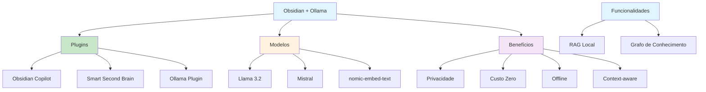

# [Obsidian and Ollama Free Local AI PKM - YouTube](/blog/obsidian-and-ollama-free-local-ai-pkm---youtube)

> [!compass] **[MyMess](/blog/moc---projeto-mymess)** » [Estudos](/blog/dashboard---estudos-mymess) » Engenharia de Contexto

---

> [!info]+ Detalhes do Artigo
> **Ler:** [Obsidian and Ollama - Free Local AI Powered PKM](https://www.youtube.com/watch?v=0KttkhL7-b4)
> **Fonte:** YouTube (Vídeo Tutorial)
> **Autores:** Diversos criadores
> **Publicado:** 2025

> [!abstract]+ Materiais Complementares
>
> **Plugins Obsidian para Ollama**
> 1. Obsidian Copilot - Assistente IA versátil
> 2. Smart Second Brain - Integração com grafo
> 3. Ollama Plugin - Context-aware com backlinks
>
> **Modelos Recomendados**
> - Llama 3.2 3B (note-taking)
> - Mistral
> - nomic-embed-text (embeddings)

> [!tip]- Léxico
>
> **Tecnologia e IA**
> - **Data Sovereignty**: Controle total sobre dados pessoais
> - **Context-aware**: IA considera backlinks e notas conectadas
>
> **Conceitos Fundamentais**
> - **Ollama**: Framework open-source para rodar LLMs localmente
>
> **Outros Conceitos**
> - **Local-first**: Dados residem no vault, não na nuvem
> [!question]- Pontos para Aprofundar (Sugestão da IA)
>
> - **Qual modelo funciona melhor para note-taking?**
>     - Testar Llama 3.2 vs Mistral
> - **Como configurar RAG com vault Obsidian?**
>     - Explorar Smart Second Brain
> - **Qual o impacto em performance local?**
>     - Medir uso de recursos por modelo

> [!robot]- Sugestões Complementares
>
> - **Leituras Recomendadas:**
>     - Documentação Ollama oficial
>     - Guides dos plugins
> - **Ferramentas Úteis:**
>     - **Ollama** - Runtime de LLMs
>     - **Obsidian Copilot** - Assistente principal
>     - **LM Studio** - Alternativa com GUI
> - **Exercícios Práticos:**
>     - Instalar Ollama + Llama 3.2
>     - Configurar Obsidian Copilot
>     - Testar queries no vault

---

## Resumo

Tutorial sobre integração **Obsidian + Ollama** para PKM (Personal Knowledge Management) com IA local. A combinação oferece "assistente de IA poderoso diretamente no vault pessoal" com **privacidade total** - dados nunca saem do computador. Apresenta plugins como **Obsidian Copilot** e **Smart Second Brain**. Destaca que rodar LLMs localmente elimina preocupações com privacidade e custos de assinatura, representando "data sovereignty na era de IA baseada em nuvem".

**Insight central:** "This integration is about reclaiming data sovereignty in an age of cloud-based AI. By running LLMs on your own machine with Ollama, you eliminate the privacy concerns and subscription costs associated with third-party services."

---

## Principais Conceitos

### O que é Ollama?

A tabela abaixo resume as informações principais.

| Aspecto | Descrição |
|:--------|:----------|
| **Tipo** | Framework open-source para LLMs locais |
| **Função** | Download, gerenciamento e execução de modelos |
| **Plataformas** | Windows, macOS, Linux |
| **Arquitetura** | Servidor local que aplicações podem conectar |
| **Custo** | Gratuito |

### Plugins Obsidian para Ollama

A tabela a seguir detalha os campos e seus valores.

| Plugin | Função | Diferencial |
|:-------|:-------|:------------|
| **Obsidian Copilot** | Assistente IA versátil | Conecta múltiplos provedores (local + cloud) |
| **Smart Second Brain** | Integração com grafo | Embedding model + chat model |
| **Ollama Plugin** | Context-aware nativo | Inclui backlinks e notas conectadas automaticamente |

### Modelos Recomendados

Os dados abaixo mostram a estrutura e configurações.

| Modelo | Uso | Comando |
|:-------|:----|:--------|
| **Llama 3.2 3B** | Note-taking leve | `ollama pull llama3.2:3b` |
| **Mistral** | Raciocínio geral | `ollama pull mistral` |
| **nomic-embed-text** | Embeddings/RAG | `ollama pull nomic-embed-text` |

---

## Detalhamento

### Instalação do Ollama

**Linux:**
```bash
curl -fsSL https://ollama.ai/install.sh | sh
```

**Windows/macOS:**
- Download do instalador oficial em ollama.com

### Configuração no Obsidian

1. **Settings** → **Community Plugins**
2. **Disable Safe Mode**
3. **Browse** → Procurar "Ollama" ou "Copilot"
4. Instalar e ativar plugin
5. Configurar URL: `http://127.0.0.1:11434`
6. Selecionar modelo no dropdown

### Benefícios da Integração

A tabela abaixo resume as informações principais.

| Benefício | Descrição |
|:----------|:----------|
| **Privacidade** | Dados nunca saem do computador |
| **Custo zero** | Sem assinaturas após setup |
| **Offline** | Funciona sem internet (após download) |
| **Customização** | Adapta-se aos seus padrões de pensamento |
| **Context-aware** | Considera grafo de conexões |

### Funcionalidades Avançadas

A tabela a seguir detalha os campos e seus valores.

| Feature | Descrição |
|:--------|:----------|
| **RAG local** | Retrieval-Augmented Generation com vault |
| **Conversation threading** | Histórico de conversas |
| **Batch processing** | Processamento em lote |
| **Template system** | Prompts reutilizáveis |
| **Knowledge graph integration** | IA entende conexões entre notas |

---

## Mapa de Conceitos

O diagrama abaixo ilustra o fluxo do processo, mostrando as etapas e suas conexões.



---

## Insights & Aprendizados

**O que funcionou bem:**
- Tutorial passo-a-passo claro
- Múltiplas opções de plugins
- Enfoque em privacidade e soberania de dados
- Context-aware com grafo de conhecimento

**O que posso adaptar para o MyMess:**
- **Local-first**: Oferecer opção de IA local para clientes sensíveis
- **Obsidian Copilot**: Usar para pesquisa em bases de conhecimento
- **RAG local**: Implementar para briefings confidenciais
- **Context-aware**: Aproveitar conexões entre notas

**Ideias para aplicar:**
- Configurar Ollama + Obsidian para base de conhecimento interna
- Criar templates de prompts para workflows específicos
- Testar RAG local com documentação de clientes
- Comparar qualidade local vs cloud para diferentes tarefas

---

## Recursos Adicionais

- [Vídeo Tutorial](https://www.youtube.com/watch?v=0KttkhL7-b4)
- [Ollama Official](https://ollama.ai/)
- [Obsidian Plugins](https://obsidian.md/plugins?search=ollama)
- [Obsidian Copilot Guide](https://www.byteplus.com/en/topic/555919)
- [Smart Second Brain](https://web-highlights.com/blog/run-ai-locally-against-your-obsidian-notes-smart-second-brain-plugin/)

---

## Propriedades da nota

> [!note]- Propriedades Gerais do Obsidian
>
>> **Identificação**
>
> | Campo      | Valor                    |
> |:-----------|:-------------------------|
> | **Título** | `INPUT[text:titulo]`     |
>
>> **Conexões**
>
> | Campo           | Valor                                                                 |
> |:----------------|:----------------------------------------------------------------------|
> | **Pai**         | `INPUT[suggester(optionQuery("")):pai]`                               |
> | **Coleção**     | `INPUT[inlineSelect(option(financeiro, Financeiro), option(growth, Growth), option(ia, IA), option(lideranca, Liderança), option(marketing, Marketing), option(negocios, Negócios), option(produtividade, Produtividade), option(pkm, PKM), option(saas, SaaS), option(tecnologia, Tecnologia), option(vendas, Vendas)):colecao]` |
> | **Área**        | `INPUT[suggester(optionQuery("Esforços/Áreas")):area]`                         |
> | **Projeto**     | `INPUT[suggester(optionQuery("#projeto")):projeto]`                   |
> | **Autor**       | `INPUT[suggester(optionQuery("Atlas/Pessoas")):pessoa]`                      |
> | **Relacionado** | `INPUT[inlineListSuggester(optionQuery(""), useLinks(true)):relacionado]` |
>
>> **Classificação**
>
> | Campo      | Valor                                                                 |
> |:-----------|:----------------------------------------------------------------------|
> | **Tipo**   | `INPUT[inlineSelect(option(atomica, Atômica), option(aula, Aula), option(artigo, Artigo), option(checklist, Checklist), option(curso, Curso), option(dashboard, Dashboard), option(framework, Framework), option(livro, Livro), option(moc, MOC), option(newsletter, Newsletter), option(pessoa, Pessoa), option(prompt, Prompt), option(template, Template Obsidian), option(tutorial, Tutorial), option(video_youtube, Vídeo Youtube)):tipo_nota]` |
> | **Tags**   | `INPUT[inlineList:tags]`                                              |
> | **Status** | `INPUT[inlineSelect(option(nao_iniciado, ⬜ Não Iniciado), option(em_andamento, 🔄 Em Andamento), option(concluido, ✅ Concluído), option(pausado, ⏸️ Pausado), option(cancelado, ❌ Cancelado)):status]` |
>
>> **Temporal**
>
> | Campo          | Valor                      |
> |:---------------|:---------------------------|
> | **Criado**     | `INPUT[date:data_criado]`       |
> | **Atualizado** | `INPUT[date:data_atualizado]`   |

> [!note]- Propriedades SaaS
>
> | Campo             | Valor                                                              |
> |:------------------|:-------------------------------------------------------------------|
> | **Mostrar Bloco** | `INPUT[toggle(onValue(true), offValue(false)):mostrar_bloco_saas]` |
> | **Status SaaS**   | `INPUT[toggle(onValue(true), offValue(false)):status_saas]`        |

> [!note]- Propriedades do Artigo
>
> | Campo            | Valor                          |
> |:-----------------|:-------------------------------|
> | **URL**          | `INPUT[text(placeholder(https://...)):url_artigo]`  |
> | **Fonte**        | `INPUT[text:fonte]`  |
> | **Autor**        | `INPUT[text:autor]`  |
> | **Data Publicação** | `INPUT[date:data_publicacao]`  |
> | **Tipo Conteúdo** | `INPUT[inlineSelect(option(educacional, Educacional), option(curadoria, Curadoria), option(historia, História Pessoal), option(listicle, Lista), option(contrarian, Opinião Contrária), option(tutorial, Tutorial), option(entrevista, Entrevista), option(analise, Análise), option(estudo_de_caso, Estudo de Caso), option(lancamento, Lançamento), option(opiniao, Opinião), option(outro, Outro)):tipo_conteudo]`  |

