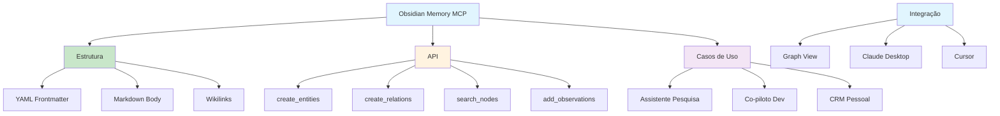

# [Obsidian Memory MCP Server - Skywork](/blog/obsidian-memory-mcp-server---skywork)

> [!compass] **[MyMess](/blog/moc---projeto-mymess)** » [Estudos](/blog/dashboard---estudos-mymess) » Engenharia de Contexto

---

> [!info]+ Detalhes do Artigo
> **Ler:** [A Deep Dive into the Obsidian Memory MCP Server](https://skywork.ai/skypage/en/ai-obsidian-memory-server/1978331309583015936)
> **Fonte:** Skywork (Deep Dive)
> **Autores:** YuNaga224 (Yu Nagasaki) - Criador do projeto
> **Publicado:** 2025

> [!abstract]+ Materiais Complementares
>
> **Ferramentas da API**
> - create_entities - Cria nós no grafo
> - create_relations - Vincula entidades
> - add_observations - Adiciona fatos
> - search_nodes - Busca entidades
> - open_nodes - Recupera detalhes
> - delete_entities - Remove entidades
>
> **Estrutura dos Arquivos**
> - YAML Frontmatter (metadados)
> - Corpo Markdown (observações)
> - Wikilinks [[]] (relações)

> [!tip]- Léxico
>
> **Tecnologia e IA**
> - **Obsidian Memory MCP**: Servidor que cria arquivos .md individuais para cada "entidade" da IA
> - **Entity-based memory**: Memória estruturada por entidades vs JSON monolítico
>
> **Elementos Visuais**
> - **Graph View**: Visualização automática de conexões entre notas
>
> **Outros Conceitos**
> - **Local-first**: Dados residem no vault markdown, não na nuvem
> [!question]- Pontos para Aprofundar (Sugestão da IA)
>
> - **Como escalar para 10K+ notas?**
>     - Avaliar bottlenecks de renderização Obsidian
> - **Como mitigar confusão de contexto entre projetos?**
>     - Explorar namespacing ou vault separados
> - **Vale integrar vs usar RAG tradicional?**
>     - Comparar conexões explícitas vs busca semântica

> [!robot]- Sugestões Complementares
>
> - **Leituras Recomendadas:**
>     - Documentação MCP Anthropic
>     - Repositório obsidian-memory-mcp
> - **Ferramentas Úteis:**
>     - **Claude Desktop** - Cliente MCP
>     - **Cursor** - IDE com suporte MCP
>     - **Obsidian** - Visualização do grafo
> - **Exercícios Práticos:**
>     - Clonar e instalar obsidian-memory-mcp
>     - Configurar com Claude Desktop
>     - Testar criação de entidades

---

## Resumo

Deep dive sobre **Obsidian Memory MCP Server** de **YuNaga224** - implementação modificada do servidor de memória da Anthropic que cria **arquivos Markdown individuais** para cada "entidade" que a IA aprende, em vez de JSON monolítico. Usa **YAML frontmatter** para metadados, **wikilinks** para relações, e integra com **Graph View** do Obsidian para visualização automática. Ideal para assistentes de pesquisa, co-pilotos de programação persistentes e CRM pessoal.

**Insight central:** "Em vez de um arquivo JSON monolítico, o servidor cria arquivos Markdown individuais para cada 'entidade' que a IA aprende - transformando memórias de IA em estruturas legíveis por humanos."

---

## Principais Conceitos

### O que é Obsidian Memory MCP?

A tabela abaixo resume as informações principais.

| Aspecto | Descrição |
|:--------|:----------|
| **Tipo** | MCP Server para memória persistente |
| **Base** | Modificação do servidor de referência Anthropic |
| **Diferencial** | Arquivos .md individuais vs JSON monolítico |
| **Integração** | Graph View do Obsidian |
| **Autor** | YuNaga224 (Yu Nagasaki) |

### Estrutura dos Arquivos de Memória

A tabela a seguir detalha os campos e seus valores.

| Componente | Função | Exemplo |
|:-----------|:-------|:--------|
| **YAML Frontmatter** | Metadados | tipo, datas, tags |
| **Corpo Markdown** | Observações não-estruturadas | fatos, notas |
| **Wikilinks** | Relações entre entidades | `[Pessoa](/blog/pessoa)`, `[Projeto](/blog/projeto)` |

### Arquitetura MCP

```
User → AI Host → MCP Client → Node.js Server → .md Files → Obsidian
                                    ↓
                              MEMORY_DIR
```

---

## Detalhamento

### Ferramentas da API

Os dados abaixo mostram a estrutura e configurações.

| Ferramenta | Função |
|:-----------|:-------|
| `create_entities` | Cria novos nós no grafo |
| `create_relations` | Vincula entidades existentes com wikilinks |
| `add_observations` | Adiciona fatos a entidades |
| `search_nodes` | Busca entidades por consulta |
| `open_nodes` | Recupera detalhes completos |
| `delete_entities` | Remove entidades e relações |

### Instalação

**Pré-requisitos:**
- Node.js v18+
- Git
- Obsidian instalado
- Cliente MCP (Claude Desktop, Cursor)

```bash
git clone https://github.com/yunaga224/obsidian-memory-mcp.git
cd obsidian-memory-mcp
npm install
npm run build
```

### Configuração Claude Desktop

```json
{
  "mcpServers": {
    "obsidian-memory": {
      "command": "node",
      "args": ["/caminho/completo/dist/index.js"],
      "env": {
        "MEMORY_DIR": "/caminho/seu/obsidian/vault"
      }
    }
  }
}
```

### Casos de Uso

A tabela abaixo resume as informações principais.

| Caso | Descrição |
|:-----|:----------|
| **Assistente de Pesquisa** | IA cria entidades para conceitos enquanto explica, vincula ideias automaticamente |
| **Co-piloto Persistente** | Lembra stack, funções-chave, padrões; recupera memória semanas depois |
| **CRM Pessoal** | Extrai nome, empresa, pontos-chave de conversas; mapa de relacionamentos |

### Considerações de Desempenho

A tabela a seguir detalha os campos e seus valores.

| Aspecto | Detalhe |
|:--------|:--------|
| **Escalabilidade** | Bottleneck é Obsidian com 10K+ notas |
| **Tokens** | Workflows com ferramentas consomem mais tokens |
| **Latência** | Operações locais praticamente instantâneas |

### Limitações

Os dados abaixo mostram a estrutura e configurações.

| Limitação | Descrição |
|:----------|:----------|
| **Segurança** | Script terceirizado com acesso R/W ao diretório |
| **Context confusion** | IAs podem confundir contextos entre projetos |
| **Manutenção** | Projeto open-source sem suporte comercial |

### Comparativo

A tabela abaixo resume as informações principais.

| vs cyanheads/obsidian-mcp | vs RAG/Vector DB |
|:--------------------------|:-----------------|
| Acesso R/W a vault existente | Busca semântica implícita |
| **Este**: Cria novo grafo estruturado | **Este**: Conexões explícitas e visuais |

---

## Mapa de Conceitos

O diagrama abaixo ilustra o fluxo do processo, mostrando as etapas e suas conexões.



---

## Insights & Aprendizados

**O que funcionou bem:**
- Arquivos .md individuais legíveis por humanos
- Integração natural com Graph View
- API clara com ferramentas específicas
- Local-first respeitando privacidade

**O que posso adaptar para o MyMess:**
- **Entity-based memory**: Criar entidades para clientes, campanhas, briefings
- **Wikilinks automáticos**: Conectar projetos relacionados automaticamente
- **CRM Pessoal**: Adaptar para relacionamento com clientes
- **Co-piloto persistente**: Manter contexto entre sessões de trabalho

**Ideias para aplicar:**
- Implementar obsidian-memory-mcp para base de conhecimento de clientes
- Criar entidades automáticas de briefings e campanhas
- Usar Graph View para visualizar relacionamentos entre projetos
- Desenvolver fluxo de "memória de projeto" persistente

---

## Recursos Adicionais

- [Skywork - Deep Dive](https://skywork.ai/skypage/en/ai-obsidian-memory-server/1978331309583015936)
- [GitHub - obsidian-memory-mcp](https://github.com/yunaga224/obsidian-memory-mcp)
- [MCP Documentation](https://docs.anthropic.com/en/docs/mcp)
- [Obsidian](https://obsidian.md/)

---

## Propriedades da nota

> [!note]- Propriedades Gerais do Obsidian
>
>> **Identificação**
>
> | Campo      | Valor                    |
> |:-----------|:-------------------------|
> | **Título** | `INPUT[text:titulo]`     |
>
>> **Conexões**
>
> | Campo           | Valor                                                                 |
> |:----------------|:----------------------------------------------------------------------|
> | **Pai**         | `INPUT[suggester(optionQuery("")):pai]`                               |
> | **Coleção**     | `INPUT[inlineSelect(option(financeiro, Financeiro), option(growth, Growth), option(ia, IA), option(lideranca, Liderança), option(marketing, Marketing), option(negocios, Negócios), option(produtividade, Produtividade), option(pkm, PKM), option(saas, SaaS), option(tecnologia, Tecnologia), option(vendas, Vendas)):colecao]` |
> | **Área**        | `INPUT[suggester(optionQuery("Esforços/Áreas")):area]`                         |
> | **Projeto**     | `INPUT[suggester(optionQuery("#projeto")):projeto]`                   |
> | **Autor**       | `INPUT[suggester(optionQuery("Atlas/Pessoas")):pessoa]`                      |
> | **Relacionado** | `INPUT[inlineListSuggester(optionQuery(""), useLinks(true)):relacionado]` |
>
>> **Classificação**
>
> | Campo      | Valor                                                                 |
> |:-----------|:----------------------------------------------------------------------|
> | **Tipo**   | `INPUT[inlineSelect(option(atomica, Atômica), option(aula, Aula), option(artigo, Artigo), option(checklist, Checklist), option(curso, Curso), option(dashboard, Dashboard), option(framework, Framework), option(livro, Livro), option(moc, MOC), option(newsletter, Newsletter), option(pessoa, Pessoa), option(prompt, Prompt), option(template, Template Obsidian), option(tutorial, Tutorial), option(video_youtube, Vídeo Youtube)):tipo_nota]` |
> | **Tags**   | `INPUT[inlineList:tags]`                                              |
> | **Status** | `INPUT[inlineSelect(option(nao_iniciado, ⬜ Não Iniciado), option(em_andamento, 🔄 Em Andamento), option(concluido, ✅ Concluído), option(pausado, ⏸️ Pausado), option(cancelado, ❌ Cancelado)):status]` |
>
>> **Temporal**
>
> | Campo          | Valor                      |
> |:---------------|:---------------------------|
> | **Criado**     | `INPUT[date:data_criado]`       |
> | **Atualizado** | `INPUT[date:data_atualizado]`   |

> [!note]- Propriedades SaaS
>
> | Campo             | Valor                                                              |
> |:------------------|:-------------------------------------------------------------------|
> | **Mostrar Bloco** | `INPUT[toggle(onValue(true), offValue(false)):mostrar_bloco_saas]` |
> | **Status SaaS**   | `INPUT[toggle(onValue(true), offValue(false)):status_saas]`        |

> [!note]- Propriedades do Artigo
>
> | Campo            | Valor                          |
> |:-----------------|:-------------------------------|
> | **URL**          | `INPUT[text(placeholder(https://...)):url_artigo]`  |
> | **Fonte**        | `INPUT[text:fonte]`  |
> | **Autor**        | `INPUT[text:autor]`  |
> | **Data Publicação** | `INPUT[date:data_publicacao]`  |
> | **Tipo Conteúdo** | `INPUT[inlineSelect(option(educacional, Educacional), option(curadoria, Curadoria), option(historia, História Pessoal), option(listicle, Lista), option(contrarian, Opinião Contrária), option(tutorial, Tutorial), option(entrevista, Entrevista), option(analise, Análise), option(estudo_de_caso, Estudo de Caso), option(lancamento, Lançamento), option(opiniao, Opinião), option(outro, Outro)):tipo_conteudo]`  |

