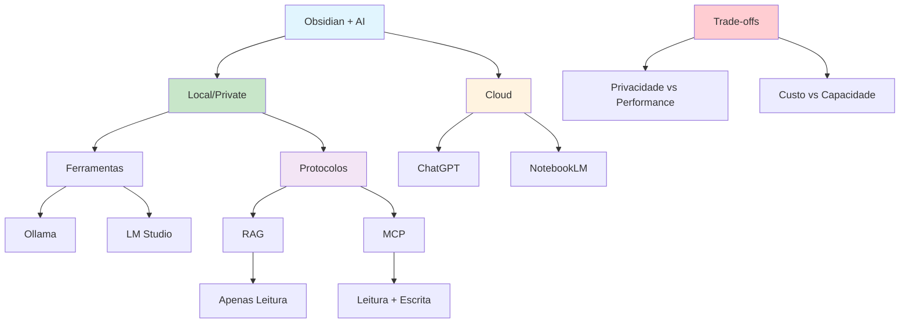

# [Obsidian RAG Private AI or Cloud - YouTube](/blog/obsidian-rag-private-ai-or-cloud---youtube)

> [!compass] **[MyMess](/blog/moc---projeto-mymess)** » [Estudos](/blog/dashboard---estudos-mymess) » Engenharia de Contexto

---

> [!info]+ Detalhes do Artigo
> **Ler:** [Obsidian RAG: Private AI or Cloud Power (Complete Setup Guide)](https://www.youtube.com/watch?v=e_CCEAiGJpA)
> **Fonte:** YouTube (Vídeo Tutorial)
> **Autores:** Khoa Nguyen
> **Publicado:** 2025

> [!abstract]+ Materiais Complementares
>
> **Ferramentas para RAG Local**
> - LM Studio - Interface para LLMs locais
> - Ollama - Servidor de LLMs
> - Msty - Alternativa com GUI
>
> **Plugins Obsidian**
> - CoPilot - Assistente IA integrado
> - Smart Second Brain - RAG nativo
> - LLM Workspace - Source sets manuais
>
> **Protocolos**
> - MCP (Model Context Protocol) - Integração avançada

> [!tip]- Léxico
>
> **Tecnologia e IA**
> - **RAG**: Retrieval Augmented Generation - busca + geração
> - **MCP**: Model Context Protocol - permite leitura/escrita no vault
> - **MOC (Map of Content)**: Nota índice para navegação contextual
>
> **Outros Conceitos**
> - **Vector Store**: Armazenamento de embeddings para busca semântica
> [!question]- Pontos para Aprofundar (Sugestão da IA)
>
> - **RAG vs MCP: quando usar cada um?**
>     - RAG para consulta, MCP para interação completa
> - **Como otimizar dados para vector store?**
>     - Selecionar notas relevantes vs carregar tudo
> - **Qual o impacto de MOCs no RAG?**
>     - Usar links para criar contexto específico

> [!robot]- Sugestões Complementares
>
> - **Leituras Recomendadas:**
>     - Documentação LlamaIndex
>     - MCP Protocol Guide
> - **Ferramentas Úteis:**
>     - **LM Studio** - LLMs com GUI
>     - **Ollama** - Servidor local
>     - **Chroma** - Vector database
> - **Exercícios Práticos:**
>     - Configurar RAG local com Ollama
>     - Testar MCP com vault Obsidian
>     - Comparar qualidade local vs cloud

---

## Resumo

Guia completo sobre **Obsidian RAG** comparando abordagens de **IA privada (local)** versus **cloud**. Cobre ferramentas como LM Studio, Ollama, Msty e plugins como CoPilot e Smart Second Brain. Destaca a diferença entre **RAG** (apenas recuperação de dados) e **MCP** (interação completa com vault). Insight importante: "Menos dados relevantes produzem resultados melhores que carregar tudo" - usar MOCs para criar contexto específico.

**Insight central:** "Instead of copying and pasting, my local AI model can now read, search, and even write to my vault automatically. By using an MCP layer with my local tools, everything is now completely free, all my data stays on my computer."

---

## Principais Conceitos

### RAG vs MCP

A tabela abaixo resume as informações principais.

| Aspecto | RAG | MCP |
|:--------|:----|:----|
| **Função** | Recuperação de dados | Interação completa |
| **Escrita** | Não | Sim |
| **Complexidade** | Simples/rápido | Mais configuração |
| **Uso** | Dar contexto ao LLM | Ler, buscar, escrever no vault |

### Trade-offs: Local vs Cloud

A tabela a seguir detalha os campos e seus valores.

| Aspecto | Local/Private | Cloud |
|:--------|:--------------|:------|
| **Privacidade** | Total - dados no computador | Dados enviados a servidores |
| **Custo** | Gratuito após setup | Assinaturas/tokens |
| **Performance** | Depende do hardware | Modelos avançados |
| **Controle** | Completo | Limitado |

### Arquitetura RAG com Obsidian

```
User Query → Vector Search → Relevant Notes → LLM Context → Response
                  ↓
            Chroma/Vector Store
                  ↓
            Obsidian Vault (.md files)
```

---

## Detalhamento

### Ferramentas para Setup Local

Os dados abaixo mostram a estrutura e configurações.

| Ferramenta | Função | Destaque |
|:-----------|:-------|:---------|
| **LM Studio** | GUI para LLMs | Fácil de usar |
| **Ollama** | Servidor de modelos | Leve, linha de comando |
| **Msty** | Interface alternativa | Design moderno |
| **LlamaIndex** | Framework RAG | Integração Obsidian |

### Plugins Obsidian Recomendados

A tabela abaixo resume as informações principais.

| Plugin | Função | Diferencial |
|:-------|:-------|:------------|
| **CoPilot** | Assistente IA versátil | Múltiplos provedores |
| **Smart Second Brain** | RAG nativo | Embedding + chat |
| **LLM Workspace** | Source sets manuais | Mais preciso que RAG automático |

### Insight Chave: Menos é Mais

> [!quote] Aprendizado Importante
> "Base models are great, but when using RAG you need useful and relevant data to add to the context window. I got more interesting and useful results when I loaded less data into my vector store."

**Técnica do MOC:**
- Usar Map of Content (MOC) como ponto de partida
- Caminhar a árvore de links para carregar apenas notas relevantes
- Criar RAG específico para cada MOC/projeto

### Setup MCP vs RAG

**MCP (completo):**
- Permite ler, buscar E escrever no vault
- Requer configuração de protocolo
- Integração mais profunda

**RAG (simples):**
- Apenas recuperação de dados
- Setup mais rápido
- Bom para dar contexto

---

## Mapa de Conceitos

O diagrama abaixo ilustra o fluxo do processo, mostrando as etapas e suas conexões.



---

## Insights & Aprendizados

**O que funcionou bem:**
- MOCs como filtro de contexto para RAG
- Seleção manual de notas melhora qualidade
- MCP para interação completa vs RAG para consulta
- Setup local elimina custos recorrentes

**O que posso adaptar para o MyMess:**
- **MOC-based RAG**: Criar RAGs específicos por projeto/cliente
- **MCP Integration**: Permitir agentes escreverem no vault
- **Hybrid Approach**: Local para privacidade, cloud para tarefas complexas
- **Source Sets**: Curar conjuntos de notas relevantes

**Ideias para aplicar:**
- Configurar Ollama + MCP para base de conhecimento interna
- Criar MOCs específicos para cada cliente/projeto
- Implementar RAG seletivo vs carregar vault inteiro
- Testar qualidade local vs cloud para diferentes tarefas

---

## Recursos Adicionais

- [Complete Setup Guide](https://khoa-nguyen-bk18.github.io/brain/LLMs/LlamaIndex/Obsidian-RAG-Private-AI-or-Cloud-Power-(Complete-Setup-Guide))
- [GitHub - obsidian-rag](https://github.com/ParthSareen/obsidian-rag)
- [MakeUseOf - MCP + Obsidian](https://www.makeuseof.com/connected-local-model-obsidian-mcp-better-than-notebooklm-chatgpt/)
- [Obsidian Forum - RAG Discussion](https://forum.obsidian.md/t/obsidian-rag-personal-ai-bot/93020)
- [LLM Workspace Plugin](https://www.obsidianstats.com/plugins/llm-workspace)

---

## Propriedades da nota

> [!note]- Propriedades Gerais do Obsidian
>
>> **Identificação**
>
> | Campo      | Valor                    |
> |:-----------|:-------------------------|
> | **Título** | `INPUT[text:titulo]`     |
>
>> **Conexões**
>
> | Campo           | Valor                                                                 |
> |:----------------|:----------------------------------------------------------------------|
> | **Pai**         | `INPUT[suggester(optionQuery("")):pai]`                               |
> | **Coleção**     | `INPUT[inlineSelect(option(financeiro, Financeiro), option(growth, Growth), option(ia, IA), option(lideranca, Liderança), option(marketing, Marketing), option(negocios, Negócios), option(produtividade, Produtividade), option(pkm, PKM), option(saas, SaaS), option(tecnologia, Tecnologia), option(vendas, Vendas)):colecao]` |
> | **Área**        | `INPUT[suggester(optionQuery("Esforços/Áreas")):area]`                         |
> | **Projeto**     | `INPUT[suggester(optionQuery("#projeto")):projeto]`                   |
> | **Autor**       | `INPUT[suggester(optionQuery("Atlas/Pessoas")):pessoa]`                      |
> | **Relacionado** | `INPUT[inlineListSuggester(optionQuery(""), useLinks(true)):relacionado]` |
>
>> **Classificação**
>
> | Campo      | Valor                                                                 |
> |:-----------|:----------------------------------------------------------------------|
> | **Tipo**   | `INPUT[inlineSelect(option(atomica, Atômica), option(aula, Aula), option(artigo, Artigo), option(checklist, Checklist), option(curso, Curso), option(dashboard, Dashboard), option(framework, Framework), option(livro, Livro), option(moc, MOC), option(newsletter, Newsletter), option(pessoa, Pessoa), option(prompt, Prompt), option(template, Template Obsidian), option(tutorial, Tutorial), option(video_youtube, Vídeo Youtube)):tipo_nota]` |
> | **Tags**   | `INPUT[inlineList:tags]`                                              |
> | **Status** | `INPUT[inlineSelect(option(nao_iniciado, ⬜ Não Iniciado), option(em_andamento, 🔄 Em Andamento), option(concluido, ✅ Concluído), option(pausado, ⏸️ Pausado), option(cancelado, ❌ Cancelado)):status]` |
>
>> **Temporal**
>
> | Campo          | Valor                      |
> |:---------------|:---------------------------|
> | **Criado**     | `INPUT[date:data_criado]`       |
> | **Atualizado** | `INPUT[date:data_atualizado]`   |

> [!note]- Propriedades SaaS
>
> | Campo             | Valor                                                              |
> |:------------------|:-------------------------------------------------------------------|
> | **Mostrar Bloco** | `INPUT[toggle(onValue(true), offValue(false)):mostrar_bloco_saas]` |
> | **Status SaaS**   | `INPUT[toggle(onValue(true), offValue(false)):status_saas]`        |

> [!note]- Propriedades do Artigo
>
> | Campo            | Valor                          |
> |:-----------------|:-------------------------------|
> | **URL**          | `INPUT[text(placeholder(https://...)):url_artigo]`  |
> | **Fonte**        | `INPUT[text:fonte]`  |
> | **Autor**        | `INPUT[text:autor]`  |
> | **Data Publicação** | `INPUT[date:data_publicacao]`  |
> | **Tipo Conteúdo** | `INPUT[inlineSelect(option(educacional, Educacional), option(curadoria, Curadoria), option(historia, História Pessoal), option(listicle, Lista), option(contrarian, Opinião Contrária), option(tutorial, Tutorial), option(entrevista, Entrevista), option(analise, Análise), option(estudo_de_caso, Estudo de Caso), option(lancamento, Lançamento), option(opiniao, Opinião), option(outro, Outro)):tipo_conteudo]`  |

