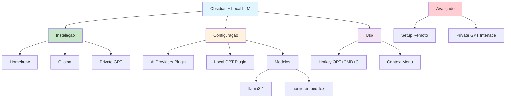

# [Obsidian with Local LLM - Annvix](/blog/obsidian-with-local-llm---annvix)

> [!compass] **[MyMess](/blog/moc---projeto-mymess)** » [Estudos](/blog/dashboard---estudos-mymess) » Engenharia de Contexto

---

> [!info]+ Detalhes do Artigo
> **Ler:** [Using Obsidian with a Local LLM](https://annvix.com/blog/using-obsidian-with-a-local-llm)
> **Fonte:** Annvix Blog (Tutorial)
> **Autores:** Vincent Danen
> **Publicado:** 7 de Maio de 2025 (Atualizado 9 de Maio de 2025)

> [!abstract]+ Materiais Complementares
>
> **Ferramentas Principais**
> - Ollama - Servidor LLM local
> - Private GPT - Interface web opcional (localhost:8001)
> - Local GPT - Plugin Obsidian
> - Obsidian AI Providers - Configuração de backend
>
> **Modelos Recomendados**
> - llama3.1 - Modelo principal
> - nomic-embed-text - Embeddings
> - DeepSeek - Opções adicionais

> [!tip]- Léxico
>
> **Tecnologia e IA**
> - **Local GPT**: Plugin Obsidian para IA local
> - **Embeddings**: Representações vetoriais para busca semântica
>
> **Conceitos Fundamentais**
> - **Ollama**: Framework para rodar LLMs localmente
>
> **Outros Conceitos**
> - **Private GPT**: Intermediário opcional com interface web
> [!question]- Pontos para Aprofundar (Sugestão da IA)
>
> - **Qual modelo funciona melhor para note-taking?**
>     - Testar llama3.1 vs DeepSeek
> - **Como configurar Ollama em máquina remota?**
>     - Setup de rede e variáveis de ambiente
> - **Private GPT vale a configuração extra?**
>     - Avaliar benefícios da interface web

> [!robot]- Sugestões Complementares
>
> - **Leituras Recomendadas:**
>     - Documentação Ollama
>     - Guia Private GPT
> - **Ferramentas Úteis:**
>     - **Homebrew** - Gerenciador de pacotes macOS
>     - **Poetry** - Gerenciador Python
> - **Exercícios Práticos:**
>     - Instalar Ollama via Homebrew
>     - Configurar Local GPT no Obsidian
>     - Testar hotkey OPT+CMD+G

---

## Resumo

Tutorial detalhado de **Vincent Danen** sobre configuração de **LLM local com Obsidian** em macOS. Usa **Ollama** como servidor, **Local GPT** e **Obsidian AI Providers** como plugins. Inclui setup opcional de **Private GPT** para interface web. Destaca performance "pretty fast" em M1/M3 Mac Studios. Cobre também configuração de **Ollama remoto** para usar servidor em outra máquina da rede.

**Motivação central:** Privacidade para dados sensíveis no vault (meeting notes, etc.) sem depender de serviços cloud.

---

## Principais Conceitos

### Stack de Ferramentas

A tabela abaixo resume as informações principais.

| Componente | Função | URL Local |
|:-----------|:-------|:----------|
| **Ollama** | Servidor de modelos | `http://127.0.0.1:11434` |
| **Private GPT** | Interface web (opcional) | `http://localhost:8001` |
| **Local GPT** | Plugin Obsidian | Integração direta |
| **AI Providers** | Configuração backend | Settings do Obsidian |

### Modelos Recomendados

A tabela a seguir detalha os campos e seus valores.

| Modelo | Uso | Comando |
|:-------|:----|:--------|
| **llama3.1** | Chat/geração principal | `ollama pull llama3.1` |
| **nomic-embed-text** | Embeddings/RAG | `ollama pull nomic-embed-text` |
| **DeepSeek** | Alternativa avançada | Disponível no Ollama |

---

## Detalhamento

### Instalação macOS (Homebrew)

```bash
# Instalar Ollama
brew install --cask ollama
brew install ollama

# Iniciar servidor
ollama serve

# Em outro terminal - baixar modelos
ollama pull llama3.1
ollama pull nomic-embed-text

# Configurar para iniciar automaticamente
brew services start ollama
```

### Configuração Private GPT (Opcional)

```bash
# Clonar repositório
git clone https://github.com/zylon-ai/private-gpt
cd private-gpt

# Configurar ambiente Python
brew install python@3.11
python3.11 -m venv .venv
source .venv/bin/activate

# Instalar dependências
poetry install --extras "ui llms-ollama embeddings-ollama..."

# Executar com perfil Ollama
PGPT_PROFILES=ollama make run
```

### Configuração no Obsidian

**Plugin AI Providers:**
1. Settings → Community Plugins → Browse
2. Instalar "Obsidian AI Providers"
3. Configurar:
   - URL: `http://127.0.0.1:11434`
   - Model: `llama3.1:latest`
   - Embedding: `nomic-embed-text:latest`

**Plugin Local GPT:**
1. Instalar "Local GPT"
2. Configurar Main AI Provider: llama3.1
3. Definir hotkey: `OPT+CMD+G` para context menu

### Setup Remoto (Ollama em outra máquina)

```bash
# Na máquina remota - configurar para aceitar conexões
launchctl setenv OLLAMA_HOST 0.0.0.0:11434
brew services restart ollama

# No Obsidian - alterar URL
# http://192.168.x.x:11434
```

### Benefícios vs Limitações

Os dados abaixo mostram a estrutura e configurações.

| Benefícios | Limitações |
|:-----------|:-----------|
| Privacidade total | Modelos não treinados no vault |
| Performance rápida (M1/M3) | Settings não persistem sem workaround |
| Sem custos recorrentes | Setup remoto requer config extra |
| Funciona offline | Depende do hardware local |

---

## Mapa de Conceitos

O diagrama abaixo ilustra o fluxo do processo, mostrando as etapas e suas conexões.



---

## Insights & Aprendizados

**O que funcionou bem:**
- Homebrew simplifica instalação no macOS
- Performance adequada em Apple Silicon
- Hotkey para acesso rápido (OPT+CMD+G)
- Configuração de servidor remoto possível

**O que posso adaptar para o MyMess:**
- **Stack Local**: Ollama + Local GPT para trabalho com dados sensíveis
- **Embeddings**: nomic-embed-text para busca semântica
- **Remote Setup**: Servidor centralizado para equipe
- **Private GPT**: Interface web para usuários não-técnicos

**Ideias para aplicar:**
- Configurar Ollama em Mac Studio dedicado
- Criar vault específico para dados sensíveis de clientes
- Implementar hotkey para acesso rápido à IA
- Testar performance de diferentes modelos

---

## Recursos Adicionais

- [Annvix Blog - Tutorial Original](https://annvix.com/blog/using-obsidian-with-a-local-llm)
- [Ollama Official](https://ollama.ai/)
- [Private GPT GitHub](https://github.com/zylon-ai/private-gpt)
- [Local GPT Plugin](https://obsidian.md/plugins?search=local-gpt)
- [Obsidian AI Providers](https://obsidian.md/plugins?search=ai-providers)

---

## Propriedades da nota

> [!note]- Propriedades Gerais do Obsidian
>
>> **Identificação**
>
> | Campo      | Valor                    |
> |:-----------|:-------------------------|
> | **Título** | `INPUT[text:titulo]`     |
>
>> **Conexões**
>
> | Campo           | Valor                                                                 |
> |:----------------|:----------------------------------------------------------------------|
> | **Pai**         | `INPUT[suggester(optionQuery("")):pai]`                               |
> | **Coleção**     | `INPUT[inlineSelect(option(financeiro, Financeiro), option(growth, Growth), option(ia, IA), option(lideranca, Liderança), option(marketing, Marketing), option(negocios, Negócios), option(produtividade, Produtividade), option(pkm, PKM), option(saas, SaaS), option(tecnologia, Tecnologia), option(vendas, Vendas)):colecao]` |
> | **Área**        | `INPUT[suggester(optionQuery("Esforços/Áreas")):area]`                         |
> | **Projeto**     | `INPUT[suggester(optionQuery("#projeto")):projeto]`                   |
> | **Autor**       | `INPUT[suggester(optionQuery("Atlas/Pessoas")):pessoa]`                      |
> | **Relacionado** | `INPUT[inlineListSuggester(optionQuery(""), useLinks(true)):relacionado]` |
>
>> **Classificação**
>
> | Campo      | Valor                                                                 |
> |:-----------|:----------------------------------------------------------------------|
> | **Tipo**   | `INPUT[inlineSelect(option(atomica, Atômica), option(aula, Aula), option(artigo, Artigo), option(checklist, Checklist), option(curso, Curso), option(dashboard, Dashboard), option(framework, Framework), option(livro, Livro), option(moc, MOC), option(newsletter, Newsletter), option(pessoa, Pessoa), option(prompt, Prompt), option(template, Template Obsidian), option(tutorial, Tutorial), option(video_youtube, Vídeo Youtube)):tipo_nota]` |
> | **Tags**   | `INPUT[inlineList:tags]`                                              |
> | **Status** | `INPUT[inlineSelect(option(nao_iniciado, ⬜ Não Iniciado), option(em_andamento, 🔄 Em Andamento), option(concluido, ✅ Concluído), option(pausado, ⏸️ Pausado), option(cancelado, ❌ Cancelado)):status]` |
>
>> **Temporal**
>
> | Campo          | Valor                      |
> |:---------------|:---------------------------|
> | **Criado**     | `INPUT[date:data_criado]`       |
> | **Atualizado** | `INPUT[date:data_atualizado]`   |

> [!note]- Propriedades SaaS
>
> | Campo             | Valor                                                              |
> |:------------------|:-------------------------------------------------------------------|
> | **Mostrar Bloco** | `INPUT[toggle(onValue(true), offValue(false)):mostrar_bloco_saas]` |
> | **Status SaaS**   | `INPUT[toggle(onValue(true), offValue(false)):status_saas]`        |

> [!note]- Propriedades do Artigo
>
> | Campo            | Valor                          |
> |:-----------------|:-------------------------------|
> | **URL**          | `INPUT[text(placeholder(https://...)):url_artigo]`  |
> | **Fonte**        | `INPUT[text:fonte]`  |
> | **Autor**        | `INPUT[text:autor]`  |
> | **Data Publicação** | `INPUT[date:data_publicacao]`  |
> | **Tipo Conteúdo** | `INPUT[inlineSelect(option(educacional, Educacional), option(curadoria, Curadoria), option(historia, História Pessoal), option(listicle, Lista), option(contrarian, Opinião Contrária), option(tutorial, Tutorial), option(entrevista, Entrevista), option(analise, Análise), option(estudo_de_caso, Estudo de Caso), option(lancamento, Lançamento), option(opiniao, Opinião), option(outro, Outro)):tipo_conteudo]`  |

