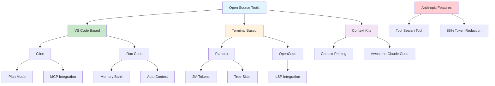

# [Open Source Tools for Claude Code Context - Reddit](/blog/open-source-tools-for-claude-code-context---reddit)

> [!compass] **[MyMess](/blog/moc---projeto-mymess)** » [Estudos](/blog/dashboard---estudos-mymess) » Engenharia de Contexto

---

> [!info]+ Detalhes do Artigo
> **Ler:** [Open Source Tools for Claude Code Context](https://www.reddit.com/r/ClaudeAI/comments/1lx6tth/open_source_tools_for_claude_code_context/)
> **Fonte:** Reddit - r/ClaudeAI (Discussão/Curadoria)
> **Autores:** Comunidade Reddit
> **Publicado:** Julho 2025

> [!abstract]+ Materiais Complementares
>
> **Ferramentas Open Source**
> - Cline - Agentic workflows em VS Code
> - Roo Code - Context-aware com memory bank
> - Plandex - 2M tokens, terminal-based
> - OpenCode - LSP integration
>
> **Context Engineering Kits**
> - Context Priming (disler)
> - Context Engineering Intro (coleam00)
> - Awesome Claude Code (hesreallyhim)

> [!tip]- Léxico
>
> **Tecnologia e IA**
> - **Agentic Workflows**: Fluxos autônomos de agentes IA
> - **Memory Bank**: Registro persistente de preferências e trabalho
>
> **Ferramentas e Recursos**
> - **MCP Integration**: Model Context Protocol para ferramentas
>
> **Outros Conceitos**
> - **Tree-Sitter**: Parser para mapeamento de código
> [!question]- Pontos para Aprofundar (Sugestão da IA)
>
> - **Cline vs Roo Code vs Plandex: qual escolher?**
>     - Comparar por caso de uso e stack
> - **Como configurar Context Priming efetivo?**
>     - Estudar templates por tipo de projeto
> - **Tool Search Tool da Anthropic: como usar?**
>     - Explorar feature para muitas ferramentas

> [!robot]- Sugestões Complementares
>
> - **Leituras Recomendadas:**
>     - Awesome Claude Code GitHub
>     - Context Engineering Intro repo
> - **Ferramentas para Testar:**
>     - **Cline** - Para VS Code
>     - **Plandex** - Para projetos grandes
>     - **OpenCode** - Para LSP integration
> - **Exercícios Práticos:**
>     - Instalar Cline no VS Code
>     - Testar Plandex em projeto existente
>     - Configurar memory bank no Roo Code

---

## Resumo

Curadoria da comunidade r/ClaudeAI sobre **ferramentas open source para context engineering** com Claude Code. Destaca alternativas como **Cline** (agentic em VS Code), **Roo Code** (memory bank), **Plandex** (2M tokens), e **OpenCode** (LSP). Também apresenta kits de context engineering como **Context Priming** e **Context Engineering Intro**. A Anthropic lançou **Tool Search Tool** que reduz 85% do uso de tokens ao acessar milhares de ferramentas.

**Insight central:** "Context engineering is the new vibe coding - it's the way to actually make AI coding assistants work."

---

## Principais Conceitos

### Alternativas Open Source ao Claude Code

A tabela abaixo resume as informações principais.

| Ferramenta | Ambiente | Destaque |
|:-----------|:---------|:---------|
| **Cline** | VS Code | Plan Mode, MCP integration |
| **Roo Code** | VS Code | Memory bank, context-aware |
| **Plandex** | Terminal | 2M tokens, diff sandbox |
| **OpenCode** | Terminal | LSP integration, session management |

### Context Engineering Kits

A tabela a seguir detalha os campos e seus valores.

| Kit | Autor | Função |
|:----|:------|:-------|
| **Context Priming** | disler | Priming sistemático por cenário |
| **Context Engineering Intro** | coleam00 | Template introdutório |
| **Awesome Claude Code** | hesreallyhim | Curadoria de comandos e workflows |

---

## Detalhamento

### Cline (VS Code)

**Características:**
- Deep agentic workflows
- Plan Mode para planejamento
- Transparent steps - cada ação visível
- Permissioned terminal/file operations
- MCP integration nativa
- **Gratuito e open source** (desde Set 2025)

**Melhor para:** Desenvolvedores que preferem VS Code e querem controle granular.

### Roo Code (VS Code)

**Características:**
- Context-aware assistance automática
- Busca documentação de bibliotecas automaticamente
- **Memory bank** - mantém registro de preferências
- Previne alucinações com lookup de docs

**Melhor para:** Quem quer contexto automático sem configuração manual.

### Plandex (Terminal)

**Características:**
- **2M token context window** - líder da indústria
- Diff review sandbox
- Tree-sitter project mapping
- Smart context management

**Melhor para:** Projetos grandes, codebases extensos, produção.

### OpenCode (Terminal)

**Características:**
- Mapeamento completo do codebase
- Session management
- File change tracking
- **LSP integration** - code intelligence em tempo real

**Melhor para:** Desenvolvedores que preferem terminal com IDE-level intelligence.

### Feature da Anthropic: Tool Search Tool

> [!info] Economia de Tokens
> Tool Search Tool preserva **191,300 tokens** comparado a 122,800 com abordagem tradicional - **85% de redução** no uso de tokens mantendo acesso a milhares de ferramentas.

**Outras features avançadas:**
- **Programmatic Tool Calling** - execução em ambiente de código
- **Tool Use Examples** - padrão universal para demonstrar uso

### Pesquisa Acadêmica (2025)

Paper propõe workflow combinando:
1. **Intent Translator** - clarifica requisitos
2. **Elicit** - semantic literature retrieval
3. **NotebookLM** - síntese de documentos
4. **Claude Code** - geração e validação multi-agente

---

## Mapa de Conceitos

O diagrama abaixo ilustra o fluxo do processo, mostrando as etapas e suas conexões.

---

## Insights & Aprendizados

**O que funcionou bem:**
- Múltiplas opções para diferentes workflows
- Cline e Roo Code para VS Code
- Plandex para projetos grandes (2M tokens)
- Kits de context engineering prontos para uso

**O que posso adaptar para o MyMess:**
- **Cline**: Para desenvolvimento em VS Code com controle
- **Roo Code**: Memory bank para preferências de projeto
- **Context Priming**: Templates por tipo de projeto
- **Tool Search Tool**: Quando usar muitas ferramentas

**Ideias para aplicar:**
- Testar Cline vs Claude Code nativo
- Implementar memory bank para contexto de clientes
- Usar Context Engineering Intro como base
- Explorar Plandex para projetos maiores

---

## Recursos Adicionais

- [Cline Bot Blog](https://cline.bot/blog/6-best-open-source-claude-code-alternatives-in-2025-for-developers-startups-copy)
- [GitHub - Awesome Claude Code](https://github.com/hesreallyhim/awesome-claude-code)
- [GitHub - Context Engineering Intro](https://github.com/coleam00/context-engineering-intro)
- [Anthropic - Advanced Tool Use](https://www.anthropic.com/engineering/advanced-tool-use)
- [arXiv - Context Engineering for Multi-Agent](https://arxiv.org/abs/2508.08322)
- [Open Alternative - Claude Code](https://openalternative.co/alternatives/claude-code)

---

## Propriedades da nota

> [!note]- Propriedades Gerais do Obsidian
>
>> **Identificação**
>
> | Campo      | Valor                    |
> |:-----------|:-------------------------|
> | **Título** | `INPUT[text:titulo]`     |
>
>> **Conexões**
>
> | Campo           | Valor                                                                 |
> |:----------------|:----------------------------------------------------------------------|
> | **Pai**         | `INPUT[suggester(optionQuery("")):pai]`                               |
> | **Coleção**     | `INPUT[inlineSelect(option(financeiro, Financeiro), option(growth, Growth), option(ia, IA), option(lideranca, Liderança), option(marketing, Marketing), option(negocios, Negócios), option(produtividade, Produtividade), option(pkm, PKM), option(saas, SaaS), option(tecnologia, Tecnologia), option(vendas, Vendas)):colecao]` |
> | **Área**        | `INPUT[suggester(optionQuery("Esforços/Áreas")):area]`                         |
> | **Projeto**     | `INPUT[suggester(optionQuery("#projeto")):projeto]`                   |
> | **Autor**       | `INPUT[suggester(optionQuery("Atlas/Pessoas")):pessoa]`                      |
> | **Relacionado** | `INPUT[inlineListSuggester(optionQuery(""), useLinks(true)):relacionado]` |
>
>> **Classificação**
>
> | Campo      | Valor                                                                 |
> |:-----------|:----------------------------------------------------------------------|
> | **Tipo**   | `INPUT[inlineSelect(option(atomica, Atômica), option(aula, Aula), option(artigo, Artigo), option(checklist, Checklist), option(curso, Curso), option(dashboard, Dashboard), option(framework, Framework), option(livro, Livro), option(moc, MOC), option(newsletter, Newsletter), option(pessoa, Pessoa), option(prompt, Prompt), option(template, Template Obsidian), option(tutorial, Tutorial), option(video_youtube, Vídeo Youtube)):tipo_nota]` |
> | **Tags**   | `INPUT[inlineList:tags]`                                              |
> | **Status** | `INPUT[inlineSelect(option(nao_iniciado, ⬜ Não Iniciado), option(em_andamento, 🔄 Em Andamento), option(concluido, ✅ Concluído), option(pausado, ⏸️ Pausado), option(cancelado, ❌ Cancelado)):status]` |
>
>> **Temporal**
>
> | Campo          | Valor                      |
> |:---------------|:---------------------------|
> | **Criado**     | `INPUT[date:data_criado]`       |
> | **Atualizado** | `INPUT[date:data_atualizado]`   |

> [!note]- Propriedades SaaS
>
> | Campo             | Valor                                                              |
> |:------------------|:-------------------------------------------------------------------|
> | **Mostrar Bloco** | `INPUT[toggle(onValue(true), offValue(false)):mostrar_bloco_saas]` |
> | **Status SaaS**   | `INPUT[toggle(onValue(true), offValue(false)):status_saas]`        |

> [!note]- Propriedades do Artigo
>
> | Campo            | Valor                          |
> |:-----------------|:-------------------------------|
> | **URL**          | `INPUT[text(placeholder(https://...)):url_artigo]`  |
> | **Fonte**        | `INPUT[text:fonte]`  |
> | **Autor**        | `INPUT[text:autor]`  |
> | **Data Publicação** | `INPUT[date:data_publicacao]`  |
> | **Tipo Conteúdo** | `INPUT[inlineSelect(option(educacional, Educacional), option(curadoria, Curadoria), option(historia, História Pessoal), option(listicle, Lista), option(contrarian, Opinião Contrária), option(tutorial, Tutorial), option(entrevista, Entrevista), option(analise, Análise), option(estudo_de_caso, Estudo de Caso), option(lancamento, Lançamento), option(opiniao, Opinião), option(outro, Outro)):tipo_conteudo]`  |

