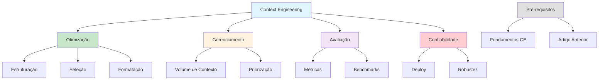

# [Powerful LLM Applications Context Engineering - Towards Data Science](/blog/powerful-llm-applications-context-engineering---towards-data-science)

> [!compass] **[MyMess](/blog/moc---projeto-mymess)** » [Estudos](/blog/dashboard---estudos-mymess) » Engenharia de Contexto

---

> [!info]+ Detalhes do Artigo
> **Ler:** [How to Create Powerful LLM Applications with Context Engineering](https://towardsdatascience.com/how-to-create-powerful-llm-applications-with-context-engineering/)
> **Fonte:** Towards Data Science (Blog/Artigo)
> **Autores:** Eivind Kjosbakken
> **Publicado:** 18 de Agosto de 2025
> **Tempo de Leitura:** 7 minutos

> [!abstract]+ Materiais Complementares
>
> **Artigos Relacionados do Autor**
> - "How You Can Enhance LLMs with Context Engineering" (fundamentos)
> - Conteúdo sobre confiabilidade em LLMs
> - Guia de benchmarking com ARC AGI 3
>
> **Tópicos Principais**
> - Otimização de contexto
> - Gerenciamento de informação contextual
> - Metodologias de avaliação
> - Confiabilidade em deploy

> [!tip]- Léxico
>
> **Conceitos Fundamentais**
> - **Context Engineering**: Metodologia para aumentar eficácia de aplicações LLM
>
> **Técnicas e Estratégias**
> - **Context Optimization**: Processo de otimizar informação contextual
>
> **Tecnologia e IA**
> - **Reliability**: Considerações de confiabilidade em produção
>
> **Ferramentas e Recursos**
> - **ARC AGI 3**: Benchmark para avaliação de sistemas de IA
> [!question]- Pontos para Aprofundar (Sugestão da IA)
>
> - **Como medir eficácia do context engineering?**
>     - Estudar metodologias de avaliação apresentadas
> - **Quais são os fundamentos vs técnicas avançadas?**
>     - Revisar artigo anterior do autor
> - **Como garantir confiabilidade em produção?**
>     - Explorar considerações de deploy

> [!robot]- Sugestões Complementares
>
> - **Leituras Recomendadas:**
>     - Artigo anterior sobre fundamentos
>     - Guia de benchmarking ARC AGI 3
> - **Conceitos a Estudar:**
>     - Otimização de context window
>     - Estratégias de gerenciamento de contexto
> - **Exercícios Práticos:**
>     - Aplicar técnicas em aplicação existente
>     - Medir melhoria com contexto otimizado
>     - Benchmark antes/depois

---

## Resumo

Artigo de **Eivind Kjosbakken** no Towards Data Science sobre como criar **aplicações LLM poderosas** com Context Engineering. Define CE como "conceito poderoso para aumentar a eficácia de aplicações LLM". Cobre otimização de contexto, gerenciamento de informação contextual, metodologias de avaliação e considerações de confiabilidade. Recomenda leitura do artigo anterior sobre fundamentos antes das técnicas avançadas.

**Definição central:** "Context engineering is a powerful concept you can utilize to increase the effectiveness of your LLM applications."

---

## Principais Conceitos

### Foco do Artigo

A tabela abaixo resume as informações principais.

| Área | Descrição |
|:-----|:----------|
| **Otimização de Contexto** | Como estruturar e otimizar contexto |
| **Gerenciamento** | Técnicas para gerenciar informação contextual |
| **Avaliação** | Metodologias para medir eficácia |
| **Confiabilidade** | Considerações para deploy em produção |

### Pré-requisitos

O autor enfatiza que este é um artigo avançado que **build upon fundamentos**:

1. **Artigo Anterior**: "How You Can Enhance LLMs with Context Engineering"
2. **Conceitos Base**: Fundamentos de context engineering
3. **Material Complementar**: Confiabilidade em LLMs, benchmarking

### Público-Alvo

> [!info] Para Quem é Este Artigo
> Praticantes que ativamente desenvolvem aplicações de IA utilizando LLMs e buscam melhorar performance e confiabilidade dos seus sistemas.

---

## Detalhamento

### Estrutura Conceitual

O artigo apresenta Context Engineering como metodologia completa:

```
Fundamentos → Técnicas Avançadas → Avaliação → Deploy
```

### Áreas de Foco

**1. Otimização de Contexto**
- Estruturação de informação
- Seleção de dados relevantes
- Formatação para máxima eficácia

**2. Gerenciamento de Informação**
- Técnicas para gerenciar volume de contexto
- Trade-offs entre quantidade e qualidade
- Estratégias de priorização

**3. Metodologias de Avaliação**
- Como medir eficácia do contexto
- Benchmarks e métricas
- Comparação antes/depois

**4. Considerações de Confiabilidade**
- Deploy em produção
- Robustez do sistema
- Handling de edge cases

### Recursos Relacionados do Autor

A tabela a seguir detalha os campos e seus valores.

| Recurso | Função |
|:--------|:-------|
| **Artigo de Fundamentos** | Base conceitual para este material |
| **Confiabilidade em LLMs** | Como garantir sistemas robustos |
| **ARC AGI 3 Benchmarking** | Guia para avaliar sistemas |

---

## Mapa de Conceitos

O diagrama abaixo ilustra o fluxo do processo, mostrando as etapas e suas conexões.



---

## Insights & Aprendizados

**O que funcionou bem:**
- Abordagem estruturada (fundamentos → avançado)
- Foco em praticantes ativos
- Inclusão de considerações de produção
- Referências a benchmarks (ARC AGI 3)

**O que posso adaptar para o MyMess:**
- **Metodologia em camadas**: Fundamentos primeiro, depois avançado
- **Foco em confiabilidade**: Não só eficácia, mas robustez
- **Avaliação sistemática**: Medir antes/depois de otimizações
- **Deploy considerations**: Pensar em produção desde o início

**Ideias para aplicar:**
- Criar checklist de otimização de contexto
- Implementar métricas de eficácia
- Desenvolver benchmarks para projetos específicos
- Documentar considerações de deploy

---

## Recursos Adicionais

- [Towards Data Science - Artigo Original](https://towardsdatascience.com/how-to-create-powerful-llm-applications-with-context-engineering/)
- [Eivind Kjosbakken - Medium](https://medium.com/@eivind-kjosbakken)
- [ARC AGI 3 Benchmark](https://arcprize.org/)
- [Towards Data Science - LLM Applications](https://towardsdatascience.com/tagged/large-language-models)

---

## Propriedades da nota

> [!note]- Propriedades Gerais do Obsidian
>
>> **Identificação**
>
> | Campo      | Valor                    |
> |:-----------|:-------------------------|
> | **Título** | `INPUT[text:titulo]`     |
>
>> **Conexões**
>
> | Campo           | Valor                                                                 |
> |:----------------|:----------------------------------------------------------------------|
> | **Pai**         | `INPUT[suggester(optionQuery("")):pai]`                               |
> | **Coleção**     | `INPUT[inlineSelect(option(financeiro, Financeiro), option(growth, Growth), option(ia, IA), option(lideranca, Liderança), option(marketing, Marketing), option(negocios, Negócios), option(produtividade, Produtividade), option(pkm, PKM), option(saas, SaaS), option(tecnologia, Tecnologia), option(vendas, Vendas)):colecao]` |
> | **Área**        | `INPUT[suggester(optionQuery("Esforços/Áreas")):area]`                         |
> | **Projeto**     | `INPUT[suggester(optionQuery("#projeto")):projeto]`                   |
> | **Autor**       | `INPUT[suggester(optionQuery("Atlas/Pessoas")):pessoa]`                      |
> | **Relacionado** | `INPUT[inlineListSuggester(optionQuery(""), useLinks(true)):relacionado]` |
>
>> **Classificação**
>
> | Campo      | Valor                                                                 |
> |:-----------|:----------------------------------------------------------------------|
> | **Tipo**   | `INPUT[inlineSelect(option(atomica, Atômica), option(aula, Aula), option(artigo, Artigo), option(checklist, Checklist), option(curso, Curso), option(dashboard, Dashboard), option(framework, Framework), option(livro, Livro), option(moc, MOC), option(newsletter, Newsletter), option(pessoa, Pessoa), option(prompt, Prompt), option(template, Template Obsidian), option(tutorial, Tutorial), option(video_youtube, Vídeo Youtube)):tipo_nota]` |
> | **Tags**   | `INPUT[inlineList:tags]`                                              |
> | **Status** | `INPUT[inlineSelect(option(nao_iniciado, ⬜ Não Iniciado), option(em_andamento, 🔄 Em Andamento), option(concluido, ✅ Concluído), option(pausado, ⏸️ Pausado), option(cancelado, ❌ Cancelado)):status]` |
>
>> **Temporal**
>
> | Campo          | Valor                      |
> |:---------------|:---------------------------|
> | **Criado**     | `INPUT[date:data_criado]`       |
> | **Atualizado** | `INPUT[date:data_atualizado]`   |

> [!note]- Propriedades SaaS
>
> | Campo             | Valor                                                              |
> |:------------------|:-------------------------------------------------------------------|
> | **Mostrar Bloco** | `INPUT[toggle(onValue(true), offValue(false)):mostrar_bloco_saas]` |
> | **Status SaaS**   | `INPUT[toggle(onValue(true), offValue(false)):status_saas]`        |

> [!note]- Propriedades do Artigo
>
> | Campo            | Valor                          |
> |:-----------------|:-------------------------------|
> | **URL**          | `INPUT[text(placeholder(https://...)):url_artigo]`  |
> | **Fonte**        | `INPUT[text:fonte]`  |
> | **Autor**        | `INPUT[text:autor]`  |
> | **Data Publicação** | `INPUT[date:data_publicacao]`  |
> | **Tipo Conteúdo** | `INPUT[inlineSelect(option(educacional, Educacional), option(curadoria, Curadoria), option(historia, História Pessoal), option(listicle, Lista), option(contrarian, Opinião Contrária), option(tutorial, Tutorial), option(entrevista, Entrevista), option(analise, Análise), option(estudo_de_caso, Estudo de Caso), option(lancamento, Lançamento), option(opiniao, Opinião), option(outro, Outro)):tipo_conteudo]`  |

