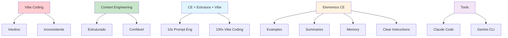

# [Practical Context Engineering Vibe Coding - Vijay Kumar](/blog/practical-context-engineering-vibe-coding---vijay-kumar)

> [!compass] **[MyMess](/blog/moc---projeto-mymess)** » [Estudos](/blog/dashboard---estudos-mymess) » Engenharia de Contexto

---

> [!info]+ Detalhes do Artigo
> **Ler:** [Practical Context Engineering for Vibe Coding with Claude Code](https://abvijaykumar.medium.com/practical-context-engineering-for-vibe-coding-with-claude-code-6aac4ee77f81)
> **Fonte:** Medium - Vijay Kumar (Blog/Artigo)
> **Autores:** A B Vijay Kumar (IBM Fellow, Master Inventor)
> **Publicado:** 18 de Julho de 2025
> **Tempo de Leitura:** 9 minutos

> [!abstract]+ Materiais Complementares
>
> **Ferramentas Vibe Coding**
> - Claude Code - Anthropic
> - Gemini CLI - Google
>
> **Curated List do Autor**
> - 5 stories sobre Vibe Coding no Medium
>
> **Conceitos Relacionados**
> - Context Engineering como skill emergente
> - Eliminação de trial-error em prompts

> [!tip]- Léxico
>
> **Tecnologia e IA**
> - **Vibe Coding**: Geração de código completo com zero experiência prévia
> - **10x/100x Better**: CE é 10x melhor que prompt engineering, 100x melhor que vibe coding
>
> **Técnicas e Estratégias**
> - **Context Engineering**: Abordagem estruturada que traz confiabilidade ao vibe coding
>
> **Ferramentas e Recursos**
> - **Agentic AI Tools**: Claude Code, Gemini CLI - ferramentas que geram aplicações completas
> [!question]- Pontos para Aprofundar (Sugestão da IA)
>
> - **Como CE elimina trial-error?**
>     - Explorar exemplos, summaries, memory, clear instructions
> - **Qual a diferença entre vibe coding e CE?**
>     - Vibe coding = intuitivo, CE = estruturado
> - **Como o autor aplica na prática?**
>     - Estudar workflow e resultados

> [!robot]- Sugestões Complementares
>
> - **Leituras Recomendadas:**
>     - Lista "Vibe Coding" do autor no Medium
>     - Artigos anteriores sobre Context Engineering
> - **Ferramentas para Testar:**
>     - **Claude Code** - Para desenvolvimento agentic
>     - **Gemini CLI** - Alternativa Google
> - **Exercícios Práticos:**
>     - Experimentar vibe coding em projeto novo
>     - Aplicar CE para melhorar qualidade de output
>     - Comparar resultados antes/depois de CE

---

## Resumo

Artigo de **A B Vijay Kumar** (IBM Fellow, Master Inventor) sobre **Context Engineering prático para Vibe Coding** com Claude Code. Define vibe coding como uso de ferramentas agentic (Claude Code, Gemini CLI) que permitem gerar "aplicações completas com zero experiência de código". Argumenta que CE é uma **skill emergente e crítica** que traz **estrutura e confiabilidade** ao vibe coding. CE é descrito como "10x melhor que prompt engineering e 100x melhor que vibe coding" porque elimina trial-error através de exemplos, summaries, memory e instruções claras.

**Insight central:** "Context engineering offers a structured approach to vibe coding and has significantly increased output quality, making the results more reliable."

---

## Principais Conceitos

### Vibe Coding vs Context Engineering

A tabela abaixo resume as informações principais.

| Aspecto | Vibe Coding | Context Engineering |
|:--------|:------------|:--------------------|
| **Abordagem** | Intuitiva | Estruturada |
| **Confiabilidade** | Inconsistente | Alta |
| **Processo** | Trial-error | Exemplos + Memory + Instructions |
| **Resultado** | Variável | Consistente |

### Multiplicadores de Eficácia

A tabela a seguir detalha os campos e seus valores.

| Técnica | Comparação |
|:--------|:-----------|
| **Context Engineering** | Baseline (melhor) |
| **Prompt Engineering** | CE é 10x melhor |
| **Vibe Coding Puro** | CE é 100x melhor |

### Ferramentas Agentic de Vibe Coding

Os dados abaixo mostram a estrutura e configurações.

| Ferramenta | Empresa | Característica |
|:-----------|:--------|:---------------|
| **Claude Code** | Anthropic | Linha de comando, agentic |
| **Gemini CLI** | Google | Alternativa com integração Google |

---

## Detalhamento

### O que é Vibe Coding

> [!quote] Definição
> Ferramentas de "true Vibe-Coding" que permitem usuários gerar código completo com **zero experiência prévia de código**.

**Características:**
- Geração de aplicações completas
- Abordagem intuitiva
- Sem necessidade de conhecimento técnico prévio
- Resultados variáveis

### Por que Context Engineering é Crítico

O autor argumenta que CE é uma **skill emergente e crítica** porque:

1. **Traz estrutura** ao que era intuitivo
2. **Aumenta confiabilidade** dos resultados
3. **Elimina trial-error** do prompt engineering tradicional

### Como CE Elimina Trial-Error

Em vez de "endlessly tweaking every word hoping your prompt would work":

| Elemento | Função |
|:---------|:-------|
| **Examples** | Demonstrar formato esperado |
| **Summaries** | Contextualizar informação |
| **Memory** | Manter estado entre interações |
| **Clear Instructions** | Eliminar ambiguidade |

### Sobre o Autor

**A B Vijay Kumar:**
- IBM Fellow
- Master Inventor
- Expertise em Agentic AI, GenAI, Hybrid Cloud, Mobile, RPi Full-Stack
- Curador de lista "Vibe Coding" com 5 stories no Medium

### Aprendizados Práticos do Autor

> [!success] Resultado Prático
> Na experiência do autor, context engineering **aumentou significativamente a qualidade do output**, tornando os resultados **mais confiáveis**.

---

## Mapa de Conceitos

O diagrama abaixo ilustra o fluxo do processo, mostrando as etapas e suas conexões.

---

## Insights & Aprendizados

**O que funcionou bem:**
- Distinção clara entre vibe coding e CE
- Multiplicadores concretos (10x, 100x)
- Experiência prática do autor como validação
- Elementos específicos que eliminam trial-error

**O que posso adaptar para o MyMess:**
- **Estrutura + Intuição**: Combinar criatividade com processo
- **4 Elementos**: Aplicar examples, summaries, memory, instructions
- **Medição de Qualidade**: Avaliar consistência dos outputs
- **Eliminação de Trial-Error**: Investir em contexto upfront

**Ideias para aplicar:**
- Criar templates com os 4 elementos de CE
- Medir confiabilidade antes/depois de CE
- Treinar equipe na abordagem estruturada
- Documentar exemplos de sucesso

---

## Recursos Adicionais

- [Medium - Artigo Original](https://abvijaykumar.medium.com/practical-context-engineering-for-vibe-coding-with-claude-code-6aac4ee77f81)
- [Medium - Lista Vibe Coding](https://abvijaykumar.medium.com/list/vibe-coding-f7a176b99480)
- [Thoughtworks - Vibe Coding to Context Engineering](https://www.thoughtworks.com/insights/blog/machine-learning-and-ai/vibe-coding-context-engineering-2025-software-development)
- [MIT Technology Review - 2025 Software Development](https://www.technologyreview.com/2025/11/05/1127477/from-vibe-coding-to-context-engineering-2025-in-software-development/)
- [GitHub - Context Engineering Intro](https://github.com/coleam00/context-engineering-intro)

---

## Propriedades da nota

> [!note]- Propriedades Gerais do Obsidian
>
>> **Identificação**
>
> | Campo      | Valor                    |
> |:-----------|:-------------------------|
> | **Título** | `INPUT[text:titulo]`     |
>
>> **Conexões**
>
> | Campo           | Valor                                                                 |
> |:----------------|:----------------------------------------------------------------------|
> | **Pai**         | `INPUT[suggester(optionQuery("")):pai]`                               |
> | **Coleção**     | `INPUT[inlineSelect(option(financeiro, Financeiro), option(growth, Growth), option(ia, IA), option(lideranca, Liderança), option(marketing, Marketing), option(negocios, Negócios), option(produtividade, Produtividade), option(pkm, PKM), option(saas, SaaS), option(tecnologia, Tecnologia), option(vendas, Vendas)):colecao]` |
> | **Área**        | `INPUT[suggester(optionQuery("Esforços/Áreas")):area]`                         |
> | **Projeto**     | `INPUT[suggester(optionQuery("#projeto")):projeto]`                   |
> | **Autor**       | `INPUT[suggester(optionQuery("Atlas/Pessoas")):pessoa]`                      |
> | **Relacionado** | `INPUT[inlineListSuggester(optionQuery(""), useLinks(true)):relacionado]` |
>
>> **Classificação**
>
> | Campo      | Valor                                                                 |
> |:-----------|:----------------------------------------------------------------------|
> | **Tipo**   | `INPUT[inlineSelect(option(atomica, Atômica), option(aula, Aula), option(artigo, Artigo), option(checklist, Checklist), option(curso, Curso), option(dashboard, Dashboard), option(framework, Framework), option(livro, Livro), option(moc, MOC), option(newsletter, Newsletter), option(pessoa, Pessoa), option(prompt, Prompt), option(template, Template Obsidian), option(tutorial, Tutorial), option(video_youtube, Vídeo Youtube)):tipo_nota]` |
> | **Tags**   | `INPUT[inlineList:tags]`                                              |
> | **Status** | `INPUT[inlineSelect(option(nao_iniciado, ⬜ Não Iniciado), option(em_andamento, 🔄 Em Andamento), option(concluido, ✅ Concluído), option(pausado, ⏸️ Pausado), option(cancelado, ❌ Cancelado)):status]` |
>
>> **Temporal**
>
> | Campo          | Valor                      |
> |:---------------|:---------------------------|
> | **Criado**     | `INPUT[date:data_criado]`       |
> | **Atualizado** | `INPUT[date:data_atualizado]`   |

> [!note]- Propriedades SaaS
>
> | Campo             | Valor                                                              |
> |:------------------|:-------------------------------------------------------------------|
> | **Mostrar Bloco** | `INPUT[toggle(onValue(true), offValue(false)):mostrar_bloco_saas]` |
> | **Status SaaS**   | `INPUT[toggle(onValue(true), offValue(false)):status_saas]`        |

> [!note]- Propriedades do Artigo
>
> | Campo            | Valor                          |
> |:-----------------|:-------------------------------|
> | **URL**          | `INPUT[text(placeholder(https://...)):url_artigo]`  |
> | **Fonte**        | `INPUT[text:fonte]`  |
> | **Autor**        | `INPUT[text:autor]`  |
> | **Data Publicação** | `INPUT[date:data_publicacao]`  |
> | **Tipo Conteúdo** | `INPUT[inlineSelect(option(educacional, Educacional), option(curadoria, Curadoria), option(historia, História Pessoal), option(listicle, Lista), option(contrarian, Opinião Contrária), option(tutorial, Tutorial), option(entrevista, Entrevista), option(analise, Análise), option(estudo_de_caso, Estudo de Caso), option(lancamento, Lançamento), option(opiniao, Opinião), option(outro, Outro)):tipo_conteudo]`  |

