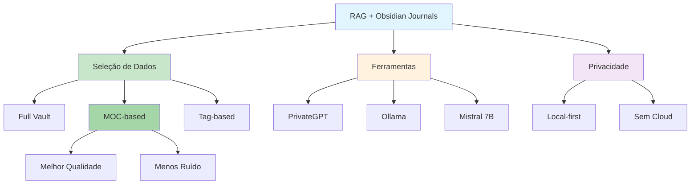

# [RAG Analyze Journals Obsidian - Reddit LocalLLaMA](/blog/rag-analyze-journals-obsidian---reddit-localllama)

> [!compass] **[MyMess](/blog/moc---projeto-mymess)** » [Estudos](/blog/dashboard---estudos-mymess) » Engenharia de Contexto

---

> [!info]+ Detalhes do Artigo
> **Ler:** [Using RAG to Analyze Journals from Obsidian](https://www.reddit.com/r/LocalLLaMA/comments/1gp3w02/using_a_rag_to_analyze_journals_and_entries_from/)
> **Fonte:** Reddit - r/LocalLLaMA (Discussão Comunidade)
> **Autores:** Comunidade LocalLLaMA
> **Publicado:** Novembro 2024

> [!abstract]+ Materiais Complementares
>
> **Ferramentas Mencionadas**
> - PrivateGPT - API configurável para RAG
> - Ollama - Servidor de LLMs locais
> - Mistral 7B - Modelo recomendado
> - LM Studio - Interface GUI para LLMs
>
> **Projetos GitHub**
> - obsidian-rag (chrispine6) - Smart RAG
> - Personal Notes Assistant - MCP Server

> [!tip]- Léxico
>
> **Tecnologia e IA**
> - **RAG para Journals**: Análise aumentada de diários pessoais
> - **Zettelkasten + RAG**: Aproveitar links para selecionar notas relevantes
>
> **Conteúdo e Criação**
> - **MOC-specific RAG**: Usar Map of Content para criar contexto específico
>
> **Outros Conceitos**
> - **Local-first**: Privacidade total, sem cloud
> [!question]- Pontos para Aprofundar (Sugestão da IA)
>
> - **Como selecionar notas para o vector store?**
>     - Menos dados = melhores resultados
> - **Como usar MOCs para criar RAGs específicos?**
>     - Caminhar árvore de links
> - **Qual modelo funciona melhor para journals?**
>     - Testar Mistral 7B vs outros

> [!robot]- Sugestões Complementares
>
> - **Leituras Recomendadas:**
>     - BitsOfChris - Training LLM on Obsidian
>     - Obsidian Forum - RAG Plugin Ideas
> - **Ferramentas para Testar:**
>     - **PrivateGPT** - RAG pipeline configurável
>     - **Personal Notes Assistant** - MCP server para Obsidian
> - **Exercícios Práticos:**
>     - Configurar RAG com subset de journals
>     - Testar MOC-based selection
>     - Comparar qualidade com diferentes quantidades de dados

---

## Resumo

Discussão da comunidade **r/LocalLLaMA** sobre uso de **RAG para analisar journals do Obsidian**. Destaca que **carregar menos dados produz melhores resultados** - selecionar apenas notas relevantes em vez de todo o vault. Sugere usar metodologia **Zettelkasten com MOCs** (Map of Content) para criar RAGs específicos por tema. Ferramentas mencionadas: PrivateGPT, Ollama, Mistral 7B. Enfatiza benefícios de privacidade com LLMs locais.

**Insight central:** "More interesting and useful results came when loading less data into the vector store. If manually selecting only notes relevant to the question, responses were more potent."

---

## Principais Conceitos

### Abordagem "Menos é Mais"

A tabela abaixo resume as informações principais.

| Estratégia | Resultado |
|:-----------|:----------|
| **Todo o vault** | Respostas genéricas, ruído |
| **Seleção manual** | Respostas mais potentes |
| **MOC-based** | RAG específico por tema |

### Técnica MOC + Zettelkasten

> [!quote] Insight Chave
> "Using Obsidian with a Zettelkasten note-taking method, you can take a MOC (Map of Content) note and walk the tree of links to only load those notes - creating a RAG specific to that MOC."

### Stack Técnico Recomendado

A tabela a seguir detalha os campos e seus valores.

| Componente | Ferramenta | Função |
|:-----------|:-----------|:-------|
| **Pipeline RAG** | PrivateGPT | Abstrai detalhes do RAG |
| **Servidor LLM** | Ollama | Executa modelos localmente |
| **Modelo** | Mistral 7B | Equilíbrio performance/recursos |
| **Interface** | LM Studio | GUI opcional |

---

## Detalhamento

### Configuração PrivateGPT + Ollama

**Passos básicos:**
1. Instalar Ollama
2. Baixar modelo: `ollama pull mistral`
3. Configurar PrivateGPT para usar Ollama como backend
4. Apontar para pasta de journals

### Estratégias de Seleção de Dados

Os dados abaixo mostram a estrutura e configurações.

| Estratégia | Quando Usar | Trade-off |
|:-----------|:------------|:----------|
| **Full Vault** | Perguntas gerais | Ruído alto |
| **Folder-based** | Tema específico | Médio |
| **MOC-based** | Projeto/conceito | Melhor qualidade |
| **Tag-based** | Cross-folder | Flexível |

### Personal Notes Assistant (MCP Server)

**Funcionalidades:**
- Transforma vault em knowledge base dinâmica
- Indexa notas em Milvus vector database
- Sincronização em tempo real com mudanças
- Suporta Ollama local ou OpenAI API

### Benefícios de Privacidade

> [!success] Vantagem Local
> "Using a LLM locally is not only more flexible than using online models hosted by corporations, it is also better for privacy because you don't give away any information about yourself, your system and files."

---

## Mapa de Conceitos

O diagrama abaixo ilustra o fluxo do processo, mostrando as etapas e suas conexões.

---

## Insights & Aprendizados

**O que funcionou bem:**
- MOC como filtro de contexto
- Seleção manual supera indexação total
- PrivateGPT abstrai complexidade do RAG
- Mistral 7B bom balanço para hardware limitado

**O que posso adaptar para o MyMess:**
- **MOC-based RAG**: Criar RAGs específicos por cliente/projeto
- **Seleção curada**: Não indexar tudo, selecionar relevante
- **Personal Notes Assistant**: Testar MCP server para vault
- **Zettelkasten approach**: Usar links para criar contexto

**Ideias para aplicar:**
- Criar MOC por tipo de trabalho (briefings, campanhas, etc.)
- Implementar RAG seletivo por projeto
- Testar Personal Notes Assistant com vault MyMess
- Documentar estratégias de seleção que funcionam

---

## Recursos Adicionais

- [Obsidian Forum - RAG Personal AI Bot](https://forum.obsidian.md/t/obsidian-rag-personal-ai-bot/93020)
- [BitsOfChris - Training LLM on Obsidian](https://bitsofchris.com/p/i-trained-a-local-llm-on-my-obsidian)
- [GitHub - obsidian-rag](https://github.com/chrispine6/obsidian-rag)
- [Personal Notes Assistant MCP](https://mcpmarket.com/server/personal-notes-assistant)
- [Sarah Glasmacher - Local RAG 2025](https://sarahglasmacher.com/starting-january-project-local-rag-system/)

---

## Propriedades da nota

> [!note]- Propriedades Gerais do Obsidian
>
>> **Identificação**
>
> | Campo      | Valor                    |
> |:-----------|:-------------------------|
> | **Título** | `INPUT[text:titulo]`     |
>
>> **Conexões**
>
> | Campo           | Valor                                                                 |
> |:----------------|:----------------------------------------------------------------------|
> | **Pai**         | `INPUT[suggester(optionQuery("")):pai]`                               |
> | **Coleção**     | `INPUT[inlineSelect(option(financeiro, Financeiro), option(growth, Growth), option(ia, IA), option(lideranca, Liderança), option(marketing, Marketing), option(negocios, Negócios), option(produtividade, Produtividade), option(pkm, PKM), option(saas, SaaS), option(tecnologia, Tecnologia), option(vendas, Vendas)):colecao]` |
> | **Área**        | `INPUT[suggester(optionQuery("Esforços/Áreas")):area]`                         |
> | **Projeto**     | `INPUT[suggester(optionQuery("#projeto")):projeto]`                   |
> | **Autor**       | `INPUT[suggester(optionQuery("Atlas/Pessoas")):pessoa]`                      |
> | **Relacionado** | `INPUT[inlineListSuggester(optionQuery(""), useLinks(true)):relacionado]` |
>
>> **Classificação**
>
> | Campo      | Valor                                                                 |
> |:-----------|:----------------------------------------------------------------------|
> | **Tipo**   | `INPUT[inlineSelect(option(atomica, Atômica), option(aula, Aula), option(artigo, Artigo), option(checklist, Checklist), option(curso, Curso), option(dashboard, Dashboard), option(framework, Framework), option(livro, Livro), option(moc, MOC), option(newsletter, Newsletter), option(pessoa, Pessoa), option(prompt, Prompt), option(template, Template Obsidian), option(tutorial, Tutorial), option(video_youtube, Vídeo Youtube)):tipo_nota]` |
> | **Tags**   | `INPUT[inlineList:tags]`                                              |
> | **Status** | `INPUT[inlineSelect(option(nao_iniciado, ⬜ Não Iniciado), option(em_andamento, 🔄 Em Andamento), option(concluido, ✅ Concluído), option(pausado, ⏸️ Pausado), option(cancelado, ❌ Cancelado)):status]` |
>
>> **Temporal**
>
> | Campo          | Valor                      |
> |:---------------|:---------------------------|
> | **Criado**     | `INPUT[date:data_criado]`       |
> | **Atualizado** | `INPUT[date:data_atualizado]`   |

> [!note]- Propriedades SaaS
>
> | Campo             | Valor                                                              |
> |:------------------|:-------------------------------------------------------------------|
> | **Mostrar Bloco** | `INPUT[toggle(onValue(true), offValue(false)):mostrar_bloco_saas]` |
> | **Status SaaS**   | `INPUT[toggle(onValue(true), offValue(false)):status_saas]`        |

> [!note]- Propriedades do Artigo
>
> | Campo            | Valor                          |
> |:-----------------|:-------------------------------|
> | **URL**          | `INPUT[text(placeholder(https://...)):url_artigo]`  |
> | **Fonte**        | `INPUT[text:fonte]`  |
> | **Autor**        | `INPUT[text:autor]`  |
> | **Data Publicação** | `INPUT[date:data_publicacao]`  |
> | **Tipo Conteúdo** | `INPUT[inlineSelect(option(educacional, Educacional), option(curadoria, Curadoria), option(historia, História Pessoal), option(listicle, Lista), option(contrarian, Opinião Contrária), option(tutorial, Tutorial), option(entrevista, Entrevista), option(analise, Análise), option(estudo_de_caso, Estudo de Caso), option(lancamento, Lançamento), option(opiniao, Opinião), option(outro, Outro)):tipo_conteudo]`  |

