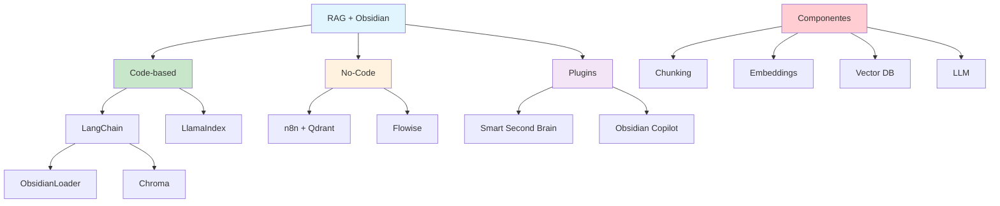

# [RAG System Based on Obsidian Notes - AllAboutWebDev](/blog/rag-system-based-on-obsidian-notes---allaboutwebdev)

> [!compass] **[MyMess](/blog/moc---projeto-mymess)** » [Estudos](/blog/dashboard---estudos-mymess) » Engenharia de Contexto

---

> [!info]+ Detalhes do Artigo
> **Ler:** [6 Steps Building an RAG System Based on Obsidian Notes](https://allaboutwebdev.com/rag/)
> **Fonte:** AllAboutWebDev (Tutorial Técnico)
> **Autores:** AllAboutWebDev
> **Publicado:** 2025

> [!abstract]+ Materiais Complementares
>
> **Ferramentas para RAG + Obsidian**
> - obsidian-rag (GitHub) - LangChain based
> - n8n + Qdrant - No-code approach
> - Flowise - Visual RAG builder
> - LlamaIndex - Knowledge Graph RAG
>
> **Componentes Típicos**
> - Vector Database (Milvus, Qdrant, Chroma)
> - Embedding Model (OpenAI, nomic-embed-text)
> - LLM (GPT-4, Mistral, Llama)

> [!tip]- Léxico
>
> **Outros Conceitos**
> - **Vector Database**: Armazenamento de embeddings
> - **Chunking**: Divisão de documentos em partes menores
>
> **Tecnologia e IA**
> - **RAG Pipeline**: Fluxo completo de retrieval + generation
>
> **Conteúdo e Criação**
> - **Embedding**: Representação vetorial de texto
> [!question]- Pontos para Aprofundar (Sugestão da IA)
>
> - **Qual o melhor tamanho de chunk para notas Obsidian?**
>     - Testar diferentes configurações
> - **Como lidar com links entre notas?**
>     - Estratégias de processamento de wikilinks
> - **Qual vector database escolher?**
>     - Comparar Milvus vs Qdrant vs Chroma

> [!robot]- Sugestões Complementares
>
> - **Leituras Recomendadas:**
>     - GitHub obsidian-rag documentation
>     - LlamaIndex Obsidian integration
> - **Ferramentas para Testar:**
>     - **n8n** - Automação no-code
>     - **Flowise** - Visual RAG builder
>     - **LangChain** - Framework programático
> - **Exercícios Práticos:**
>     - Implementar RAG básico com subset de notas
>     - Testar diferentes embedding models
>     - Comparar abordagens code vs no-code

---

## Resumo

Tutorial sobre construção de **sistema RAG (Retrieval Augmented Generation)** usando notas do Obsidian como base de conhecimento. Cobre diferentes abordagens: **programática** (LangChain, LlamaIndex), **no-code** (n8n + Qdrant, Flowise), e **plugins nativos**. Destaca projeto **obsidian-rag** que usa LangChain com ObsidianLoader. Enfatiza importância de escolher corretamente vector database e embedding model.

**Conceito central:** Combinar busca semântica (retrieval) com geração de texto (LLM) para criar assistente personalizado com conhecimento do vault.

---

## Principais Conceitos

### Arquitetura RAG com Obsidian

```
Obsidian Vault → Chunking → Embeddings → Vector DB → Retrieval → LLM → Response
      .md files      ↓           ↓           ↓           ↓         ↓
                 Divisão    Vetorização  Armazenamento Busca   Geração
```

### Abordagens de Implementação

A tabela abaixo resume as informações principais.

| Abordagem | Ferramenta | Complexidade | Flexibilidade |
|:----------|:-----------|:-------------|:--------------|
| **Code** | LangChain, LlamaIndex | Alta | Máxima |
| **No-Code** | n8n, Flowise | Baixa | Média |
| **Plugin** | Obsidian plugins | Mínima | Limitada |

### Vector Databases Comparativo

A tabela a seguir detalha os campos e seus valores.

| Database | Características | Melhor Para |
|:---------|:---------------|:------------|
| **Chroma** | Leve, local | Protótipos |
| **Qdrant** | Rápido, filtros | Produção médio porte |
| **Milvus** | Escalável, enterprise | Alto volume |
| **Pinecone** | Cloud, managed | Simplicidade |

---

## Detalhamento

### Projeto obsidian-rag (LangChain)

**Stack:**
- LangChain framework
- ObsidianLoader (nativo)
- OllamaEmbeddings ou OpenAI
- Chroma vector store

**Funcionalidades:**
- Local-first (privacidade)
- Suporte a markdown com frontmatter
- Processamento de wikilinks

### n8n + Qdrant (No-Code)

**Workflow:**
1. Trigger: Mudança em pasta Google Drive/local
2. Process: Chunking e embedding
3. Store: Qdrant vector database
4. Query: Interface conversacional

**Vantagens:**
- Sem código
- Visual e intuitivo
- Integração com múltiplas fontes

### Flowise RAG (Visual Builder)

> [!quote] Proposta
> "Build a fully local RAG application based on notes in your Obsidian Vault, without writing a single line of code."

**Componentes visuais:**
- Document loaders
- Text splitters
- Embedding nodes
- Vector store nodes
- Chat models

### LlamaIndex Knowledge Graph RAG

**Diferencial:**
- Além de embeddings, cria knowledge graph
- Preserva relacionamentos entre notas
- Melhor para navegação contextual

---

## Mapa de Conceitos

O diagrama abaixo ilustra o fluxo do processo, mostrando as etapas e suas conexões.



---

## Insights & Aprendizados

**O que funcionou bem:**
- ObsidianLoader do LangChain processa markdown nativamente
- n8n para quem não quer código
- Flowise para prototipagem visual
- Chroma como vector DB leve para começar

**O que posso adaptar para o MyMess:**
- **n8n Workflow**: Para sincronização automática de notas
- **LangChain**: Para controle granular do pipeline
- **Flowise**: Para protótipos rápidos
- **Knowledge Graph**: Para preservar conexões

**Ideias para aplicar:**
- Implementar n8n workflow para vault MyMess
- Testar Flowise para criar RAG visual
- Usar ObsidianLoader para processar briefings
- Comparar Chroma vs Qdrant para scale

---

## Recursos Adicionais

- [GitHub - obsidian-rag](https://github.com/ParthSareen/obsidian-rag)
- [n8n RAG for Obsidian Guide](https://rumjahn.com/how-to-create-an-a-i-agent-for-obsidian-using-n8n-rag-a-step-by-step-guide-without-coding/)
- [Flowise RAG for Obsidian](https://medium.com/@martk/talking-to-your-second-brain-build-a-flowise-rag-to-chat-with-your-obsidian-vault-00645106e73b)
- [LlamaIndex Knowledge Graph RAG](https://medium.com/@haiyangli_38602/make-knowledge-graph-rag-with-llamaindex-from-own-obsidian-notes-b20a350fa354)
- [Obsidian Forum - RAG Search Plugin](https://forum.obsidian.md/t/developing-obsidian-rag-search-plugin-beta/100876)

---

## Propriedades da nota

> [!note]- Propriedades Gerais do Obsidian
>
>> **Identificação**
>
> | Campo      | Valor                    |
> |:-----------|:-------------------------|
> | **Título** | `INPUT[text:titulo]`     |
>
>> **Conexões**
>
> | Campo           | Valor                                                                 |
> |:----------------|:----------------------------------------------------------------------|
> | **Pai**         | `INPUT[suggester(optionQuery("")):pai]`                               |
> | **Coleção**     | `INPUT[inlineSelect(option(financeiro, Financeiro), option(growth, Growth), option(ia, IA), option(lideranca, Liderança), option(marketing, Marketing), option(negocios, Negócios), option(produtividade, Produtividade), option(pkm, PKM), option(saas, SaaS), option(tecnologia, Tecnologia), option(vendas, Vendas)):colecao]` |
> | **Área**        | `INPUT[suggester(optionQuery("Esforços/Áreas")):area]`                         |
> | **Projeto**     | `INPUT[suggester(optionQuery("#projeto")):projeto]`                   |
> | **Autor**       | `INPUT[suggester(optionQuery("Atlas/Pessoas")):pessoa]`                      |
> | **Relacionado** | `INPUT[inlineListSuggester(optionQuery(""), useLinks(true)):relacionado]` |
>
>> **Classificação**
>
> | Campo      | Valor                                                                 |
> |:-----------|:----------------------------------------------------------------------|
> | **Tipo**   | `INPUT[inlineSelect(option(atomica, Atômica), option(aula, Aula), option(artigo, Artigo), option(checklist, Checklist), option(curso, Curso), option(dashboard, Dashboard), option(framework, Framework), option(livro, Livro), option(moc, MOC), option(newsletter, Newsletter), option(pessoa, Pessoa), option(prompt, Prompt), option(template, Template Obsidian), option(tutorial, Tutorial), option(video_youtube, Vídeo Youtube)):tipo_nota]` |
> | **Tags**   | `INPUT[inlineList:tags]`                                              |
> | **Status** | `INPUT[inlineSelect(option(nao_iniciado, ⬜ Não Iniciado), option(em_andamento, 🔄 Em Andamento), option(concluido, ✅ Concluído), option(pausado, ⏸️ Pausado), option(cancelado, ❌ Cancelado)):status]` |
>
>> **Temporal**
>
> | Campo          | Valor                      |
> |:---------------|:---------------------------|
> | **Criado**     | `INPUT[date:data_criado]`       |
> | **Atualizado** | `INPUT[date:data_atualizado]`   |

> [!note]- Propriedades SaaS
>
> | Campo             | Valor                                                              |
> |:------------------|:-------------------------------------------------------------------|
> | **Mostrar Bloco** | `INPUT[toggle(onValue(true), offValue(false)):mostrar_bloco_saas]` |
> | **Status SaaS**   | `INPUT[toggle(onValue(true), offValue(false)):status_saas]`        |

> [!note]- Propriedades do Artigo
>
> | Campo            | Valor                          |
> |:-----------------|:-------------------------------|
> | **URL**          | `INPUT[text(placeholder(https://...)):url_artigo]`  |
> | **Fonte**        | `INPUT[text:fonte]`  |
> | **Autor**        | `INPUT[text:autor]`  |
> | **Data Publicação** | `INPUT[date:data_publicacao]`  |
> | **Tipo Conteúdo** | `INPUT[inlineSelect(option(educacional, Educacional), option(curadoria, Curadoria), option(historia, História Pessoal), option(listicle, Lista), option(contrarian, Opinião Contrária), option(tutorial, Tutorial), option(entrevista, Entrevista), option(analise, Análise), option(estudo_de_caso, Estudo de Caso), option(lancamento, Lançamento), option(opiniao, Opinião), option(outro, Outro)):tipo_conteudo]`  |

