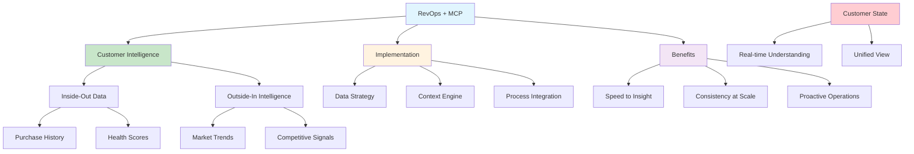

# [RevOps Context Engineering MCP - Poggio](/blog/revops-context-engineering-mcp---poggio)

> [!compass] **[MyMess](/blog/moc---projeto-mymess)** » [Estudos](/blog/dashboard---estudos-mymess) » Engenharia de Contexto

---

> [!info]+ Detalhes do Artigo
> **Ler:** [The RevOps Revolution: Context Engineering with MCP](https://www.poggio.io/post/revops-context-engineering-with-mcp)
> **Fonte:** Poggio.io (Blog Enterprise)
> **Autores:** Poggio
> **Publicado:** 2025

> [!abstract]+ Materiais Complementares
>
> **Dois Tipos de Inteligência**
> - Inside-Out (histórico): compras, health scores, engajamento
> - Outside-In (forward-looking): tendências, mudanças pessoal, competição
>
> **Componentes MCP para RevOps**
> - Organizational Data Strategy
> - Context Engine Implementation
> - Process Integration

> [!tip]- Léxico
>
> **Outros Conceitos**
> - **RevOps**: Revenue Operations - unificação de dados de receita
> - **Customer State**: Visão real-time completa de cada conta
> - **Inside-Out Data**: Dados históricos internos
>
> **Tecnologia e IA**
> - **Outside-In Intelligence**: Sinais externos forward-looking
> [!question]- Pontos para Aprofundar (Sugestão da IA)
>
> - **Como implementar Customer State na prática?**
>     - Mapear dados necessários
> - **Quais sistemas conectar via MCP?**
>     - CRM, product analytics, market intelligence
> - **Como medir ROI de context engineering em RevOps?**
>     - KPIs de speed to insight, consistency

> [!robot]- Sugestões Complementares
>
> - **Leituras Recomendadas:**
>     - Documentação MCP Anthropic
>     - RevOps frameworks
> - **Ferramentas Relacionadas:**
>     - **MCP** - Protocolo de integração
>     - **CRM Systems** - Salesforce, HubSpot
> - **Exercícios Práticos:**
>     - Mapear inside-out vs outside-in data
>     - Identificar gaps de customer intelligence
>     - Planejar implementação MCP

---

## Resumo

Artigo da **Poggio** sobre como **Context Engineering com MCP** está revolucionando **RevOps (Revenue Operations)**. Define MCP como "padrão aberto que funciona como tradutor universal entre agentes IA e aplicações de negócio". Apresenta conceito de **Customer State** - visão real-time completa de cada conta combinando dados **inside-out** (históricos) e **outside-in** (forward-looking). Destaca benefícios: redução de complexidade de integração, melhor utilização de ferramentas existentes, escalabilidade.

**Problema central:** "Customer intelligence remains fragmented, backward-looking, and disconnected from the real-time insights sellers need to win."

---

## Principais Conceitos

### Inside-Out vs Outside-In Intelligence

A tabela abaixo resume as informações principais.

| Tipo | Foco | Exemplos |
|:-----|:-----|:---------|
| **Inside-Out** | Histórico | Compras, renewals, health scores, engajamento |
| **Outside-In** | Forward-looking | Tendências de indústria, mudanças de pessoal, competição |

### O que é Customer State

> [!quote] Definição
> "Customer State é entendimento real-time englobando iniciativas estratégicas, dinâmicas organizacionais, pressões competitivas, restrições financeiras e requisitos técnicos - respondendo: 'O que realmente está acontecendo com esta conta?'"

### MCP para RevOps

A tabela a seguir detalha os campos e seus valores.

| Benefício | Descrição |
|:----------|:----------|
| **Reduced Complexity** | Elimina integrações ponto-a-ponto via protocolo padrão |
| **Enhanced Tool Utilization** | Transforma investimentos existentes em recursos AI-accessible |
| **Scalable Intelligence** | Custo incremental mínimo para expandir análise |
| **Future-Proof** | Integração seamless conforme stack evolui |

---

## Detalhamento

### Três Componentes de Implementação

**1. Organizational Data Strategy**
- Expor recursos internos através de MCP
- Tornar dados consumíveis por agentes IA
- Padronizar acesso a sistemas existentes

**2. Context Engine Implementation**
- Deploy de sistemas de inteligência domain-specific
- Combinar inside-out e outside-in intelligence
- Criar Customer State unificado

**3. Process Integration**
- Embedar ferramentas context-aware em workflows existentes
- Não substituir processos, aumentá-los
- Integração natural com dia-a-dia de vendas

### Vantagens Competitivas

Os dados abaixo mostram a estrutura e configurações.

| Vantagem | Impacto |
|:---------|:--------|
| **Speed to Insight** | Análise instantânea de pipeline inteiro |
| **Consistency at Scale** | Mesmo nível de insight para todo time |
| **Proactive RevOps** | Identificação antecipada de oportunidades |

### O Problema Atual

> [!warning] Gap de Inteligência
> Organizações investem pesadamente em tech stacks mas customer intelligence permanece fragmentada, backward-looking e desconectada dos insights que vendedores precisam para vencer.

---

## Mapa de Conceitos

O diagrama abaixo ilustra o fluxo do processo, mostrando as etapas e suas conexões.

---

## Insights & Aprendizados

**O que funcionou bem:**
- Distinção clara inside-out vs outside-in
- Customer State como conceito unificador
- MCP como "tradutor universal"
- Foco em aumentar processos existentes, não substituir

**O que posso adaptar para o MyMess:**
- **Customer State**: Criar visão unificada de cada cliente
- **Inside-Out + Outside-In**: Combinar histórico com sinais de mercado
- **MCP Integration**: Conectar ferramentas via protocolo padrão
- **Process Integration**: Embedar IA em workflows existentes

**Ideias para aplicar:**
- Mapear inside-out data disponível sobre clientes
- Identificar fontes de outside-in intelligence
- Planejar implementação de Customer State
- Testar MCP para conectar CRM + ferramentas

---

## Recursos Adicionais

- [Poggio - Artigo Original](https://www.poggio.io/post/revops-context-engineering-with-mcp)
- [Anthropic MCP Documentation](https://docs.anthropic.com/en/docs/mcp)
- [RevOps Best Practices](https://www.salesforce.com/resources/articles/revenue-operations/)
- [MCP GitHub Repository](https://github.com/modelcontextprotocol)

---

## Propriedades da nota

> [!note]- Propriedades Gerais do Obsidian
>
>> **Identificação**
>
> | Campo      | Valor                    |
> |:-----------|:-------------------------|
> | **Título** | `INPUT[text:titulo]`     |
>
>> **Conexões**
>
> | Campo           | Valor                                                                 |
> |:----------------|:----------------------------------------------------------------------|
> | **Pai**         | `INPUT[suggester(optionQuery("")):pai]`                               |
> | **Coleção**     | `INPUT[inlineSelect(option(financeiro, Financeiro), option(growth, Growth), option(ia, IA), option(lideranca, Liderança), option(marketing, Marketing), option(negocios, Negócios), option(produtividade, Produtividade), option(pkm, PKM), option(saas, SaaS), option(tecnologia, Tecnologia), option(vendas, Vendas)):colecao]` |
> | **Área**        | `INPUT[suggester(optionQuery("Esforços/Áreas")):area]`                         |
> | **Projeto**     | `INPUT[suggester(optionQuery("#projeto")):projeto]`                   |
> | **Autor**       | `INPUT[suggester(optionQuery("Atlas/Pessoas")):pessoa]`                      |
> | **Relacionado** | `INPUT[inlineListSuggester(optionQuery(""), useLinks(true)):relacionado]` |
>
>> **Classificação**
>
> | Campo      | Valor                                                                 |
> |:-----------|:----------------------------------------------------------------------|
> | **Tipo**   | `INPUT[inlineSelect(option(atomica, Atômica), option(aula, Aula), option(artigo, Artigo), option(checklist, Checklist), option(curso, Curso), option(dashboard, Dashboard), option(framework, Framework), option(livro, Livro), option(moc, MOC), option(newsletter, Newsletter), option(pessoa, Pessoa), option(prompt, Prompt), option(template, Template Obsidian), option(tutorial, Tutorial), option(video_youtube, Vídeo Youtube)):tipo_nota]` |
> | **Tags**   | `INPUT[inlineList:tags]`                                              |
> | **Status** | `INPUT[inlineSelect(option(nao_iniciado, ⬜ Não Iniciado), option(em_andamento, 🔄 Em Andamento), option(concluido, ✅ Concluído), option(pausado, ⏸️ Pausado), option(cancelado, ❌ Cancelado)):status]` |
>
>> **Temporal**
>
> | Campo          | Valor                      |
> |:---------------|:---------------------------|
> | **Criado**     | `INPUT[date:data_criado]`       |
> | **Atualizado** | `INPUT[date:data_atualizado]`   |

> [!note]- Propriedades SaaS
>
> | Campo             | Valor                                                              |
> |:------------------|:-------------------------------------------------------------------|
> | **Mostrar Bloco** | `INPUT[toggle(onValue(true), offValue(false)):mostrar_bloco_saas]` |
> | **Status SaaS**   | `INPUT[toggle(onValue(true), offValue(false)):status_saas]`        |

> [!note]- Propriedades do Artigo
>
> | Campo            | Valor                          |
> |:-----------------|:-------------------------------|
> | **URL**          | `INPUT[text(placeholder(https://...)):url_artigo]`  |
> | **Fonte**        | `INPUT[text:fonte]`  |
> | **Autor**        | `INPUT[text:autor]`  |
> | **Data Publicação** | `INPUT[date:data_publicacao]`  |
> | **Tipo Conteúdo** | `INPUT[inlineSelect(option(educacional, Educacional), option(curadoria, Curadoria), option(historia, História Pessoal), option(listicle, Lista), option(contrarian, Opinião Contrária), option(tutorial, Tutorial), option(entrevista, Entrevista), option(analise, Análise), option(estudo_de_caso, Estudo de Caso), option(lancamento, Lançamento), option(opiniao, Opinião), option(outro, Outro)):tipo_conteudo]`  |

