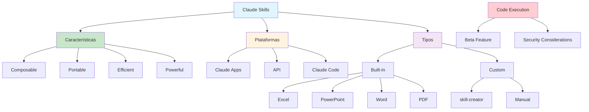

# [Skills - Claude Blog](/blog/skills---claude-blog)

> [!compass] **[MyMess](/blog/moc---projeto-mymess)** » [Estudos](/blog/dashboard---estudos-mymess) » Engenharia de Contexto

---

> [!info]+ Detalhes do Artigo
> **Ler:** [Skills](https://www.claude.com/blog/skills)
> **Fonte:** Claude Blog - Anthropic (Anúncio Oficial)
> **Autores:** Anthropic
> **Publicado:** 2025

> [!abstract]+ Materiais Complementares
>
> **4 Características de Skills**
> 1. Composable - Múltiplas skills trabalham juntas
> 2. Portable - Mesmo formato em apps, Claude Code, API
> 3. Efficient - Carrega apenas componentes necessários
> 4. Powerful - Pode incluir código executável
>
> **Plataformas Suportadas**
> - Claude Apps (Pro, Max, Team, Enterprise)
> - Claude Developer Platform (API)
> - Claude Code (plugins)

> [!tip]- Léxico
>
> **Técnicas e Estratégias**
> - **Skills**: Pastas com instruções, scripts e recursos que Claude carrega sob demanda
> - **Composable**: Skills funcionam juntas automaticamente
> - **skill-creator**: Ferramenta interativa para criar skills customizadas
> - **Code Execution Tool**: Beta que permite skills executarem código
> - **Como criar skills customizadas para workflows específicos?**
> - Usar skill-creator interativo
> - **Como skills se compõem automaticamente?**
>
> **Tecnologia e IA**
> - **Quais são as considerações de segurança?**
> - Avaliar riscos de code execution
>
> **Outros Conceitos**
> - Entender mecanismo de matching
> [!robot]- Sugestões Complementares
>
> - **Leituras Recomendadas:**
>     - Anthropic Skills Documentation
>     - Claude Code plugins guide
> - **Ferramentas para Testar:**
>     - **skill-creator** - Criação interativa
>     - **Claude Code plugins** - Marketplace de skills
> - **Exercícios Práticos:**
>     - Criar skill customizada com skill-creator
>     - Testar built-in skills (Excel, PowerPoint)
>     - Integrar skills via API

---

## Resumo

Anúncio oficial da **Anthropic** sobre **Claude Skills** - pastas especializadas contendo instruções, scripts e recursos que Claude carrega sob demanda. Skills são **composable** (funcionam juntas), **portable** (mesmo formato em todos ambientes), **efficient** (carrega apenas necessário), e **powerful** (incluem código executável). Disponível para Claude Apps (Pro+), API (/v1/skills), e Claude Code (plugins). Built-in skills permitem criar Excel, PowerPoint, Word e PDFs preenchíveis.

**Conceito central:** "Claude will only access a skill when it's relevant to the task at hand."

---

## Principais Conceitos

### 4 Características de Skills

A tabela abaixo resume as informações principais.

| Característica | Descrição |
|:---------------|:----------|
| **Composable** | Múltiplas skills trabalham juntas automaticamente |
| **Portable** | Mesmo formato funciona em apps, Claude Code e API |
| **Efficient** | Carrega apenas componentes necessários quando requerido |
| **Powerful** | Pode incluir código executável para tarefas confiáveis |

### Como Skills Funcionam

```
User Request → Claude Scans Available Skills → Match Relevante → Load Minimal Info → Execute
```

### Disponibilidade por Plataforma

A tabela a seguir detalha os campos e seus valores.

| Plataforma | Acesso | Recursos |
|:-----------|:-------|:---------|
| **Claude Apps** | Pro, Max, Team, Enterprise | Built-in + custom skills |
| **Claude API** | `/v1/skills` endpoint | Controle programático |
| **Claude Code** | `~/.claude/skills` | Plugins marketplace |

---

## Detalhamento

### Built-In Skills (Anthropic)

**Capacidades nativas:**
- Criar e editar planilhas **Excel** com fórmulas
- Gerar apresentações **PowerPoint**
- Criar documentos **Word**
- Gerar **PDFs preenchíveis**

### Custom Skills Development

**Processo com skill-creator:**
1. Ativar skill-creator interativo
2. Definir workflow desejado
3. Bundlar recursos automaticamente
4. Testar e iterar

> [!success] Sem edição manual
> "Users can create personalized skills without manual file editing. The skill-creator tool guides workflow definition and resource bundling automatically."

### Integração via API

```
POST /v1/skills
```

**Funcionalidades:**
- Criar skills programaticamente
- Listar skills disponíveis
- Ativar/desativar skills
- Code Execution Tool beta

### Integração Claude Code

**Instalação:**
- Marketplace `anthropics/skills`
- Manual: `~/.claude/skills`

**Estrutura de pasta:**
```
skill-name/
├── instructions.md
├── scripts/
│   └── main.py
└── resources/
    └── templates/
```

### Considerações de Segurança

> [!warning] Trusted Sources Only
> "Since skills execute code, users should only deploy trusted sources to protect data integrity."

---

## Mapa de Conceitos

O diagrama abaixo ilustra o fluxo do processo, mostrando as etapas e suas conexões.



---

## Insights & Aprendizados

**O que funcionou bem:**
- Skills se compõem automaticamente
- Portabilidade entre plataformas
- skill-creator elimina edição manual
- Built-in skills para documentos office

**O que posso adaptar para o MyMess:**
- **Custom Skills**: Criar skills para tarefas repetitivas
- **Document Generation**: Usar built-in para relatórios
- **API Integration**: Integrar skills em automações
- **Claude Code**: Instalar skills relevantes para desenvolvimento

**Ideias para aplicar:**
- Criar skill para geração de relatórios de campanha
- Usar built-in Excel para análises automáticas
- Desenvolver skill customizada para briefings
- Integrar skills via API em workflows existentes

---

## Recursos Adicionais

- [Claude Blog - Skills Announcement](https://www.claude.com/blog/skills)
- [Anthropic API Documentation](https://docs.anthropic.com)
- [Claude Code Plugins](https://github.com/anthropics/skills)
- [Claude.ai](https://claude.ai) - Interface oficial

---

## Propriedades da nota

> [!note]- Propriedades Gerais do Obsidian
>
>> **Identificação**
>
> | Campo      | Valor                    |
> |:-----------|:-------------------------|
> | **Título** | `INPUT[text:titulo]`     |
>
>> **Conexões**
>
> | Campo           | Valor                                                                 |
> |:----------------|:----------------------------------------------------------------------|
> | **Pai**         | `INPUT[suggester(optionQuery("")):pai]`                               |
> | **Coleção**     | `INPUT[inlineSelect(option(financeiro, Financeiro), option(growth, Growth), option(ia, IA), option(lideranca, Liderança), option(marketing, Marketing), option(negocios, Negócios), option(produtividade, Produtividade), option(pkm, PKM), option(saas, SaaS), option(tecnologia, Tecnologia), option(vendas, Vendas)):colecao]` |
> | **Área**        | `INPUT[suggester(optionQuery("Esforços/Áreas")):area]`                         |
> | **Projeto**     | `INPUT[suggester(optionQuery("#projeto")):projeto]`                   |
> | **Autor**       | `INPUT[suggester(optionQuery("Atlas/Pessoas")):pessoa]`                      |
> | **Relacionado** | `INPUT[inlineListSuggester(optionQuery(""), useLinks(true)):relacionado]` |
>
>> **Classificação**
>
> | Campo      | Valor                                                                 |
> |:-----------|:----------------------------------------------------------------------|
> | **Tipo**   | `INPUT[inlineSelect(option(atomica, Atômica), option(aula, Aula), option(artigo, Artigo), option(checklist, Checklist), option(curso, Curso), option(dashboard, Dashboard), option(framework, Framework), option(livro, Livro), option(moc, MOC), option(newsletter, Newsletter), option(pessoa, Pessoa), option(prompt, Prompt), option(template, Template Obsidian), option(tutorial, Tutorial), option(video_youtube, Vídeo Youtube)):tipo_nota]` |
> | **Tags**   | `INPUT[inlineList:tags]`                                              |
> | **Status** | `INPUT[inlineSelect(option(nao_iniciado, ⬜ Não Iniciado), option(em_andamento, 🔄 Em Andamento), option(concluido, ✅ Concluído), option(pausado, ⏸️ Pausado), option(cancelado, ❌ Cancelado)):status]` |
>
>> **Temporal**
>
> | Campo          | Valor                      |
> |:---------------|:---------------------------|
> | **Criado**     | `INPUT[date:data_criado]`       |
> | **Atualizado** | `INPUT[date:data_atualizado]`   |

> [!note]- Propriedades SaaS
>
> | Campo             | Valor                                                              |
> |:------------------|:-------------------------------------------------------------------|
> | **Mostrar Bloco** | `INPUT[toggle(onValue(true), offValue(false)):mostrar_bloco_saas]` |
> | **Status SaaS**   | `INPUT[toggle(onValue(true), offValue(false)):status_saas]`        |

> [!note]- Propriedades do Artigo
>
> | Campo            | Valor                          |
> |:-----------------|:-------------------------------|
> | **URL**          | `INPUT[text(placeholder(https://...)):url_artigo]`  |
> | **Fonte**        | `INPUT[text:fonte]`  |
> | **Autor**        | `INPUT[text:autor]`  |
> | **Data Publicação** | `INPUT[date:data_publicacao]`  |
> | **Tipo Conteúdo** | `INPUT[inlineSelect(option(educacional, Educacional), option(curadoria, Curadoria), option(historia, História Pessoal), option(listicle, Lista), option(contrarian, Opinião Contrária), option(tutorial, Tutorial), option(entrevista, Entrevista), option(analise, Análise), option(estudo_de_caso, Estudo de Caso), option(lancamento, Lançamento), option(opiniao, Opinião), option(outro, Outro)):tipo_conteudo]`  |

