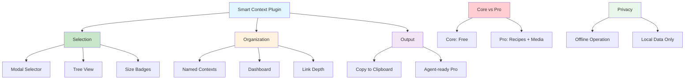

# [Smart Context Obsidian Plugin](/blog/smart-context-obsidian-plugin)

> [!compass] **[MyMess](/blog/moc---projeto-mymess)** » [Estudos](/blog/dashboard---estudos-mymess) » Engenharia de Contexto

---

> [!info]+ Detalhes do Artigo
> **Ler:** [Smart Context - Obsidian Plugin](https://smartconnections.app/smart-context/)
> **Fonte:** Smart Connections (Plugin Obsidian)
> **Autores:** Smart Connections Team
> **Publicado:** 2025

> [!abstract]+ Materiais Complementares
>
> **Core Features (Free)**
> - Modal selector com tree view e size badges
> - Named context saving e dashboard
> - Link depth selection com summaries
>
> **Pro Features (Paid)**
> - Reusable recipes em codeblocks
> - Media-aware copying (images, PDFs)
> - Structured agent-ready outputs
> - External source integration

> [!tip]- Léxico
>
> **Tecnologia e IA**
> - **Context Selector**: Modal interativo para selecionar notas
>
> **Conteúdo e Criação**
> - **Named Contexts**: Contextos salvos e reutilizáveis
>
> **Outros Conceitos**
> - **Link Depth**: Controle de profundidade de links a incluir
>
> **Métricas e Indicadores**
> - **Size Badges**: Indicadores visuais de tamanho/tokens
> [!question]- Pontos para Aprofundar (Sugestão da IA)
>
> - **Como otimizar seleção de contexto para diferentes LLMs?**
>     - Usar size summaries para respeitar limites
> - **Quais são os melhores use cases para named contexts?**
>     - Contextos frequentes, reuniões recorrentes
> - **Como integrar com workflows de IA existentes?**
>     - Copy to clipboard → paste em LLM

> [!robot]- Sugestões Complementares
>
> - **Leituras Recomendadas:**
>     - Smart Connections documentation
>     - Obsidian plugins comparison
> - **Ferramentas Relacionadas:**
>     - **Smart Connections** - Plugin irmão
>     - **Obsidian Copilot** - Alternativa
> - **Exercícios Práticos:**
>     - Instalar Smart Context Core (free)
>     - Criar named context para projeto
>     - Testar diferentes link depths

---

## Resumo

Plugin do Obsidian focado em **context engineering** que permite "curar contexto, não clutter". Permite selecionar e copiar **bundle preciso de notas, links e metadata** para qualquer modelo de IA em segundos. Features incluem **context selector modal** com tree view, **named contexts** salvos, **link depth control**, e **live size summaries** para respeitar limites de tokens. Opera **offline** - dados nunca saem do vault a menos que usuário copie explicitamente. Versão Core é gratuita.

**Proposta central:** "Curate context, not clutter. Copy a precise bundle of notes, links, and metadata into any AI model in seconds."

---

## Principais Conceitos

### Core vs Pro Features

A tabela abaixo resume as informações principais.

| Feature | Core (Free) | Pro (Paid) |
|:--------|:------------|:-----------|
| **Modal Selector** | Tree view + size badges | + Advanced filters |
| **Named Contexts** | Save + dashboard | + Recipes |
| **Link Depth** | Selection + summaries | + External sources |
| **Media** | Text only | Images, PDFs, tables |
| **Output** | Copy to clipboard | Agent-ready manifests |

### Workflow do Plugin

```
Select Notes → Configure Link Depth → Review Size → Copy Context → Paste in LLM
       ↓             ↓                  ↓             ↓
  Tree Modal    1-3 levels          Token count   Clipboard
```

### Privacidade

> [!success] Offline-First
> "Operates offline; data remains in the vault unless explicitly shared. Sensitive sections can be filtered before sharing context."

---

## Detalhamento

### Selection & Organization

**Context Selector Modal:**
- Tree view hierárquico
- Size badges inline para cada item
- Seleção individual ou por pasta
- Preview de conteúdo

**Named Contexts:**
- Salvar seleções para reutilização
- Dashboard dedicado para gerenciamento
- Ideal para contextos frequentes

### Content Management

**Link Depth Control:**
- Nível 0: Nota selecionada apenas
- Nível 1: Incluir notas linkadas diretamente
- Nível 2+: Links de links

**Live Size Summaries:**
- Contagem de tokens em tempo real
- Alerta para limites de modelo
- Filtrar para reduzir tamanho

### Pro Features Detalhadas

**Reusable Recipes:**
- Definir em markdown codeblocks
- Automatizar seleções complexas
- Compartilhar entre projetos

**Media-Aware Copying:**
- Imagens incluídas/referenciadas
- PDFs processados
- Tabelas formatadas

**External Sources:**
- Integrar code repos
- Incluir arquivos externos
- Combinar fontes diversas

### Use Cases Principais

A tabela a seguir detalha os campos e seus valores.

| Use Case | Benefício |
|:---------|:----------|
| **AI Prompts** | Reduzir tempo coletando notas |
| **Complete Context** | Respostas tailored do LLM |
| **Meetings** | Informação completa sem noise |
| **Focus** | Manter foco com info certa |

---

## Mapa de Conceitos

O diagrama abaixo ilustra o fluxo do processo, mostrando as etapas e suas conexões.



---

## Insights & Aprendizados

**O que funcionou bem:**
- Tree view para seleção visual
- Size badges previnem erros de token
- Named contexts para reutilização
- Privacidade first com offline

**O que posso adaptar para o MyMess:**
- **Named Contexts**: Criar para cada cliente/projeto
- **Link Depth**: Usar para incluir contexto relacionado
- **Size Management**: Respeitar limites dos modelos
- **Recipes (Pro)**: Automatizar seleções frequentes

**Ideias para aplicar:**
- Instalar Smart Context Core no vault
- Criar named context para cada projeto ativo
- Testar link depth optimal para briefings
- Avaliar upgrade para Pro se recipes úteis

---

## Recursos Adicionais

- [Smart Context Official](https://smartconnections.app/smart-context/)
- [Obsidian Plugins](https://obsidian.md/plugins?search=smart-context)
- [Smart Connections Main Plugin](https://smartconnections.app/)
- [Obsidian](https://obsidian.md/)

---

## Propriedades da nota

> [!note]- Propriedades Gerais do Obsidian
>
>> **Identificação**
>
> | Campo      | Valor                    |
> |:-----------|:-------------------------|
> | **Título** | `INPUT[text:titulo]`     |
>
>> **Conexões**
>
> | Campo           | Valor                                                                 |
> |:----------------|:----------------------------------------------------------------------|
> | **Pai**         | `INPUT[suggester(optionQuery("")):pai]`                               |
> | **Coleção**     | `INPUT[inlineSelect(option(financeiro, Financeiro), option(growth, Growth), option(ia, IA), option(lideranca, Liderança), option(marketing, Marketing), option(negocios, Negócios), option(produtividade, Produtividade), option(pkm, PKM), option(saas, SaaS), option(tecnologia, Tecnologia), option(vendas, Vendas)):colecao]` |
> | **Área**        | `INPUT[suggester(optionQuery("Esforços/Áreas")):area]`                         |
> | **Projeto**     | `INPUT[suggester(optionQuery("#projeto")):projeto]`                   |
> | **Autor**       | `INPUT[suggester(optionQuery("Atlas/Pessoas")):pessoa]`                      |
> | **Relacionado** | `INPUT[inlineListSuggester(optionQuery(""), useLinks(true)):relacionado]` |
>
>> **Classificação**
>
> | Campo      | Valor                                                                 |
> |:-----------|:----------------------------------------------------------------------|
> | **Tipo**   | `INPUT[inlineSelect(option(atomica, Atômica), option(aula, Aula), option(artigo, Artigo), option(checklist, Checklist), option(curso, Curso), option(dashboard, Dashboard), option(framework, Framework), option(livro, Livro), option(moc, MOC), option(newsletter, Newsletter), option(pessoa, Pessoa), option(prompt, Prompt), option(template, Template Obsidian), option(tutorial, Tutorial), option(video_youtube, Vídeo Youtube)):tipo_nota]` |
> | **Tags**   | `INPUT[inlineList:tags]`                                              |
> | **Status** | `INPUT[inlineSelect(option(nao_iniciado, ⬜ Não Iniciado), option(em_andamento, 🔄 Em Andamento), option(concluido, ✅ Concluído), option(pausado, ⏸️ Pausado), option(cancelado, ❌ Cancelado)):status]` |
>
>> **Temporal**
>
> | Campo          | Valor                      |
> |:---------------|:---------------------------|
> | **Criado**     | `INPUT[date:data_criado]`       |
> | **Atualizado** | `INPUT[date:data_atualizado]`   |

> [!note]- Propriedades SaaS
>
> | Campo             | Valor                                                              |
> |:------------------|:-------------------------------------------------------------------|
> | **Mostrar Bloco** | `INPUT[toggle(onValue(true), offValue(false)):mostrar_bloco_saas]` |
> | **Status SaaS**   | `INPUT[toggle(onValue(true), offValue(false)):status_saas]`        |

> [!note]- Propriedades do Artigo
>
> | Campo            | Valor                          |
> |:-----------------|:-------------------------------|
> | **URL**          | `INPUT[text(placeholder(https://...)):url_artigo]`  |
> | **Fonte**        | `INPUT[text:fonte]`  |
> | **Autor**        | `INPUT[text:autor]`  |
> | **Data Publicação** | `INPUT[date:data_publicacao]`  |
> | **Tipo Conteúdo** | `INPUT[inlineSelect(option(educacional, Educacional), option(curadoria, Curadoria), option(historia, História Pessoal), option(listicle, Lista), option(contrarian, Opinião Contrária), option(tutorial, Tutorial), option(entrevista, Entrevista), option(analise, Análise), option(estudo_de_caso, Estudo de Caso), option(lancamento, Lançamento), option(opiniao, Opinião), option(outro, Outro)):tipo_conteudo]`  |

