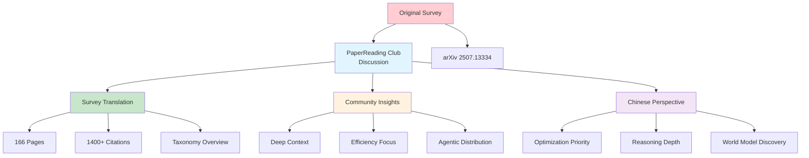

# [Survey Context Engineering Chinese - PaperReading](/blog/survey-context-engineering-chinese---paperreading)

> [!compass] **[MyMess](/blog/moc---projeto-mymess)** » [Estudos](/blog/dashboard---estudos-mymess) » Engenharia de Contexto

---

> [!info]+ Detalhes do Artigo
> **Ler:** [Survey em Chinês - PaperReading Club](http://paperreading.club/page?id=324343)
> **Fonte:** PaperReading Club (Comunidade Chinesa de IA)
> **Autores:** Comunidade de discussão acadêmica
> **Publicado:** Julho 2025 (seguindo publicação do arXiv)

> [!abstract]+ Materiais Complementares
>
> **Artigo Original**
> - [Survey Context Engineering for LLMs - arXiv](/blog/survey-context-engineering-for-llms---arxiv) - Paper completo (166 páginas)
>
> **Contexto da Plataforma**
> - PaperReading Club: comunidade chinesa de leitura e discussão de papers
> - Foco em disseminação de pesquisa de IA para audiência chinesa
>
> **Formato**
> - Resumo traduzido e comentado
> - Discussão comunitária
> - Links para recursos relacionados

> [!tip]- Léxico
>
> **Conteúdo e Criação**
> - **Context Engineering (上下文工程)**: Termo chinês para engenharia de contexto
> - **Deep Context**: Contexto profundo para otimização e eficiência de inteligência
>
> **Ferramentas e Recursos**
> - **PaperReading Club**: Plataforma chinesa de discussão acadêmica de papers de IA
>
> **Outros Conceitos**
> - **Agentic Architectures**: Arquiteturas agênticas distribuídas
> [!question]- Pontos para Aprofundar (Sugestão da IA)
>
> - **Quais insights únicos a comunidade chinesa traz?**
>     - Perspectiva de deep context para reasoning
> - **Como a pesquisa chinesa em IA difere da ocidental?**
>     - Foco em eficiência e escala
> - **Existem papers chineses adicionais sobre CE?**
>     - Verificar citações chinesas no paper original

> [!robot]- Sugestões Complementares
>
> - **Leituras Recomendadas:**
>     - [Survey Context Engineering for LLMs - arXiv](/blog/survey-context-engineering-for-llms---arxiv) - Original completo
>     - Papers chineses citados na discussão
> - **Ferramentas Úteis:**
>     - **Google Translate** - Tradução básica
>     - **DeepL** - Tradução de alta qualidade
>     - **Claude** - Compreensão de contexto chinês
> - **Exercícios Práticos:**
>     - Comparar abordagens chinesas vs ocidentais
>     - Identificar papers chineses relevantes
>     - Explorar outros papers no PaperReading Club

---

## Resumo

Página de discussão da **comunidade chinesa de IA** (PaperReading Club) sobre o survey "A Survey of Context Engineering for Large Language Models". Oferece **tradução comentada**, síntese dos conceitos principais, e discussão comunitária do paper de 166 páginas e 1400+ citações. A comunidade chinesa destaca a **necessidade de deep context** para otimização de inteligência, incluindo distribuição sobre arquiteturas agênticas, reasoning profundo, e descoberta evolutiva de world models.

**Insight da comunidade chinesa:** "Deep context é necessário tanto para otimização quanto eficiência de inteligência, incluindo distribuição sobre arquiteturas agênticas."

---

## Principais Conceitos

### Síntese Chinesa do Survey

A tabela abaixo resume as informações principais.

| Aspecto | Contribuição |
|:--------|:------------|
| **Definição** | CE como disciplina formal além de prompt design |
| **Taxonomia** | Componentes fundamentais + implementações de sistema |
| **Escopo** | Análise de +1400 papers sistematizados |
| **Foco Chinês** | Deep context para eficiência e distribuição |

### Perspectiva da Comunidade Chinesa

**Ênfases identificadas:**
1. **Deep Context para Reasoning** - Contexto profundo essencial para raciocínio
2. **Eficiência de Inteligência** - Otimização como prioridade
3. **Arquiteturas Distribuídas** - Distribuição sobre sistemas agênticos
4. **Descoberta Evolutiva** - Exposição de world models desconhecidos

### PaperReading Club como Recurso

A tabela a seguir detalha os campos e seus valores.

| Característica | Valor |
|:---------------|:------|
| **Idioma** | Chinês (simplificado) |
| **Formato** | Resumos + discussão comunitária |
| **Foco** | Papers de IA/ML de ponta |
| **Audiência** | Pesquisadores e praticantes chineses |

---

## Detalhamento

### Estrutura do Survey (Visão Chinesa)

**Componentes Fundamentais:**
```
Context Retrieval → Context Processing → Context Management
      ↓                    ↓                    ↓
  CoT, RAG, KG      Long Context, Compression   Memory, Cache
```

**Implementações de Sistema:**
```
RAG Systems → Memory Systems → Tool Integration → Multi-Agent
      ↓              ↓               ↓               ↓
  GraphRAG      MemGPT, MemOS    Toolformer      AutoGen
```

### Contribuição Única da Discussão Chinesa

**Deep Context Concept:**
> "Authors comprehend the necessity of deep context to both optimization and efficiency of intelligence including its distribution over agentic architectures, for deep reasoning, and even evolutionary discovery (exposure) of unknown world models."

Esta perspectiva expande o conceito de CE para:
- **Otimização** - Melhoria de performance
- **Eficiência** - Uso eficiente de recursos
- **Distribuição** - Espalhamento sobre arquiteturas agênticas
- **Reasoning Profundo** - Raciocínio em múltiplas camadas
- **Descoberta Evolutiva** - Exposição de modelos de mundo não conhecidos

### Timeline de Evolução (2020-2025)

```
2020 ──────────────────────────────────────────────────► 2025
  │                    │                    │
  RAG Foundational     Memory Systems       Multi-Agent
  Systems              Enhanced Agents      Sophisticated
                                           Architectures
```

### Aplicações Práticas Discutidas

Os dados abaixo mostram a estrutura e configurações.

| Área | Técnicas Destacadas |
|:-----|:-------------------|
| **RAG** | FlashRAG, GraphRAG, LightRAG |
| **Memory** | MemGPT, MemoryBank, MemOS |
| **Tools** | Toolformer, ToolLLM, Gorilla |
| **Multi-Agent** | AutoGen, MetaGPT, CrewAI |

---

## Mapa de Conceitos

O diagrama abaixo ilustra o fluxo do processo, mostrando as etapas e suas conexões.



---

## Insights & Aprendizados

**O que funcionou bem:**
- PaperReading Club como fonte de perspectiva chinesa
- Síntese focada em aspectos práticos
- Ênfase em deep context como conceito expandido
- Conexão com arquiteturas agênticas modernas

**O que posso adaptar para o MyMess:**
- **Deep Context Approach**: Aplicar conceito de contexto profundo em briefings
- **Efficiency Focus**: Priorizar otimização de uso de tokens
- **Agentic Distribution**: Distribuir tarefas entre múltiplos agentes
- **World Model Discovery**: Usar contexto para revelar padrões não óbvios

**Ideias para aplicar:**
- Acompanhar PaperReading Club para papers chineses relevantes
- Aplicar perspectiva de "deep context" em implementações
- Comparar abordagens chinesas vs ocidentais em projetos
- Usar tradução automática para acessar discussões chinesas

---

## Recursos Adicionais

- [PaperReading Club](http://paperreading.club) - Plataforma chinesa
- [Survey Original - arXiv](https://arxiv.org/abs/2507.13334) - Paper completo
- [Latent Space 2025 Reading List](https://www.latent.space/p/2025-papers) - Contexto ocidental
- [Survey Context Engineering for LLMs - arXiv](/blog/survey-context-engineering-for-llms---arxiv) - Nota detalhada do original
- [China AI Big Four Context Windows - LinkedIn](/blog/china-ai-big-four-context-windows---linkedin) - Perspectiva chinesa em IA

---

## Propriedades da nota

> [!note]- Propriedades Gerais do Obsidian
>
>> **Identificação**
>
> | Campo      | Valor                    |
> |:-----------|:-------------------------|
> | **Título** | `INPUT[text:titulo]`     |
>
>> **Conexões**
>
> | Campo           | Valor                                                                 |
> |:----------------|:----------------------------------------------------------------------|
> | **Pai**         | `INPUT[suggester(optionQuery("")):pai]`                               |
> | **Coleção**     | `INPUT[inlineSelect(option(financeiro, Financeiro), option(growth, Growth), option(ia, IA), option(lideranca, Liderança), option(marketing, Marketing), option(negocios, Negócios), option(produtividade, Produtividade), option(pkm, PKM), option(saas, SaaS), option(tecnologia, Tecnologia), option(vendas, Vendas)):colecao]` |
> | **Área**        | `INPUT[suggester(optionQuery("Esforços/Áreas")):area]`                         |
> | **Projeto**     | `INPUT[suggester(optionQuery("#projeto")):projeto]`                   |
> | **Autor**       | `INPUT[suggester(optionQuery("Atlas/Pessoas")):pessoa]`                      |
> | **Relacionado** | `INPUT[inlineListSuggester(optionQuery(""), useLinks(true)):relacionado]` |
>
>> **Classificação**
>
> | Campo      | Valor                                                                 |
> |:-----------|:----------------------------------------------------------------------|
> | **Tipo**   | `INPUT[inlineSelect(option(atomica, Atômica), option(aula, Aula), option(artigo, Artigo), option(checklist, Checklist), option(curso, Curso), option(dashboard, Dashboard), option(framework, Framework), option(livro, Livro), option(moc, MOC), option(newsletter, Newsletter), option(pessoa, Pessoa), option(prompt, Prompt), option(template, Template Obsidian), option(tutorial, Tutorial), option(video_youtube, Vídeo Youtube)):tipo_nota]` |
> | **Tags**   | `INPUT[inlineList:tags]`                                              |
> | **Status** | `INPUT[inlineSelect(option(nao_iniciado, ⬜ Não Iniciado), option(em_andamento, 🔄 Em Andamento), option(concluido, ✅ Concluído), option(pausado, ⏸️ Pausado), option(cancelado, ❌ Cancelado)):status]` |
>
>> **Temporal**
>
> | Campo          | Valor                      |
> |:---------------|:---------------------------|
> | **Criado**     | `INPUT[date:data_criado]`       |
> | **Atualizado** | `INPUT[date:data_atualizado]`   |

> [!note]- Propriedades SaaS
>
> | Campo             | Valor                                                              |
> |:------------------|:-------------------------------------------------------------------|
> | **Mostrar Bloco** | `INPUT[toggle(onValue(true), offValue(false)):mostrar_bloco_saas]` |
> | **Status SaaS**   | `INPUT[toggle(onValue(true), offValue(false)):status_saas]`        |

> [!note]- Propriedades do Artigo
>
> | Campo            | Valor                          |
> |:-----------------|:-------------------------------|
> | **URL**          | `INPUT[text(placeholder(https://...)):url_artigo]`  |
> | **Fonte**        | `INPUT[text:fonte]`  |
> | **Autor**        | `INPUT[text:autor]`  |
> | **Data Publicação** | `INPUT[date:data_publicacao]`  |
> | **Tipo Conteúdo** | `INPUT[inlineSelect(option(educacional, Educacional), option(curadoria, Curadoria), option(historia, História Pessoal), option(listicle, Lista), option(contrarian, Opinião Contrária), option(tutorial, Tutorial), option(entrevista, Entrevista), option(analise, Análise), option(estudo_de_caso, Estudo de Caso), option(lancamento, Lançamento), option(opiniao, Opinião), option(outro, Outro)):tipo_conteudo]`  |

