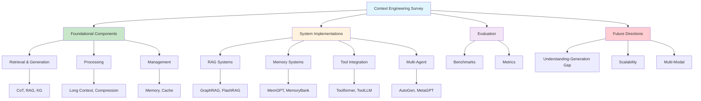

# [Survey Context Engineering for LLMs - arXiv](/blog/survey-context-engineering-for-llms---arxiv)

> [!compass] **[MyMess](/blog/moc---projeto-mymess)** » [Estudos](/blog/dashboard---estudos-mymess) » Engenharia de Contexto

---

> [!info]+ Detalhes do Artigo
> **Ler:** [A Survey of Context Engineering for Large Language Models](https://arxiv.org/abs/2507.13334)
> **Fonte:** arXiv (Survey Acadêmico)
> **Autores:** Lingrui Mei, Jiayu Yao, Yuyao Ge, Yiwei Wang + 11 pesquisadores
> **Publicado:** 17 de Julho de 2025 (v1), 21 de Julho de 2025 (v2)

> [!abstract]+ Materiais Complementares
>
> **Escopo do Survey**
> - 166 páginas com 1411 citações
> - Análise sistemática de +1400 papers
> - Taxonomia abrangente de Context Engineering
>
> **Componentes Fundamentais**
> - Context Retrieval and Generation
> - Context Processing
> - Context Management
>
> **Implementações de Sistema**
> - RAG (Retrieval-Augmented Generation)
> - Memory Systems
> - Tool-Integrated Reasoning
> - Multi-Agent Systems

> [!tip]- Léxico
>
> **Elementos Visuais**
> - **Context Engineering**: Disciplina formal que transcende prompt design para otimização sistemática de payloads de informação
>
> **Outros Conceitos**
> - **C = A(c1, c2, ..., cn)**: Formalização matemática onde função assembly orquestra componentes
>
> **Tecnologia e IA**
> - **Length Scaling**: Processamento de sequências ultra-longas (milhares a milhões de tokens)
>
> **Conteúdo e Criação**
> - **Assimetria Crítica**: LLMs entendem contexto complexo mas lutam para gerar outputs igualmente sofisticados
> [!question]- Pontos para Aprofundar (Sugestão da IA)
>
> - **Qual a relação entre prompt engineering e context engineering?**
>     - CE é superset que inclui PE como componente
> - **Como aplicar a taxonomia em projetos práticos?**
>     - Usar como checklist de componentes
> - **Quais técnicas geram maiores ganhos?**
>     - RAG, memory systems, tool integration

> [!robot]- Sugestões Complementares
>
> - **Leituras Recomendadas:**
>     - Papers citados sobre RAG (FlashRAG, GraphRAG)
>     - Papers sobre memory systems (MemGPT, MemoryBank)
> - **Ferramentas Mencionadas:**
>     - **AutoGen** - Multi-agent framework
>     - **MetaGPT** - Agent orchestration
>     - **LangChain** - RAG implementation
> - **Exercícios Práticos:**
>     - Implementar cada componente da taxonomia
>     - Avaliar usando benchmarks mencionados
>     - Testar técnicas de context compression

---

## Resumo

**Survey acadêmico monumental** de 166 páginas com 1411 citações que sistematiza o estado da arte em **Context Engineering para LLMs**. Define CE como "disciplina formal que transcende simple prompt design para englobar otimização sistemática de payloads de informação". Apresenta **taxonomia hierárquica** distinguindo componentes fundamentais (retrieval, processing, management) de implementações de sistema (RAG, memory, tools, multi-agent). Documenta ganhos substanciais: até **18x** em navegação de texto, **94%** success rates em domínios especializados, **175.96%** em bug fixing.

**Formalização central:** "C = A(c1, c2, ..., cn)" - contexto como função assembly de múltiplos componentes.

---

## Principais Conceitos

### 6 Componentes de Contexto

A tabela abaixo resume as informações principais.

| Componente | Símbolo | Descrição |
|:-----------|:--------|:----------|
| **Instructions** | c_instr | Instruções de sistema e regras |
| **Knowledge** | c_know | Conhecimento externo (RAG, KG) |
| **Tools** | c_tools | Definições e assinaturas de ferramentas |
| **Memory** | c_mem | Informação persistente de interações anteriores |
| **State** | c_state | Estado dinâmico (usuário, mundo, multi-agent) |
| **Query** | c_query | Requisição imediata do usuário |

### Prompt vs Context Engineering

A tabela a seguir detalha os campos e seus valores.

| Dimensão | Prompt Engineering | Context Engineering |
|:---------|:------------------|:--------------------|
| **Modelo** | String estática | Assembly dinâmico estruturado |
| **Alvo** | Otimização de task única | Otimização de distribuição de tasks |
| **Complexidade** | Busca em espaço de strings | Otimização de função a nível de sistema |
| **Estado** | Primariamente stateless | Inerentemente stateful |
| **Escalabilidade** | Fragilidade aumenta com tamanho | Composição modular gerenciável |

### Dimensões de Scaling

```
Length Scaling           Multi-Modal Structural Scaling
      ↓                              ↓
Milhares a milhões       Temporal, Espacial, Participantes,
de tokens                Intencional, Cultural
```

---

## Detalhamento

### Taxonomia Completa (Seções 4-5)

**4. Componentes Fundamentais:**

**4.1 Context Retrieval and Generation**
- Zero-shot/Few-shot paradigms
- Chain-of-Thought (CoT, Tree-of-Thought, Graph-of-Thought)
- RAG fundamentals
- Knowledge Graph integration
- Dynamic context assembly

**4.2 Context Processing**
- Long context architectures (Mamba, LongNet, FlashAttention)
- Position interpolation (YaRN, Ring Attention)
- Contextual self-refinement (Self-Refine, Reflexion)
- Multimodal integration
- Long Chain-of-Thought

**4.3 Context Management**
- Memory hierarchies
- Context compression (KV Cache, Heavy Hitter Oracle)
- Recurrent Context Compression

**5. Implementações de Sistema:**

**5.1 RAG Systems**
- Modular RAG, Agentic RAG, Graph-enhanced RAG
- FlashRAG, GraphRAG, LightRAG, HippoRAG, RAPTOR

**5.2 Memory Systems**
- Short-term e Long-term mechanisms
- MemoryBank, MemGPT, MemOS, CAMELoT

**5.3 Tool-Integrated Reasoning**
- Function calling (Toolformer, Gorilla, ToolLLM)
- Program-Aided Language Models, ToRA

**5.4 Multi-Agent Systems**
- Protocolos: KQML, FIPA ACL, MCP
- Frameworks: AutoGen, MetaGPT, CAMEL, CrewAI, Swarm

### Ganhos Documentados

Os dados abaixo mostram a estrutura e configurações.

| Métrica | Melhoria |
|:--------|:---------|
| **Text Navigation Accuracy** | 18x enhancement |
| **Specialized Domain Success** | 94% success rates |
| **Code Summarization BLEU-4** | +9.90% |
| **Bug Fixing Exact Match** | +175.96% |
| **Code Generation** | Up to +9.8% |

### Benchmarks de Avaliação

**Foundational:**
- NarrativeQA, MEMENTO (memory)
- API-Bank, ToolHop (tools)

**System-Level:**
- GAIA, GTA (general)
- WebArena (web agents)
- SWE-Bench (software engineering)
- StableToolBench (tool use)

---

## Mapa de Conceitos

O diagrama abaixo ilustra o fluxo do processo, mostrando as etapas e suas conexões.



---

## Insights & Aprendizados

**Descoberta crítica do survey:**
> "Current models demonstrate remarkable proficiency in understanding complex contexts but exhibit pronounced limitations in generating equally sophisticated, long-form outputs."

Esta **assimetria fundamental** (entendimento vs geração) é identificada como prioridade de pesquisa.

**O que posso adaptar para o MyMess:**
- **Taxonomia como checklist**: Usar 6 componentes para auditar implementações
- **RAG + Memory**: Combinar para contexto persistente por cliente
- **Tool Integration**: Integrar ferramentas específicas de marketing
- **Benchmarks**: Adaptar métricas para avaliar qualidade de contexto

**Ideias para aplicar:**
- Implementar pipeline CE seguindo taxonomia do survey
- Usar técnicas de context compression para otimizar tokens
- Adotar framework multi-agent para tarefas complexas
- Criar benchmarks internos baseados nos mencionados

---

## Recursos Adicionais

- [arXiv Abstract](https://arxiv.org/abs/2507.13334) - Página principal
- [arXiv HTML](https://arxiv.org/html/2507.13334v2) - Versão navegável completa
- [arXiv PDF](https://arxiv.org/pdf/2507.13334v2.pdf) - Download 166 páginas
- [Hugging Face Papers](https://huggingface.co/papers/2507.13334) - Ficha do paper
- [Survey Context Engineering Chinese - PaperReading](/blog/survey-context-engineering-chinese---paperreading) - Discussão chinesa

---

## Propriedades da nota

> [!note]- Propriedades Gerais do Obsidian
>
>> **Identificação**
>
> | Campo      | Valor                    |
> |:-----------|:-------------------------|
> | **Título** | `INPUT[text:titulo]`     |
>
>> **Conexões**
>
> | Campo           | Valor                                                                 |
> |:----------------|:----------------------------------------------------------------------|
> | **Pai**         | `INPUT[suggester(optionQuery("")):pai]`                               |
> | **Coleção**     | `INPUT[inlineSelect(option(financeiro, Financeiro), option(growth, Growth), option(ia, IA), option(lideranca, Liderança), option(marketing, Marketing), option(negocios, Negócios), option(produtividade, Produtividade), option(pkm, PKM), option(saas, SaaS), option(tecnologia, Tecnologia), option(vendas, Vendas)):colecao]` |
> | **Área**        | `INPUT[suggester(optionQuery("Esforços/Áreas")):area]`                         |
> | **Projeto**     | `INPUT[suggester(optionQuery("#projeto")):projeto]`                   |
> | **Autor**       | `INPUT[suggester(optionQuery("Atlas/Pessoas")):pessoa]`                      |
> | **Relacionado** | `INPUT[inlineListSuggester(optionQuery(""), useLinks(true)):relacionado]` |
>
>> **Classificação**
>
> | Campo      | Valor                                                                 |
> |:-----------|:----------------------------------------------------------------------|
> | **Tipo**   | `INPUT[inlineSelect(option(atomica, Atômica), option(aula, Aula), option(artigo, Artigo), option(checklist, Checklist), option(curso, Curso), option(dashboard, Dashboard), option(framework, Framework), option(livro, Livro), option(moc, MOC), option(newsletter, Newsletter), option(pessoa, Pessoa), option(prompt, Prompt), option(template, Template Obsidian), option(tutorial, Tutorial), option(video_youtube, Vídeo Youtube)):tipo_nota]` |
> | **Tags**   | `INPUT[inlineList:tags]`                                              |
> | **Status** | `INPUT[inlineSelect(option(nao_iniciado, ⬜ Não Iniciado), option(em_andamento, 🔄 Em Andamento), option(concluido, ✅ Concluído), option(pausado, ⏸️ Pausado), option(cancelado, ❌ Cancelado)):status]` |
>
>> **Temporal**
>
> | Campo          | Valor                      |
> |:---------------|:---------------------------|
> | **Criado**     | `INPUT[date:data_criado]`       |
> | **Atualizado** | `INPUT[date:data_atualizado]`   |

> [!note]- Propriedades SaaS
>
> | Campo             | Valor                                                              |
> |:------------------|:-------------------------------------------------------------------|
> | **Mostrar Bloco** | `INPUT[toggle(onValue(true), offValue(false)):mostrar_bloco_saas]` |
> | **Status SaaS**   | `INPUT[toggle(onValue(true), offValue(false)):status_saas]`        |

> [!note]- Propriedades do Artigo
>
> | Campo            | Valor                          |
> |:-----------------|:-------------------------------|
> | **URL**          | `INPUT[text(placeholder(https://...)):url_artigo]`  |
> | **Fonte**        | `INPUT[text:fonte]`  |
> | **Autor**        | `INPUT[text:autor]`  |
> | **Data Publicação** | `INPUT[date:data_publicacao]`  |
> | **Tipo Conteúdo** | `INPUT[inlineSelect(option(educacional, Educacional), option(curadoria, Curadoria), option(historia, História Pessoal), option(listicle, Lista), option(contrarian, Opinião Contrária), option(tutorial, Tutorial), option(entrevista, Entrevista), option(analise, Análise), option(estudo_de_caso, Estudo de Caso), option(lancamento, Lançamento), option(opiniao, Opinião), option(outro, Outro)):tipo_conteudo]`  |

